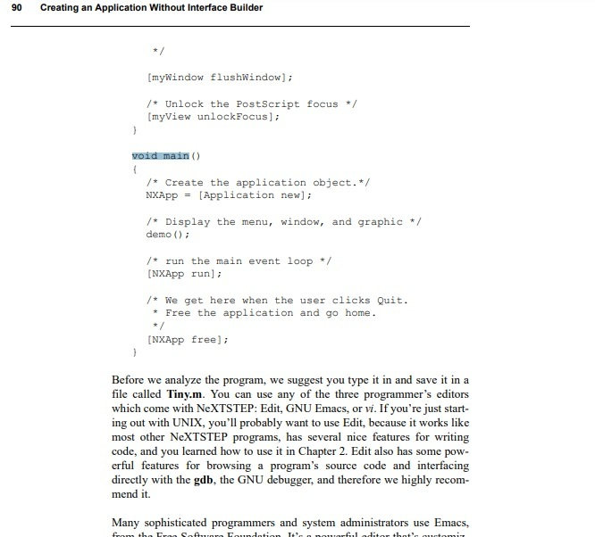
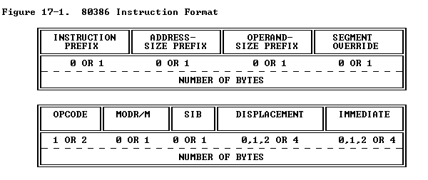
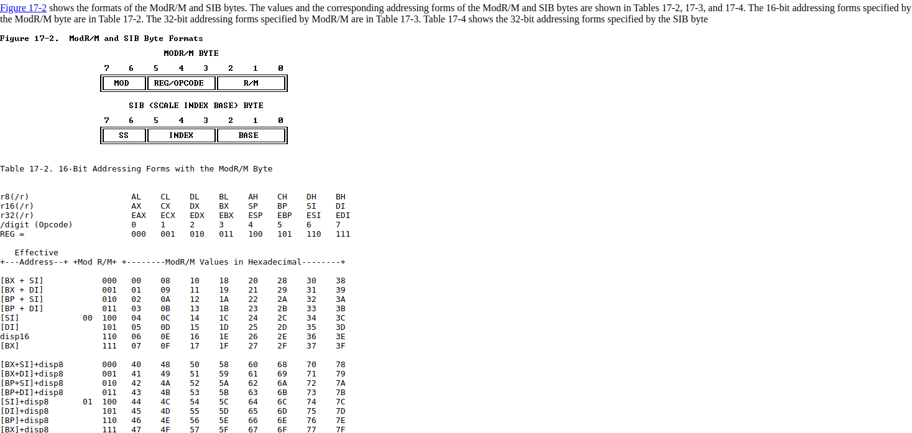
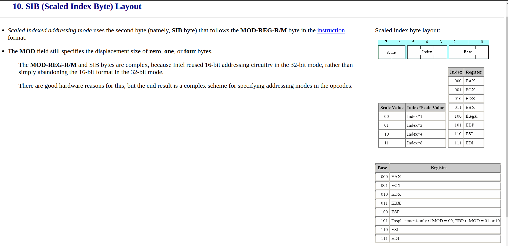
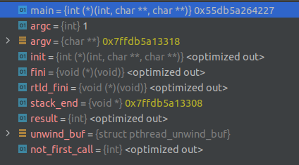
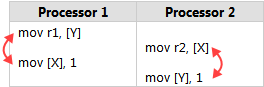
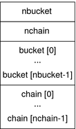

### mutable

[*lambda-declarator* ](https://en.cppreference.com/w/cpp/language/lambda)that removes `const` qualification from parameters captured by copy (since C++11)

### decltype 

推导规则如下:

1) If the argument is an unparenthesized [id-expression](https://en.cppreference.com/w/cpp/language/identifiers) or an unparenthesized [class member access](https://en.cppreference.com/w/cpp/language/operator_member_access) expression, then decltype yields the type of the *entity* named by this expression. If there is no such entity, or if the argument names a set of overloaded functions, the program is ill-formed.

| If the argument is an unparenthesized [id-expression](https://en.cppreference.com/w/cpp/language/identifiers) naming a [structured binding](https://en.cppreference.com/w/cpp/language/structured_binding), then decltype yields the *referenced type* (described in the specification of the structured binding declaration). | (since C++17) |
| ------------------------------------------------------------ | ------------- |
| If the argument is an unparenthesized [id-expression](https://en.cppreference.com/w/cpp/language/identifiers) naming a [non-type template parameter](https://en.cppreference.com/w/cpp/language/template_parameters#Non-type_template_parameter), then decltype yields the type of the template parameter (after performing any necessary type deduction if the template parameter is declared with a placeholder type). | (since C++20) |

2) If the argument is any other expression of type `T`, and

​	a) if the [value category](https://en.cppreference.com/w/cpp/language/value_category) of *expression* is *xvalue*, then decltype yields `T&&`;

​	b) if the value category of *expression* is *lvalue*, then decltype yields `T&`;

​	c) if the value category of *expression* is *prvalue*, then decltype yields `T`.

| If *expression* is a function call which returns a prvalue of class type or is a [comma expression](https://en.cppreference.com/w/cpp/language/operator_other) whose right operand is such a function call, a temporary object is not introduced for that prvalue. | (until C++17) |
| ------------------------------------------------------------ | ------------- |
| If *expression* is a prvalue other than a (possibly parenthesized) [immediate invocation](https://en.cppreference.com/w/cpp/language/consteval) (since C++20), a temporary object is not [materialized](https://en.cppreference.com/w/cpp/language/implicit_cast#Temporary_materialization) from that prvalue: such prvalue has no result object. | (since C++17) |

The type need not be [complete](https://en.cppreference.com/w/cpp/language/incomplete_type) or have an available [destructor](https://en.cppreference.com/w/cpp/language/destructor), and can be [abstract](https://en.cppreference.com/w/cpp/language/abstract_class). This rule doesn't apply to sub-expressions: in decltype(f(g())), g() must have a complete type, but f() need not.

```cpp
#include <iostream>
 
struct A { double x; };
const A* a;
 
decltype(a->x) y;       // type of y is double (declared type)
decltype((a->x)) z = y; // type of z is const double& (lvalue expression)
 
template<typename T, typename U>
auto add(T t, U u) -> decltype(t + u) // return type depends on template parameters
                                      // return type can be deduced since C++14
{
    return t + u;
}
 
int main() 
{
    int i = 33;
    decltype(i) j = i * 2;
 
    std::cout << "i = " << i << ", "
              << "j = " << j << '\n';
 
    auto f = [](int a, int b) -> int
    {
        return a * b;
    };
 
    decltype(f) g = f; // the type of a lambda function is unique and unnamed
    i = f(2, 2);
    j = g(3, 3);
 
    std::cout << "i = " << i << ", "
              << "j = " << j << '\n';
}
```

### 如何禁用vs安全检查

#define _CRT_SECURE_NO_WARNINGS

### 友元函数

类的友元函数是定义在类外部，但有权访问类的所有私有（private）成员和保护（protected）成员。尽管友元函数的原型有在类的定义中出现过，但是友元函数并不是成员函数。

### constexpr

The `constexpr` specifier declares that it is possible to evaluate the value of the function or variable at compile time. Such variables and functions can then be used where only compile time [constant expressions](https://en.cppreference.com/w/cpp/language/constant_expression) are allowed (provided that appropriate function arguments are given). A constexpr specifier used in an object declaration or non-static member function (until C++14) implies const. A constexpr specifier used in a function or [static](https://en.cppreference.com/w/cpp/language/static) member variable (since C++17) declaration implies inline. If any declaration of a function or function template has a `constexpr` specifier, then every declaration must contain that specifier.


### Memory Layout of C Programs

A typical memory representation of C program consists of following sections.

1. Text segment
2. Initialized data segment
3. Uninitialized data segment
4. Stack
5. Heap


 **1. Text Segment:**

A text segment , also known as a code segment or simply as text, is one of the sections of a program in an object file or in memory, which contains executable instructions.

As a memory region, a text segment may be placed below the heap or stack in order to **prevent heaps and stack overflows from overwriting it**.

Usually, the text segment is sharable so that only a single copy needs to be in memory for frequently executed programs, such as text editors, the C compiler, the shells, and so on. Also, the text segment is **often read-only**, to prevent a program from accidentally modifying its instructions.

**2. Initialized Data Segment:**

Initialized data segment, usually called simply the Data Segment. A data segment is a portion of virtual address space of a program, which contains the global variables and static variables that are initialized by the programmer.

Note that, data segment is **not read-only**, since the values of the variables can be altered at run time.

This segment can be further classified into **initialized read-only area** and **initialized read-write area**.

For instance the **global** string defined by **char s[] = “hello world”** in C and a C statement **like int debug=1** outside the main (i.e. global) would be stored **in initialized read-write area**. And a **global** C statement like **const char* string = “hello world”** makes the **string literal “hello world” to be stored in initialized read-only area** and the **character pointer variable string in initialized read-write area**.

Ex: static int i = 10 will be stored in data segment and global int i = 10 will also be stored in data segment

**3. Uninitialized Data Segment:**

Uninitialized data segment, often called the **“bss” segment**, named after an ancient assembler operator that stood for “block started by symbol.” Data in this segment is **initialized by the kernel to arithmetic 0 before the program starts executing**

uninitialized data starts at the end of the data segment and contains all global variables and static variables that are initialized to zero or do not have explicit initialization in source code.

For instance a variable declared **static int i**; would be contained in the BSS segment.

For instance a global variable declared **int j**; would be contained in the BSS segment.

**4. Stack:**

The stack area traditionally **adjoined the heap area and grew the opposite direction**; when the stack **pointer met the** heap pointer, **free memory was exhausted**. (With modern large address spaces and virtual memory techniques they may be placed almost anywhere, but they still typically grow opposite directions.)

The stack area contains the program stack, a LIFO structure, typically located in the higher parts of memory. On the **standard PC x86 computer architecture** it **grows toward address zero**; on some other architectures it grows the opposite direction. A **“stack pointer”** register tracks the top of the stack; it is **adjusted each time a value is “pushed” **onto the stack. The **set of values pushed** for one function call is termed **a “stack frame”**; A stack frame consists at minimum of a return address.

Stack, where **automatic variables** are stored, along with information that is saved each time a function is called. Each time a function is called, the address of where to return to and certain information about the caller’s environment, such as some of the machine registers, are saved on the stack.**The newly called function then allocates room on the stack for its automatic and temporary variables**. This is how recursive functions in C can work. Each time a recursive function calls itself, a new stack frame is used, so one set of variables doesn’t interfere with the variables from another instance of the function.

**5. Heap:**

Heap is the segment where **dynamic memory allocation usually takes place**.

The heap area begins at the **end of the BSS segment** and **grows to larger addresses** from there.The Heap area is **managed by malloc, realloc, and free**, which may use the brk and sbrk system calls to adjust its size (note that the use of brk/sbrk and a single “heap area” is not required to fulfill the contract of malloc/realloc/free; they **may** also be implemented using **mmap** to **reserve potentially non-contiguous regions of virtual memory into the process’ virtual address space**). **The Heap area is shared by all shared libraries and dynamically loaded modules in a process**.

Examples.

The size(1) command reports the sizes (in bytes) of the text, data, and bss segments. ( for more details please refer man page of size(1) )

1. Check the following simple C program

```c
#include <stdio.h> 
  
int main(void) 
{ 
    return 0; 
} 
```

```shell
[narendra@CentOS]$ gcc memory-layout.c -o memory-layout
[narendra@CentOS]$ size memory-layout
text       data        bss        dec        hex    filename
960        248         8          1216       4c0    memory-layout
```

2. Let us add one global variable in program, now check the size of bss (highlighted in red color).

```c
#include <stdio.h> 
  
int global; /* Uninitialized variable stored in bss*/
  
int main(void) 
{ 
    return 0; 
} 
```

```shell
[narendra@CentOS]$ gcc memory-layout.c -o memory-layout
[narendra@CentOS]$ size memory-layout
text       data        bss        dec        hex    filename
960        248         12         1220       4c4    memory-layout
#last
960        248         8          1216       4c0    memory-layout
```

3. Let us add one static variable which is also stored in bss.

```c
#include <stdio.h> 
  
int global; /* Uninitialized variable stored in bss*/
  
int main(void) 
{ 
    static int i; /* Uninitialized static variable stored in bss */
    return 0; 
} 

```

```shell
[narendra@CentOS]$ gcc memory-layout.c -o memory-layout
[narendra@CentOS]$ size memory-layout
text       data        bss        dec        hex    filename
960        248         16         1224       4c8    memory-layout
#last
960        248         12         1220       4c4    memory-layout
```

4. Let us initialize the static variable which will then be stored in Data Segment (DS)

```c
#include <stdio.h> 
  
int global; /* Uninitialized variable stored in bss*/
  
int main(void) 
{ 
    static int i = 100; /* Initialized static variable stored in DS*/
    return 0; 
} 
```

```shell
[narendra@CentOS]$ gcc memory-layout.c -o memory-layout
[narendra@CentOS]$ size memory-layout
text       data        bss        dec        hex    filename
960        252         12         1224       4c8    memory-layout
#last
960        248         12         1220       4c4    memory-layout
```

5. Let us initialize the global variable which will then be stored in Data Segment (DS)

```c
#include <stdio.h> 
  
int global = 10; /* initialized global variable stored in DS*/
  
int main(void) 
{ 
    static int i = 100; /* Initialized static variable stored in DS*/
    return 0; 
} 
```

```shell
[narendra@CentOS]$ gcc memory-layout.c -o memory-layout
[narendra@CentOS]$ size memory-layout
text       data        bss        dec        hex    filename
960        256         8          1224       4c8    memory-layout
#last
960        248         8          1216       4c0    memory-layout
```

### Old Lua  double to int

base on :

https://stackoverflow.com/questions/17035464/a-fast-method-to-round-a-double-to-a-32-bit-int-explained

program:

```c++
int double2int(double d)
{
    d += 6755399441055744.0;
    return reinterpret_cast<int&>(d);
}
```

**sweet range**

https://en.wikipedia.org/wiki/Double-precision_floating-point_format#IEEE_754_double-precision_binary_floating-point_format:_binary64

The bits are laid out as follows:

[](https://en.wikipedia.org/wiki/File:IEEE_754_Double_Floating_Point_Format.svg)

The real value assumed by a given 64-bit double-precision datum with a given [biased exponent](https://en.wikipedia.org/wiki/Exponent_bias) {\displaystyle e} and a 52-bit fraction is

$$(-1)^{\text{sign}}(1.b_{51}b_{50}...b_{0})_{2}\times 2^{e-1023}  $$

or

$$(-1)^{\text{sign}}\left(1+\sum _{i=1}^{52}b_{52-i}2^{-i}\right)\times 2^{e-1023}$$

Between $2^{52}$=4,503,599,627,370,496 and $2^{53}$=9,007,199,254,740,992 the representable numbers are exactly the integers. For the next range, from $2^{53}$ to $2^{54}$, everything is multiplied by 2, so the representable numbers are the even ones, etc. Conversely, for the previous range from $2^{51}$ to $2^{52}$, the spacing is 0.5, etc.

+$2^{52}$ for pos number

>actually 
>
>$(-1)^{\text{sign}}\left(1+\sum _{i=1}^{52}b_{52-i}2^{-i}\right)\times 2^{52}$
>
>= $(-1)^{\text{sign}}\left(2^{52}+\sum _{i=1}^{52}b_{52-i}2^{52-i}\right)$
>
>= $(-1)^{\text{sign}}\left(2^{52}+\sum _{i=0}^{51}b_{i}2^{i}\right)$           (convert to int)
>
>+$2^{52}$ => base = 52 , and low bits correct pos

do test 

```c++
int double2int(double d)
{
    d += 4503599627370496.5; // 2^52
    //d += 6755399441055744.0;
    return reinterpret_cast<int&>(d);
}

int main(){
    for(int i = 0 ; i <= (int)INT32_MAX; i++){
        if(i != double2int(i+0.3)){
            cout << "i: " << i << " double2int:" <<double2int(i+0.3) << endl;
        }
        if(i == INT32_MAX){
            break;
        }
    }
}
```

and

+$2^{51}$ for neg number (complement digital)

**reason**

This kind of "trick" comes from older x86 processors, using the 8087 intructions/interface for floating point. On these machines, there's an instruction for converting floating point to integer "fist", but it uses the current fp rounding mode. Unfortunately, the C spec requires that fp->int conversions truncate towards zero, while all other fp operations round to nearest, so doing an
fp->int conversion requires first changing the fp rounding mode, then doing a fist, then restoring the fp rounding mode.

Now on the original 8086/8087, this wasn't too bad, but on later processors that started to get super-scalar and out-of-order execution, altering the fp rounding mode generally serializes the CPU core and is quite expensive. So on a CPU like a Pentium-III or Pentium-IV, this overall cost is quite high -- a normal fp->int conversion is 10x or more expensive than this add+store+load trick.

On x86-64, however, floating point is done with the xmm instructions, and the cost of converting
fp->int is pretty small, so this "optimization" is likely slower than a normal conversion.

### Fast inverse square root

https://en.wikipedia.org/wiki/Fast_inverse_square_root

https://mrob.com/pub/math/numbers-16.html#le009_16

http://www.lomont.org/papers/2003/InvSqrt.pdf

(in dir)

```c++
  /* Note: This assumes "int" and "float" are both 32 bits */
  float InvSqrt (float x)
  {
    float xhalf = 0.5f * x;
    int i = *(int*)&x;         // evil floating point bit level hacking
    i = 0x5f3759df - (i>>1);   // First approximation (WTF ?!?)
    x = *(float*)&i;
    x = x*(1.5f - xhalf*x*x);  // Newton iteration
 // x = x*(1.5f - xhalf*x*x);  // Iterate again if you need full accuracy
    return x;
  }
```

### Bit Twiddling Hacks

https://graphics.stanford.edu/~seander/bithacks.html

### 字符串转换

c = > c++

```cpp
string s;
char a[10];
s = a;
```


c++ => c

```cpp
string str("test");
const char *s = str.c_str(); // const不能省略
// 进一步？
string s2 = s;
```


输出到字符串

```cpp
char buf[10];
sprintf(buf,"test");
cout<<buf;
```

### int const * & int * const

https://stackoverflow.com/questions/1143262/what-is-the-difference-between-const-int-const-int-const-and-int-const

Read it backwards (as driven by [Clockwise/Spiral Rule](http://c-faq.com/decl/spiral.anderson.html)):

- `int*` - pointer to int
- `int const *` - pointer to const int
- `int * const` - const pointer to int
- `int const * const` - const pointer to const int

Now the first `const` can be on either side of the type so:

- `const int *` == `int const *`
- `const int * const` == `int const * const`

If you want to go really crazy you can do things like this:

- `int **` - pointer to pointer to int
- `int ** const` - a const pointer to a pointer to an int
- `int * const *` - a pointer to a const pointer to an int
- `int const **` - a pointer to a pointer to a const int
- `int * const * const` - a const pointer to a const pointer to an int
- ...

And to make sure we are clear on the meaning of `const`:

```csharp
int a = 5, b = 10, c = 15;

const int* foo;     // pointer to constant int.
foo = &a;           // assignment to where foo points to.

/* dummy statement*/
*foo = 6;           // the value of a can´t get changed through the pointer.

foo = &b;           // the pointer foo can be changed.


int *const bar = &c;  // constant pointer to int 
                      // note, you actually need to set the pointer 
                      // here because you can't change it later ;)

*bar = 16;            // the value of c can be changed through the pointer.    

/* dummy statement*/
bar = &a;             // not possible because bar is a constant pointer.           
```

`foo` is a variable pointer to a constant integer. This lets you change what you point to but not the value that you point to. Most often this is seen with C-style strings where you have a pointer to a `const char`. You may change which string you point to but you can't change the content of these strings. This is important when the string itself is in the data segment of a program and shouldn't be changed.

`bar` is a constant or fixed pointer to a value that can be changed. This is like a reference without the extra syntactic sugar. Because of this fact, usually you would use a reference where you would use a `T* const` pointer unless you need to allow `NULL` pointers.


### inplace_merge

```cpp
#include <vector>
#include <iostream>
#include <algorithm>
 
template<class Iter>
void merge_sort(Iter first, Iter last)
{
    if (last - first > 1) {
        Iter middle = first + (last - first) / 2;
        merge_sort(first, middle);
        merge_sort(middle, last);
        std::inplace_merge(first, middle, last);
    }
}
 
int main()
{
    std::vector<int> v{8, 2, -2, 0, 11, 11, 1, 7, 3};
    merge_sort(v.begin(), v.end());
    for(auto n : v) {
        std::cout << n << ' ';
    }
    std::cout << '\n';
}
```

### switch var

https://stackoverflow.com/questions/92396/why-cant-variables-be-declared-in-a-switch-statement

qs:

```cpp
switch (val)  
{  
case VAL:  
  // This won't work
  int newVal = 42;  
  break;
case ANOTHER_VAL:  
  ...
  break;
} 
```

aws:

`Case` statements are only **labels**. This means the compiler will interpret this as a jump directly to the label. In C++, the problem here is one of scope. Your curly brackets define the scope as everything inside the `switch` statement. This means that you are left with a scope where a jump will be performed further into the code skipping the initialization.

The correct way to handle this is to define a scope specific to that `case` statement and define your variable within it:

```cpp
switch (val)
{   
case VAL:  
{
  // This will work
  int newVal = 42;  
  break;
}
case ANOTHER_VAL:  
...
break;
}
```


Because if you doesn't use curly bracket,  case 1: , case 2: ,... , case n: , they all in the scope of switch, so maybe you will init var in case 1, and use it in case 2, but case jmp may skip init , then will generate error, so we need use  bracket to generate a new scope , independent to other case.

### nop sled

https://stackoverflow.com/questions/14760587/how-does-a-nop-sled-work

Some attacks consist of making the program jump to a specific address and continue running from there. The injected code has to be loaded previously somehow in that exact location.

Stack randomization and other runtime differences may make the address where the program will jump impossible to predict, so the attacker places a NOP sled in a big range of memory. If the program jumps to anywhere into the sled, it will run all the remaining NOPs, doing nothing, and then will run the payload code, just next to the sled.

The reason the attacker uses the NOP sled is to make the target address bigger: the code can jump anywhere in the sled, instead of exactly at the beginning of the injected code.

A 128-byte NOP sled is just a group of NOP intructions 128 bytes wide.

NOTE #1: NOP (No-OPeration) is an instruction available in most (all?) architectures that does nothing, other than occupying memory and some runtime.

NOTE #2: in architectures with variable length instructions, a NOP instruction is usually just one byte in length, so it can be used as a convenient instruction padding. Unfortunately, that also makes it easy to do a NOP sled.

### C语言中的强符号与弱符号

https://blog.csdn.net/astrotycoon/article/details/8008629

### %i

scanf读入数字 将0开头解析为8进制,0x开头16进制

### callee and caller saved registers

https://stackoverflow.com/questions/9268586/what-are-callee-and-caller-saved-registers

> **Caller-saved registers** (AKA **volatile** registers, or **call-clobbered**) are used to hold temporary quantities that need not be preserved across calls.

For that reason, it is the caller's responsibility to push these registers onto the stack or copy them somewhere else *if* it wants to restore this value after a procedure call.

It's normal to let a `call` destroy temporary values in these registers, though.

> **Callee-saved registers** (AKA **non-volatile** registers, or **call-preserved**) are used to hold long-lived values that should be preserved across calls.

When the caller makes a procedure call, it can expect that those registers will hold the same value after the callee returns, making it the responsibility of the callee to save them and restore them before returning to the caller. Or to not touch them.

### GDB

**Show current assembly instruction in GDB**

```
(gdb) layout asm
```

### noreturn

https://stackoverflow.com/questions/45981545/why-does-noreturn-function-return

```cpp
noreturn void func()
{
        printf("noreturn func\n");
}
```

ass

```assembly
.LC0:
        .string "func"
func:
        pushq   %rbp
        movq    %rsp, %rbp
        movl    $.LC0, %edi
        call    puts
        nop
        popq    %rbp
        ret   // ==> Here function return value.
main:
        pushq   %rbp
        movq    %rsp, %rbp
        movl    $0, %eax
        call    func
```

**Why does function `func()` return after providing `noreturn` attribute?**

The function specifiers in C are a *hint* to the compiler, the degree of acceptance is implementation defined.

First of all, `_Noreturn` function specifier (or, `noreturn`, using `<stdnoreturn.h>`) is a hint to the compiler about a *theoretical promise* made by the programmer that this function will never return. Based on this promise, compiler can make certain decisions, perform some optimizations for the code generation.

IIRC, if a function specified with `noreturn` function specifier eventually returns to its caller, either

- by using and explicit `return` statement
- by reaching end of function body

the [behaviour is undefined](https://en.wikipedia.org/wiki/Undefined_behavior). You **MUST NOT** return from the function.

To make it clear, using `noreturn` function specifier **does not stop** a function form returning to its caller. It is a promise made by the programmer to the compiler to allow it some more degree of freedom to generate optimized code.

Now, in case, you made a promise earlier and later, choose to violate this, the result is UB. Compilers are encouraged, but not required, to produce warnings when a `_Noreturn` function appears to be capable of returning to its caller.

According to chapter §6.7.4, `C11`, Paragraph 8

> A function declared with a `_Noreturn` function specifier shall not return to its caller.

and, the paragraph 12, (*Note the comments!!*)

> ```c
> EXAMPLE 2
> _Noreturn void f () {
> abort(); // ok
> }
> _Noreturn void g (int i) { // causes undefined behavior if i <= 0
> if (i > 0) abort();
> }
> ```

------

For `C++`, the behaviour is quite similar. Quoting from chapter §7.6.4, `C++14`, paragraph 2 (*emphasis mine*)

> **If a function `f` is called where `f` was previously declared with the `noreturn` attribute and `f` eventually returns, the behavior is undefined.** *[ Note: The function may terminate by throwing an exception. —end note ]*
>
> *[ Note: Implementations are encouraged to issue a warning if a function marked `[[noreturn]]` might return. —end note ]*
>
> 3 *[ Example:*
>
> ```c
> [[ noreturn ]] void f() {
> throw "error"; // OK
> }
> [[ noreturn ]] void q(int i) { // behavior is undefined if called with an argument <= 0
> if (i > 0)
> throw "positive";
> }
> ```
>
> *—end example ]*

### @plt

https://stackoverflow.com/questions/5469274/what-does-plt-mean-here

It's a way to get code fixups (adjusting addresses based on where code sits in virtual memory, which may be different across different processes) without having to maintain a separate copy of the code for each process. The PLT is the **procedure linkage table**, one of the structures which makes dynamic loading and linking easier to use.

`printf@plt` is actually a small stub which (eventually) calls the real `printf` function, modifying things on the way to make subsequent calls faster.

The *real* `printf` function may be mapped into *any* location in a given process (virtual address space) as may the code that is trying to call it.

So, in order to allow proper code sharing of calling code (left side below) and called code (right side below), you don't want to apply any fixups to the calling code directly since that will restrict where it can be located in *other* processes.

So the `PLT` is a smaller *process-specific* area at a reliably-calculated-at-runtime address that *isn't* shared between processes, so any given process is free to change it however it wants to, without adverse effects.

------

Examine the following diagram which shows both your code and the library code mapped to different virtual addresses in two different processes, `ProcA` and `ProcB`:

```
Address: 0x1234          0x9000      0x8888
        +-------------+ +---------+ +---------+
        |             | | Private | |         |
ProcA   |             | | PLT/GOT | |         |
        | Shared      | +---------+ | Shared  |
========| application |=============| library |==
        | code        | +---------+ | code    |
        |             | | Private | |         |
ProcB   |             | | PLT/GOT | |         |
        +-------------+ +---------+ +---------+
Address: 0x2020          0x9000      0x6666
```

This particular example shows a simple case where the PLT maps to a fixed location. In *your* scenario, it's located relative to the current program counter as evidenced by your program-counter-relative lookup:

```
<printf@plt+0>: jmpq  *0x2004c2(%rip)  ; 0x600860 <_GOT_+24>
```

I've just used fixed addressing to keep the example simpler.

The *original* way in which code was shared meant it they had to be loaded at the *same* memory location in each virtual address space of every process that used it. Either that or it couldn't be shared, since the act of fixing up the *single* shared copy for one process would totally stuff up other processes where it was mapped to a different location.

By using position independent code, along with the PLT and a global offset table (GOT), the *first* call to a function `printf@plt` (in the PLT) is a multi-stage operation, in which the following actions take place:

- You call `printf@plt` in the PLT.
- It calls the GOT version (via a pointer) which *initially* points back to some set-up code in the PLT.
- This set-up code loads the relevant shared library if not yet done, then *modifies* the GOT pointer so that subsequent calls directly to the real `printf` rather than the PLT set-up code.
- It then calls the loaded `printf` code at the correct address for this process.

On subsequent calls, because the GOT pointer has been modified, the multi-stage approach is simplified:

- You call `printf@plt` in the PLT.
- It calls the GOT version (via pointer), which now points to the *real* `printf`.

A good article can be found [here](http://dustin.schultz.io/blog/2010/10/02/how-is-glibc-loaded-at-runtime/), detailing how `glibc` is loaded at run time.

### CFI

https://stackoverflow.com/questions/2529185/what-are-cfi-directives-in-gnu-assembler-gas-used-for/16007194#16007194

I've got a feeling it stands for [Call Frame Information](http://en.wikipedia.org/wiki/Call_frame#Structure) and is a GNU AS extension to manage call frames. From [DeveloperWorks](http://www.ibm.com/developerworks/systems/library/es-gnutool/):

> On some architectures, exception handling must be managed with Call Frame Information directives. These directives are used in the assembly to direct exception handling. These directives are available on Linux on POWER, if, for any reason (portability of the code base, for example), the GCC generated exception handling information is not sufficient.

It looks like these are generated on some platforms depending on need for exception handling.

To disable these, use the gcc option

```
-fno-asynchronous-unwind-tables
```

### why C++ cin slow?

https://stackoverflow.com/questions/9371238/why-is-reading-lines-from-stdin-much-slower-in-c-than-python

**Because of different default settings in C++ requiring more system calls. **

By default, `cin` is synchronized with stdio, which causes it to avoid any input buffering. If you add this to the top of your main, you should see much better performance:

```cpp
std::ios_base::sync_with_stdio(false);
```

Normally, when an input stream is buffered, instead of reading one character at a time, the stream will be read in larger chunks. This reduces the number of system calls, which are typically relatively expensive. However, since the `FILE*` based `stdio` and `iostreams` often have separate implementations and therefore separate buffers, this could lead to a problem if both were used together. For example:

```cpp
int myvalue1;
cin >> myvalue1;
int myvalue2;
scanf("%d",&myvalue2);
```

If more input was read by `cin` than it actually needed, then the second integer value wouldn't be available for the `scanf` function, which has its own independent buffer. This would lead to unexpected results.

To avoid this, by default, streams are synchronized with `stdio`. One common way to achieve this is to have `cin` read each character one at a time as needed using `stdio` functions. Unfortunately, this introduces a lot of overhead. For small amounts of input, this isn't a big problem, but when you are reading millions of lines, the performance penalty is significant.

Fortunately, the library designers decided that you should also be able to disable this feature to get improved performance if you knew what you were doing, so they provided the [`sync_with_stdio`](http://en.cppreference.com/w/cpp/io/ios_base/sync_with_stdio) method. From this link (emphasis added):

### C could a[-1] ? a[neg]

yes

### POD

https://stackoverflow.com/questions/146452/what-are-pod-types-in-c

*POD* stands for *Plain Old Data* - that is, a class (whether defined with the keyword `struct` or the keyword `class`) without constructors, destructors and virtual members functions. [Wikipedia's article on POD](http://en.wikipedia.org/wiki/Plain_Old_Data_Structures) goes into a bit more detail and defines it as:

> A Plain Old Data Structure in C++ is an aggregate class that contains only PODS as members, has no user-defined destructor, no user-defined copy assignment operator, and no nonstatic members of pointer-to-member type.

Greater detail can be found in [this answer for C++98/03](https://stackoverflow.com/a/4178176/734069). C++11 changed the rules surrounding POD, relaxing them greatly, thus [necessitating a follow-up answer here](https://stackoverflow.com/a/7189821/734069).

### 探索C++析构函数

深度探索c++对象模型:

```
如果class没有定义destructor,那么只有在class内含有member object(异或class自己的bass class)拥有destructor 的情况下,编译器才会合成一个出来.否则,destructor被视为不需要,也就不需被合成(当然更不需要被调用).
```

如果我们定义了其它构造函数,但是没有定义默认构造函数,是不允许的

比如

```cpp
class A{
  public:
  ~A(int i){}
};//错误
```

如下正确:

```cpp
class A{
  public:
  ~A(int i){}
  ~A(){}
};
```


在函数体中我们可以显示的调用析构函数,但是显示调用析构函数并不会释放对象的空间,(其实我们不应该显示调用析构函数). (当然vs下可能不同 合情(一贯风格)推理vs做了骚操作)

并且我们可以通过添加`{}`来改变对象的作用域,并且离开`{}`的作用域的时候会调用析构函数,并且如果离开的是我们定义的函数那么对象会被销毁.其他对象main函数前


总的来说编译器会在对象离开作用域前添加对析构函数的调用.

进一步举证如下:


曾经想法:

```
对于析构函数来说真正的对象销毁工作应该在对象离开对象的作用域时,但是最终调用的对象析构函数应该是发生在main函数返回(return )前的,所以我推测编译器在最后为代码添加了析构函数的调用,

当然也有可能最终函数的执行会交由外部函数处理,但我觉得并不合理,内外部函数存放的位置不同,如果没有其它未知操作的话,外部执行最后的析构函数会导致相同的代码在不同的段存放两次,这感觉并不是很合理,除非两段会共用,不过具体情况也就不得而知了.

综上所述,就目前来讲,对象的析构函数还是不要显示调用来的好(当然除了数组需要delete的情况).
```

实践:

确实是编译器添加了析构函数的调用

我用了在线汇编

```cpp
#include<iostream>
using namespace std;
class A{
int a;
int b;
public:
	~A(){
	}
};
int main(){
	A a;
}

```


```
A::~A() [base object destructor]:
        push    rbp
        mov     rbp, rsp
        mov     QWORD PTR [rbp-8], rdi
        nop
        pop     
        ret
main:
        push    rbp
        mov     rbp, rsp
        sub     rsp, 16
        lea     rax, [rbp-8]
        mov     rdi, rax
        call    A::~A() [complete object destructor]
        mov     eax, 0
        leave
        ret
__static_initialization_and_destruction_0(int, int):
        push    rbp
        mov     rbp, rsp
        sub     rsp, 16
        mov     DWORD PTR [rbp-4], edi
        mov     DWORD PTR [rbp-8], esi
        cmp     DWORD PTR [rbp-4], 1
        jne     .L6
        cmp     DWORD PTR [rbp-8], 65535
        jne     .L6
        mov     edi, OFFSET FLAT:_ZStL8__ioinit
        call    std::ios_base::Init::Init() [complete object constructor]
        mov     edx, OFFSET FLAT:__dso_handle
        mov     esi, OFFSET FLAT:_ZStL8__ioinit
        mov     edi, OFFSET FLAT:_ZNSt8ios_base4InitD1Ev
        call    __cxa_atexit
.L6:
        nop
        leave
        ret
_GLOBAL__sub_I_main:
        push    rbp
        mov     rbp, rsp
        mov     esi, 65535
        mov     edi, 1
        call    __static_initialization_and_destruction_0(int, int)
        pop     rbp
        ret
```

clang(只截取一部分):

```assembly
_main:                                  ## @main
	.cfi_startproc
## %bb.0:
	pushq	%rbp
	.cfi_def_cfa_offset 16
	.cfi_offset %rbp, -16
	movq	%rsp, %rbp
	.cfi_def_cfa_register %rbp
	subq	$16, %rsp
	leaq	-8(%rbp), %rdi
	callq	__ZN1AD1Ev
	xorl	%eax, %eax
	addq	$16, %rsp
	popq	%rbp
	retq
	.cfi_endproc
                                        ## -- End function
	.globl	__ZN1AD1Ev              ## -- Begin function _ZN1AD1Ev
	.weak_def_can_be_hidden	__ZN1AD1Ev
	.p2align	4, 0x90
__ZN1AD1Ev:                             ## @_ZN1AD1Ev
	.cfi_startproc
## %bb.0:
	pushq	%rbp
	.cfi_def_cfa_offset 16
	.cfi_offset %rbp, -16
	movq	%rsp, %rbp
	.cfi_def_cfa_register %rbp
	subq	$16, %rsp
	movq	%rdi, -8(%rbp)
	movq	-8(%rbp), %rdi
	callq	__ZN1AD2Ev
	addq	$16, %rsp
	popq	%rbp
	retq
	.cfi_endproc
                                        ## -- End function
	.globl	__ZN1AD2Ev              ## -- Begin function _ZN1AD2Ev
	.weak_def_can_be_hidden	__ZN1AD2Ev
	.p2align	4, 0x90
```


```cpp
#include<iostream>
using namespace std;
class A{
int a;
int b;
public:
	~A(){
	}
};
int main(){
	A a;
    A a2;
    {
        A b;
    }
    int c = 1;
    c += 2;
}

```

```assembly
main:
        push    rbp
        mov     rbp, rsp
        sub     rsp, 32
        lea     rax, [rbp-28]
        mov     rdi, rax
        call    A::~A() [complete object destructor]
        mov     DWORD PTR [rbp-4], 1
        add     DWORD PTR [rbp-4], 2
        lea     rax, [rbp-20]
        mov     rdi, rax
        call    A::~A() [complete object destructor]
        lea     rax, [rbp-12]
        mov     rdi, rax
        call    A::~A() [complete object destructor]
        mov     eax, 0
        leave
        ret
```

### Virtual Function

#### what

Without "virtual" you get "early binding". Which implementation of the method is used gets decided at compile time based on the type of the pointer that you call through.

With "virtual" you get "late binding". Which implementation of the method is used gets decided at run time based on the type of the pointed-to object - what it was originally constructed as. This is not necessarily what you'd think based on the type of the pointer that points to that object.

https://stackoverflow.com/questions/2391679/why-do-we-need-virtual-functions-in-c

#### FAQ

http://www.parashift.com/c++-faq-lite/virtual-functions.html

#### tip

> Virtuals are resolved at run time *only* if the call is made through a reference or pointer. Only in these cases is it possible for an object’s dynamic type to differ from its static type.

> A function that is **virtual** in a base class is implicitly **virtual** in its derived classes. When a derived class overrides a virtual, the parameters in the base and derived classes must match exactly.

> Virtual functions that have default arguments should use the same ar- gument values in the base and derived classes

> The base-class arguments will be used even when the derived version of the function is run. In this case, the derived function will be passed the default arguments defined for the base-class version of the function

#### final  and override

it is legal for a derived class to define a function with the same name as a virtual in its base class but with a different parameter list. The compiler considers such a function to be independent from the base-class function.

Finding such bugs can be surprisingly hard.The compiler will reject a program if a function marked override does not override an existing virtual function.

```c++
struct B {
	virtual void f1(int) const;
	virtual void f2();
	void f3();
};
struct D1 : B {
	void f1(int) const override; // ok: f1 matches f1 in the base
	void f2(int) override; // error: B has no f2(int) function
	void f3() override;
	// error: f3 not virtual
	void f4() override;
	// error: B doesn’t have a function named f4
};
```

We can also designate a function as final. Any attempt to override a function that has been defined as final will be flagged as an error:

```c++
struct D2 : B {
	// inherits f2() and f3() from B and overrides f1(int)
	void f1(int) const final; // subsequent classes can’t override 	f1(int)
};
struct D3 : D2 {
	void f2();
	// ok: overrides f2 inherited from the indirect base, B
	void f1(int) const; // error: D2 declared f2 as final
};
```

#### Circumventing the Virtual Mechanism

If a derived virtual function that intended to call its base-class version omits the scope operator, the call will be resolved at run time as a call to the derived version itself, resulting in an infinite recursion.

```c++
#include <iostream>
#include <string>
using  namespace  std;
class base {
public:
    string name() { return basename; }
    virtual void print(ostream &os) { os << basename; }
private:
    string basename;
};
class derived : public base {
public:
    void print(ostream &os) { print(os); os << " " << i; } // error
    void print(ostream &os) { base::print(os); os << " " << i; } // error
private:
    int i;
};
int main(){
    base * b = new derived();
    b->print(cout);
}
```

#### Virtual Destructors

The primary direct impact that inheritance has on copy control for a base class is that a base class generally should define a virtual destructor (§ 15.2.1, p. 594). The destructor needs to be virtual to allow objects in the inheritance hierarchy to be dynamically allocated.

> Executing delete on a pointer to base that points to a derived object has undefined behavior if the base’s destructor is not virtual.

#### Pure Virtual Functions

We specify that
a virtual function is a pure virtual by writing = 0 in place of a function body (i.e., just before the semicolon that ends the declaration). The = 0 may appear only on the declaration of a virtual function in the class body, and  the function body must be defined outside the class. That is, we cannot provide a function body inside the class for a function that is = 0.

#### Abstract Base Classes

A class containing (or inheriting without overridding) a pure virtual function is an abstract base class.

> We may not create objects of a type that is an abstract base class.

#### Virtual Inheritance and virtual base class

As an example, the IO library `istream` and `ostream` classes each inherit from a common abstract base class named `basic_ios`. That class holds the stream’s buffer and manages the stream’s condition state. The class `iostream`, which can both read and write to a stream, inherits directly from both `istream` and `ostream`. Because both types inherit from `basic_ios`, `iostream` inherits that base class twice, once through `istream` and once through `ostream`.

This default doesn’t work for a class such as `iostream`. An `iostream` object wants to use the same buffer for both reading and writing, and it wants its condition state to reflect both input and output operations. If an `iostream` object has two copies of its `basic_ios` class, this sharing isn’t possible.

In C++ we solve this kind of problem by using **virtual inheritance**. Virtual inheritance lets a class specify that it is willing to share its base class. The shared base-class subobject is called a **virtual base class**. Regardless of how often the same virtual base appears in an inheritance hierarchy, the derived object contains only one, shared subobject for that virtual base class.

**How a Virtually Inherited Object Is Constructe**

The construction order for an object with a virtual base is slightly modified from the normal order: The virtual base subparts of the object are initialized first, using initializers provided in the constructor for the most derived class. Once the virtual base subparts of the object are constructed, the direct base subparts are constructed in the order in which they appear in the derivation list.

>Virtual base classes are always constructed prior to nonvirtual base
>classes regardless of where they appear in the inheritance hierarchy.

### Local Classes

A local class can access only type names, static variables (§ 6.1.1, p. 205), and enumerators defined within the enclosing local scopes. A local class may not use the ordinary local variables of the function in which the class is defined:

```c++
int a, val;
void foo(int val)
{
	static int si;
	enum Loc { a = 1024, b };
// Bar is local to foo
	struct Bar {
		Loc locVal; // ok: uses a local type name
		int barVal;
		void fooBar(Loc l = a) // ok: default argument is Loc::a
		{
			barVal = val; // error: val is local to foo
			barVal = ::val; // ok: uses a global object
			barVal = si; // ok: uses a static local object
			locVal = b; // ok: uses an enumerator
		}
};
// . . .
}
```


### Bit-fields

use `:` to declear

The memory layout of a bit-field is machine dependent.

```c++
typedef unsigned int Bit;
class File {
	Bit mode: 2; // mode has 2 bits
	Bit modified: 1; // modified has 1 bit
	Bit prot_owner: 3; // prot_owner has 3 bits
	Bit prot_group: 3; // prot_group has 3 bits
	Bit prot_world: 3; // prot_world has 3 bits
	// operations and data members of File
public:
	// file modes specified as octal literals; see § 2.1.3 (p. 38)
	enum modes { READ = 01, WRITE = 02, EXECUTE = 03 };
	File &open(modes);
	void close();
	void write();
	bool isRead() const;
	void setWrite();
};	
```

>Ordinarily it is best to make a bit-field an **unsigned** type. The behavior
>of bit-fields stored in a signed type is implementation defined.

### 函数指针

```cpp
#include <iostream>
using namespace std;
void foo(){
    std::cout << 2 << endl;
}
int add(int a,int b){
    return a+b;
};
int main(){
    int c;
    void (* p1) () = foo;
    typedef void (*fp)();
    fp p2 = foo;
    p1();
    int (*a1)(int,int) = add;
    c = a1(1,3);
    std::cout << c <<endl;
    typedef int(*af) (int,int) ;
    af a2 = add;
    c = a2(5,6);
    std::cout << c <<endl;
}
```

### 初始化

类的成员变量有三个位置进行初始化：

声明时初始化:

初始化列表初始化（ 成员变量初始化的顺序是按照在那种定义的顺序）

以下三种情况下必须使用初始化成员列表
一、需要初始化的数据成员是对象，且该对象不能默认构造。(这里包含了继承情况下，通过显示调用父类的构造函数对父类数据成员进行初始化)；因为使用初始化列表可以不必调用默认构造函数来初始化，而是直接调用拷贝构造函数初始化。
二、需要初始化const修饰的类成员；（C++11后，声明时初始化也可以）
三、需要初始化引用成员数据；

 对于一补充:

c++ primer P258

```
如果没有构造函数的初始化列表中显式地初始化成员,
则该成员将在构造函数体之前执行默认初始化.
```

所以对于类成员,我们需要定义默认初始化,或者在初始化列表中初始化


变量初始化顺序:

c++ primer

```cpp
不过稍让人意外的是,构造函数初始值列表只用于初始化成员的值,而不限定初始化执行的顺序.
成员的初始化顺序与它们在类定义中的出现顺序一致:第一个成员先被初始化,然后第二个,以此类推. 构造函数初始化列表中初始化值的前后位置关系不会影响实际的初始化顺序.
一般情况下初始化的顺序没什么要求,如果如果一个成员使用另一个成员来初始化的,那么这两个成语啊你的初始化顺序就很关键了.
  举个例子,考虑下面这个类
class X{
  int i;
  int j;
  public:
  //未定义的,i在j之前初始化
  X(int val):j(val),i(j){}
  
  // 补充:  X(int val):i(val),j(i){}   OK
};
有些编译器具备一项比较友好的功能,即当构造函数和初始化列表中的数据成员顺序与这些成员声明的顺序不符时会生成一条警告信息.
```


构造函数内赋值初始化成员变量:

对于内置类型（char，int……指针等）:

> 基本上是没有区别的，效率上也不存在多大差异

对于自定义类对象的成员初始化

- 初始化列表是直接调用拷贝函数构造；
- 构造函数内赋值是先调用默认构造函数构造（当然，你得保证你定义的类有无参构造函数），在调用重载赋值函数赋值
  所以使用初始化列表效率高很多。**能使用初始化列表的时候尽量使用初始化列表**


### 委托构造函数

一个委托构造函数使用它所属类的其他构造函数执行它自己的初始化过程,或者说把它自己的一些(或者全部)指责委托给了其他函数

```cpp
class Sales_data{
  // 非委托构造函数
  Sales_data(string s,int a):name(s),num(a){
  }
  // 委托构造函数
  Sales_data():Sales_data("",0){}
}
```

### 指针与数组并不相同

《C专家编程》

对于

```cpp
char a[9]  = "abcdefg";       c = a[i];
编译器符号表具有一个地址9980
  运行时步骤1:取i的值,并将它与9980相加
  运行时步骤2:取地址(9980+i)的内容
```


```cpp
char *p;       c = *[p];
编译器符号表具有一个符号p,它的地址为4624
  运行时步骤1:取地址4624的值,就是 '5081'
  运行时步骤2:取地址5081的内容
```

多了一次额外的提取


当你定义为指针,但以数组方式引用

```cpp
char *p  = "abcdefg";       c = p[i];
编译器符号表具有一个p,地址为4624
  运行时步骤1:取地址4624的内容,就是 '5081'
  运行时步骤2:取得i的值,并将它与5081相加.
  运行时步骤3:取地址(5081+i)的内容
```


### 什么时候数组和指针是一样的

The C Programming Language  ed. 2 ,P99

```cpp
as format parameters in function definition
  char s[];
and 
  char* s;
are equivalent;
```

1.表达式中的数组名(与声明不同)被编译器当作指向该数组第一个元素的指针

2.下标总是与指针的偏移量相同

3.在函数参数的生命中,数组名被编译器当作指向该数组第一个元素的指针.

### 可以返回一个数组首地址吗?

局部数组不可以:

```cpp
int temp[arrlen]; 
```

动态数组可以:

```cpp
int *temp = new int[arrlen];
```

这自然是因为两个数组中变量存储的位置不同

### void main 与 main(void)

第二个答案:

`https://www.zhihu.com/question/358133724`



```
Returns:  a pointer to void if successful, or NULL if not.
```


void main似乎是一个遗留问题,

在之后void main应该是个ub ,编译器不会执行类型检查,汇编正常执行

有的编译器或许会添加上return 0;

而对于main(void):

取自:https://www.zhihu.com/question/358133724

C语言是调用者清栈，所以main函数不写参数也可以，比如 main(void)，不会运行出错，只是函数里拿不到命令行参数，但是压栈的参数还是会被正确处理


但如今实现:

```cpp
result = main (argc, argv, __environ MAIN_AUXVEC_PARAM); 
exit(result);
```

 如今应该都会补上return 0 或者直接报错了.

### NULL and nullptr

```cpp
#if defined(__need_NULL)
#undef NULL
#ifdef __cplusplus
#  if !defined(__MINGW32__) && !defined(_MSC_VER)
#    define NULL __null
#  else
#    define NULL 0
#  endif
#else
#  define NULL ((void*)0)
#endif
#ifdef __cplusplus
#if defined(_MSC_EXTENSIONS) && defined(_NATIVE_NULLPTR_SUPPORTED)
namespace std { typedef decltype(nullptr) nullptr_t; }
using ::std::nullptr_t;
#endif
#endif
#undef __need_NULL
#endif /* defined(__need_NULL) */
```

Test code:

clang :

注意下面的 NULL 其实被上方define成了 __null，在MINGW和MSC中其实被定义成了0，在后两者中是不会造成歧义的，但是前面不行。

```cpp
#include<iostream>
#include<set>
#include <cstring>
using namespace std;
void func(int * a){
    cout << "test 1 :" << endl;
}
void func(int a){
    cout << "test 2 : " << endl;
}
int main(){
    func(nullptr); // "test 1 :"
    func(0);    // "test 2 : "
    //func(NULL); error: ambiguous
}
```

剩下部分基本可以看：`https://blog.csdn.net/qq_18108083/article/details/84346655?utm_source=app` 了。

以下部分源自博客：

**一、C程序中的NULL**

在C语言中，NULL通常被定义为：**#define NULL ((void \*)0)**

所以说NULL实际上是一个空指针，如果在C语言中写入以下代码，编译是没有问题的，因为在C语言中把空指针赋给int和char指针的时候，发生了隐式类型转换，把void指针转换成了相应类型的指针。

```c
int  *pi = NULL;
char *pc = NULL;
```

**二、C++程序中的NUL**

但是问题来了，以上代码如果使用C++编译器来编译则是会出错的，因为C++是强类型语言，void*是不能隐式转换成其他类型的指针的，所以实际上编译器提供的头文件做了相应的处理：

```c
#ifdef __cplusplus
#define NULL 0
#else
#define NULL ((void *)0)
#endif
```

可见，在C++中，NULL实际上是0.因为C++中不能把void*类型的指针隐式转换成其他类型的指针，所以为了结果空指针的表示问题，C++引入了0来表示空指针，这样就有了上述代码中的NULL宏定义。

**其他：在没有C++ 11的nullptr的时候，我们怎么解决避免这个问题呢？**

```cpp
const class nullptr_t
{
public:
    template<class T>
    inline operator T*() const
        { return 0; }
 
    template<class C, class T>
    inline operator T C::*() const
        { return 0; }
 
private:
void operator&() const;
} nullptr = {};
```

//系统把NULL定位为int，把nullptr定位为void*


### 缓冲区溢出

`https://docs.microsoft.com/zh-cn/windows/win32/SecBP/avoiding-buffer-overruns`

Buffer overruns can occur in a variety of ways. The following list provides a brief introduction to a few types of buffer overrun situations and offers some ideas and resources to help you avoid creating new risks and mitigate existing ones:

- Static buffer overruns

  A static buffer overrun occurs when a buffer, which has been declared on the stack, is written to with more data than it was allocated to hold. The less apparent versions of this error occur when unverified user input data is copied directly to a static variable, causing potential stack corruption.

- Heap overruns

  Heap overruns, like static buffer overruns, can lead to memory and stack corruption. Because heap overruns occur in heap memory rather than on the stack, some people consider them to be less able to cause serious problems; nevertheless, heap overruns require real programming care and are just as able to allow system risks as static buffer overruns.

- Array indexing errors

  Array indexing errors also are a source of memory overruns. Careful bounds checking and index management will help prevent this type of memory overrun.

Preventing buffer overruns is primarily about writing good code. Always validate all your inputs and fail gracefully when necessary. For more information about writing secure code, see the following resources:

- Maguire, Steve [1993], *Writing Solid Code*, ISBN 1-55615-551-4, Microsoft Press, Redmond, Washington.
- Howard, Michael and LeBlanc, David [2003], *Writing Secure Code*, 2d ed., ISBN 0-7356-1722-8, Microsoft Press, Redmond, Washington.

### extern "C"

https://stackoverflow.com/questions/1041866/what-is-the-effect-of-extern-c-in-c

`extern "C"` makes a function-name in C++ have C linkage (compiler does not mangle the name) so that client C code can link to (use) your function using a C compatible header file that contains just the declaration of your function. Your function definition is contained in a binary format (that was compiled by your C++ compiler) that the client C linker will then link to using the C name.

Since C++ has overloading of function names and C does not, the C++ compiler cannot just use the function name as a unique id to link to, so it mangles the name by adding information about the arguments. A C compiler does not need to mangle the name since you can not overload function names in C. When you state that a function has `extern "C"` linkage in C++, the C++ compiler does not add argument/parameter type information to the name used for linkage.

Just so you know, you can specify `extern "C"` linkage to each individual declaration/definition explicitly or use a block to group a sequence of declarations/definitions to have a certain linkage:

```csharp
extern "C" void foo(int);
extern "C"
{
   void g(char);
   int i;
}
```

If you care about the technicalities, they are listed in section 7.5 of the C++03 standard, here is a brief summary (with emphasis on `extern "C"`):

- `extern "C"` is a linkage-specification
- Every compiler is *required* to provide "C" linkage
- A linkage specification shall occur only in namespace scope
- ~~All function types, function names and variable names have a language linkage ~~**[See Richard's Comment:](https://stackoverflow.com/questions/1041866/in-c-source-what-is-the-effect-of-extern-c#comment20842899_1041880)** Only function names and variable names with external linkage have a language linkage
- Two function types with distinct language linkages are distinct types even if otherwise identical
- Linkage specs nest, inner one determines the final linkage
- `extern "C"` is ignored for class members
- At most one function with a particular name can have "C" linkage (regardless of namespace)
- ~~`extern "C"` forces a function to have external linkage (cannot make it static) ~~**[See Richard's comment:](https://stackoverflow.com/questions/1041866/what-is-the-effect-of-extern-c-in-c?rq=1#comment20842893_1041880)** `static` inside `extern "C"` is valid; an entity so declared has internal linkage, and so does not have a language linkage
- Linkage from C++ to objects defined in other languages and to objects defined in C++ from other languages is implementation-defined and language-dependent. Only where the object layout strategies of two language implementations are similar enough can such linkage be achieved

### right value

Rvalue references solve at least two problems:

1. Implementing move semantics
2. Perfect forwarding

> The original definition of lvalues and rvalues from the earliest days of C is as follows: An lvalue is an expression e that may appear on the left or on the right hand side of an assignment, whereas an rvalue is an expression that can only appear on the right hand side of an assignment.

http://www.open-std.org/jtc1/sc22/wg21/docs/papers/2006/n2027.html#:~:text=Rvalue%20references%20is%20a%20small,performance%20and%20more%20robust%20libraries.

e.g.:

```cpp
A&  a_ref3 = A();  // Error!
A&& a_ref4 = A();  // Ok
```

*Question:* Why on Earth would we want to do this?

It turns out that the combination of rvalue references and lvalue references is just what is needed to easily code *move semantics*. The rvalue reference can also be used to achieve *perfect forwarding*, a heretofore unsolved problem in C++. From a casual programmer's perspective, what we get from rvalue references is more general and better performing libraries.

` Move Semantics`

```cpp
template <class T> swap(T& a, T& b)
{
    T tmp(a);   // now we have two copies of a
    a = b;      // now we have two copies of b
    b = tmp;    // now we have two copies of tmp (aka a)
}
```

But, we didn't want to have *any* copies of `a` or `b`, we just wanted to swap them. Let's try again:

```cpp
template <class T> swap(T& a, T& b)
{
    T tmp(std::move(a));
    a = std::move(b);   
    b = std::move(tmp);
}
```

In this particular case, we could have optimized `swap` by a specialization. However, we can't specialize every function that copies a large object just before it deletes or overwrites it. That would be unmanageable.

The first task of rvalue references is to allow us to implement `move()` without verbosity, or rutime overhead.

`move`

The `move` function really does very little work. All `move` does is accept either an lvalue or rvalue argument, and return it as an rvalue *without* triggering a copy construction:

```cpp
template <class T>
typename remove_reference<T>::type&&
move(T&& a)
{
    return a;
}
```

It is now up to client code to overload key functions on whether their argument is an lvalue or rvalue (e.g. copy constructor and assignment operator). When the argument is an lvalue, the argument must be copied from. When it is an rvalue, it can safely be moved from.

```cpp
template <class T>
class clone_ptr
{
private:
    T* ptr;
public:
    // construction
    explicit clone_ptr(T* p = 0) : ptr(p) {}

    // destruction
    ~clone_ptr() {delete ptr;}

    // copy semantics
    clone_ptr(const clone_ptr& p)
        : ptr(p.ptr ? p.ptr->clone() : 0) {}

    clone_ptr& operator=(const clone_ptr& p)
    {
        if (this != &p)
        {
            delete ptr;
            ptr = p.ptr ? p.ptr->clone() : 0;
        }
        return *this;
    }

    // move semantics
    clone_ptr(clone_ptr&& p)
        : ptr(p.ptr) {p.ptr = 0;}

    clone_ptr& operator=(clone_ptr&& p)
    {
        std::swap(ptr, p.ptr);
        return *this;
    }

    // Other operations
    T& operator*() const {return *ptr;}
    // ...
};
```

For classes made up of other classes (via either containment or inheritance), the move constructor and move assignment can easily be coded using the `std::move` function:

```cpp
class Derived
    : public Base
{
    std::vector<int> vec;
    std::string name;
    // ...
public:
    // ...
    // move semantics
    Derived(Derived&& x)              // rvalues bind here
        : Base(std::move(x)), 
          vec(std::move(x.vec)),
          name(std::move(x.name)) { }

    Derived& operator=(Derived&& x)   // rvalues bind here
    {
        Base::operator=(std::move(x));
        vec  = std::move(x.vec);
        name = std::move(x.name);
        return *this;
    }
    // ...
};
```

Note :

above that the argument `x` is treated as an lvalue internal to the move functions, even though it is declared as an rvalue reference parameter. That's why it is necessary to say `move(x)` instead of just `x` when passing down to the base class. This is a key safety feature of move semantics designed to prevent accidently moving twice from some named variable. All moves occur only from rvalues, or with an explicit cast to rvalue such as using `std::move`. *If you have a name for the variable, it is an lvalue.*

`Movable but Non-Copyable Types`

Some types are not amenable to copy semantics but can still be made movable. For example:

- `fstream`
- `unique_ptr` (non-shared, non-copyable ownership)
- A type representing a thread of execution

Movable but non-copyable types can also safely be put into standard containers. If the container needs to "copy" an element internally (e.g. vector reallocation) it will move the element instead of copy it.

```cpp
vector<unique_ptr<base>> v1, v2;
v1.push_back(unique_ptr<base>(new derived()));  // ok, moving, not copying
...
v2 = v1;             // Compile time error.  This is not a copyable type.
v2 = move(v1);       // Move ok.  Ownership of pointers transferred to v2.
```

Many standard algorithms benefit from moving elements of the sequence as opposed to copying them. This not only provides better performance (like the improved `std::swap` implementation described above), but also allows these algorithms to operate on movable but non-copyable types. For example the following code sorts a `vector<unique_ptr<T>>` based on comparing the pointed-to types:

```cpp
struct indirect_less
{
    template <class T>
    bool operator()(const T& x, const T& y)
        {return *x < *y;}
};
...
std::vector<std::unique_ptr<A>> v;
...
std::sort(v.begin(), v.end(), indirect_less())
```

As `sort` moves the `unique_ptr`'s around, it will use `swap` (which no longer requires `Copyability`) or move construction / move assignment. Thus during the entire algorithm, the invariant that each item is owned and referenced by one and only one smart pointer is maintained. If the algorithm were to attempt a copy (say by programming mistake) a compile time error would result.

`Perfect Forwarding`

```cpp
template <class T>
std::shared_ptr<T>
factory()   // no argument version
{
    return std::shared_ptr<T>(new T);
}

template <class T, class A1>
std::shared_ptr<T>
factory(const A1& a1)   // one argument version
{
    return std::shared_ptr<T>(new T(a1));
}

// all the other versions
```

In the interest of brevity, we will focus on just the one-parameter version. For example:

```cpp
std::shared_ptr<A> p = factory<A>(5);
```

*Question:* What if `T`'s constructor takes a parameter by non-const reference?

In that case, we get a compile-time error as the const-qualifed argument of the `factory` function will not bind to the non-const parameter of `T`'s constructor.

To solve that problem, we could use non-const parameters in our factory functions:

```cpp
template <class T, class A1>
std::shared_ptr<T>
factory(A1& a1)
{
    return std::shared_ptr<T>(new T(a1));
}
```

This example worked with our first version of `factory`, but now it's broken: The "`5`" causes the `factory` template argument to be deduced as `int&` and subsequently will not bind to the rvalue "`5`". Neither solution so far is right. Each breaks reasonable and common code.

*Question:* What about overloading on every combination of `AI&` and `const AI&`?

This would allow us to handle all examples, but at a cost of an exponential explosion: For our two-parameter case, this would require 4 overloads. For a three-parameter `factory` we would need 8 additional overloads. For a four-parameter `factory` we would need 16, and so on. This is not a scalable solution.

Rvalue references offer a simple, scalable solution to this problem:

```cpp
template <class T, class A1>
std::shared_ptr<T>
factory(A1&& a1)
{
 return std::shared_ptr<T>(new T(std::forward<A1>(a1)));
}
```

Now rvalue arguments can bind to the `factory` parameters. If the argument is const, that fact gets deduced into the `factory` template parameter type.

*Question:* What is that `forward` function in our solution?

Like `move`, `forward` is a simple standard library function used to express our intent directly and explicitly, rather than through potentially cryptic uses of references. We want to forward the argument `a1`, so we simply say so.

Here, `forward` preserves the lvalue/rvalue-ness of the argument that was passed to `factory`. If an rvalue is passed to `factory`, then an rvalue will be passed to `T`'s constructor with the help of the `forward` function. Similarly, if an lvalue is passed to `factory`, it is forwarded to `T`'s constructor as an lvalue.

The definition of `forward` looks like this:

```
template <class T>
struct identity
{
 typedef T type;
};

template <class T>
T&& forward(typename identity<T>::type&& a)
{
 return a;
}
```

### right value reference and  universal reference

https://isocpp.org/blog/2012/11/universal-references-in-c11-scott-meyers

```cpp
Widget&& var1 = someWidget;      // here, “&&” means rvalue reference

auto&& var2 = var1;              // here, “&&” does not mean rvalue reference

template<typename T>
void f(std::vector<T>&& param);  // here, “&&” means rvalue reference

template<typename T>
void f(T&& param);               // here, “&&”does not mean rvalue referenc
```

Key :

```
If a variable or parameter is declared to have type T&& for some deduced type T, that variable or parameter is a universal reference.
```

Like all references, universal references **must be initialized**, and it is a universal reference’s initializer that determines whether it represents an lvalue reference or an rvalue reference:

- If the expression initializing a universal reference is an lvalue, the universal reference becomes an lvalue reference.
- If the expression initializing the universal reference is an rvalue, the universal reference becomes an rvalue reference.

This information is useful only if you are able to distinguish lvalues from rvalues. A precise definition for these terms is difficult to develop (the C++11 standard generally specifies whether an expression is an lvalue or an rvalue on a case-by-case basis), but in practice, the following suffices:

- If you can take the address of an expression, the expression is an lvalue.
- If the type of an expression is an lvalue reference (e.g., `T&` or `const T&`, etc.), that expression is an lvalue. 
- Otherwise, the expression is an rvalue. Conceptually (and typically also in fact), rvalues correspond to temporary objects, such as those returned from functions or created through implicit type conversions. Most literal values (e.g., `10` and `5.3`) are also rvalues.

```cpp
std::vector<int> v;     // v[0] is a rvalue , because you can use v[0] = 1 etc.
...
auto&& val = v[0];               // val becomes an lvalue reference 
```

### perfect forwarding

https://eli.thegreenplace.net/2014/perfect-forwarding-and-universal-references-in-c/

qs:

if T1 is a reference, but it is not visible in the caller of wrapper(because it function(func) passing param by valie)

```c++
template <typename T1, typename T2>
void wrapper(T1 e1, T2 e2) {
    func(e1, e2);
}
```

change to ->

can't receive value

```cpp
template <typename T1, typename T2>
void wrapper(T1& e1, T2& e2) {
    func(e1, e2);
}
```


qs:

```cpp
template <typename T>
void baz(T t) {
  T& k = t;
}
int ii = 4;
baz<int&>(ii);
```


 what happens when various reference types augment (e.g. what does `int&& &` mean?).

**reference collapsing** rule.

The rule is very simple. `&` always wins. So `& &` is `&`, and so are `&& &` and `& &&`. The only case where `&&` emerges from collapsing is `&& &&`. You can think of it as a logical-OR, with `&` being 1 and `&&` being 0.


《the c++ programming language 》

23.5.2 Function Template Argument Deduction


**universal reference**

```cpp
template <class T>
void func(T&& t) {
}
func(4);            // 4 is an rvalue: T deduced to int

double d = 3.14;
func(d);            // d is an lvalue; T deduced to double&

float f() {...}
func(f());          // f() is an rvalue; T deduced to float

int bar(int i) {
  func(i);          // i is an lvalue; T deduced to int&
}
```


**Solving perfect forwarding**

forward ->`<utility> `->`std::forward`.

```cpp
template <typename T1, typename T2>
void wrapper(T1&& e1, T2&& e2) {
    func(forward<T1>(e1), forward<T2>(e2));
}
```


```cpp
  /**
   *  @brief  Forward an lvalue.
   *  @return The parameter cast to the specified type.
   *
   *  This function is used to implement "perfect forwarding".
   */
  template<typename _Tp>
    constexpr _Tp&&
    forward(typename std::remove_reference<_Tp>::type& __t) noexcept
    { return static_cast<_Tp&&>(__t); }

  /**
   *  @brief  Forward an rvalue.
   *  @return The parameter cast to the specified type.
   *
   *  This function is used to implement "perfect forwarding".
   */
  template<typename _Tp>
    constexpr _Tp&&
    forward(typename std::remove_reference<_Tp>::type&& __t) noexcept
    {
      static_assert(!std::is_lvalue_reference<_Tp>::value, "template argument"
		    " substituting _Tp is an lvalue reference type");
      return static_cast<_Tp&&>(__t);
    }

```

```cpp
wrapper(ii, ff);
ii ->forward int & -> static_cast<int & &&> -> static_cast<int &>
-> int &

wrapper(42, 3.14f);
ii ->forward int && -> static_cast<int && &&> -> static_cast<int &&>
-> int &&
```


### sizeof(xx) = 0?


https://stackoverflow.com/questions/2632021/can-sizeof-return-0-zero

In C++ an empty class or struct has a `sizeof` at least 1 by definition. From the C++ standard, 9/3 "Classes": "Complete objects and member subobjects of class type shall have nonzero size."

In C an empty struct is not permitted, except by extension (or a flaw in the compiler).

This is a consequence of the grammar (which requires that there be something inside the braces) along with this sentence from 6.7.2.1/7 "Structure and union specifiers": "If the struct-declaration-list contains no named members, the behavior is undefined".

If a zero-sized structure is permitted, then it's a language extension (or a flaw in the compiler). For example, in GCC the extension is documented in ["Structures with No Members"](http://gcc.gnu.org/onlinedocs/gcc-4.4.3/gcc/Empty-Structures.html#Empty-Structures), which says:

> GCC permits a C structure to have no members:
>
> ```csharp
>  struct empty {
>  };
> ```
>
> The structure will have size zero. In C++, empty structures are part of the language. G++ treats empty structures as if they had a single member of type `char`.


Every object in C must have a unique address. Worded another way, an address must hold no more than one object of a given type (in order for pointer dereferencing to work). That being said, consider an 'empty' struct:

```csharp
struct emptyStruct {};
```

and, more specifically, an array of them:

```ocaml
struct emptyStruct array[10];
struct emptyStruct* ptr = &array[0];
```

If the objects were indeed empty (that is, if `sizeof(struct emptyStruct) == 0`), then `ptr++ ==> (void*)ptr + sizeof(struct emptyStruct) ==> ptr`, which doesn't make sense. Which object would `*ptr` then refer to, `ptr[0]` or `ptr[1]`?

Even if a structure has no contents, the compiler should treat it as if it is one byte in length in order to maintain the "one address, one object" principle.

The C language specification (section A7.4.8) words this requirement as

> when applied to a structure or union, the result (of the `sizeof` operator) is the number of bytes in the object, including any padding required to make the object tile an array

Since a padding byte must be added to an "empty" object in order for it to work in an array, `sizeof()` must therefore return a value of at least 1 for any valid input.

**Edit:** Section A8.3 of the C spec calls a struct without a list of members an *incomplete type*, and the definition of `sizeof` specifically states (with emphasis added):

> The operator (sizeof) **may not be applied to an operand** of function type, or **of incomplete type**, or to a bit-field.

That would imply that using `sizeof` on an empty struct would be equally as invalid as using it on a data type that has not been defined. If your compiler allows the use of empty structs, be aware that using `sizeof` on them is not allowed as per the C spec. If your compiler allows you to do this anyway, understand that this is non-standard behavior that will not work on all compilers; do not rely on this behavior.

**Edit:** See also [this entry](http://www2.research.att.com/~bs/bs_faq2.html#sizeof-empty) in Bjarne Stroustrup's FAQ.

### lambda

#### sizeof(lambda) ?

https://stackoverflow.com/questions/37481767/why-does-a-lambda-have-a-size-of-1-byte#:~:text=The%20internal%20class%20that%20represents,sizeof()%20will%20indicate%20accordingly.


The lambda in question actually has *no state*.

Examine:

```cpp
struct lambda {
  auto operator()() const { return 17; }
};
```

And if we had `lambda f;`, it is an empty class. Not only is the above `lambda` functionally similar to your lambda, it is (basically) how your lambda is implemented! (It also needs an implicit cast to function pointer operator, and the name `lambda` is going to be replaced with some compiler-generated pseudo-guid)

In C++, objects are not pointers. They are actual things. They only use up the space required to store the data in them. A pointer to an object can be larger than an object.

While you might think of that lambda as a pointer to a function, it isn't. You cannot reassign the `auto f = [](){ return 17; };` to a different function or lambda!

```cpp
 auto f = [](){ return 17; };
 f = [](){ return -42; };
```

the above is *illegal*. There is no room in `f` to store *which* function is going to be called -- that information is stored in the *type* of `f`, not in the value of `f`!

If you did this:

```cpp
int(*f)() = [](){ return 17; };
```

or this:

```cpp
std::function<int()> f = [](){ return 17; };
```

you are no longer storing the lambda directly. In both of these cases, `f = [](){ return -42; }` is legal -- so in these cases, we are storing *which* function we are invoking in the value of `f`. And `sizeof(f)` is no longer `1`, but rather `sizeof(int(*)())` or larger (basically, be pointer sized or larger, as you expect. `std::function` has a min size implied by the standard (they have to be able to store "inside themselves" callables up to a certain size) which is at least as large as a function pointer in practice).

In the `int(*f)()` case, you are storing a function pointer to a function that behaves as-if you called that lambda. This only works for stateless lambdas (ones with an empty `[]` capture list).

In the `std::function<int()> f` case, you are creating a type-erasure class `std::function<int()>` instance that (in this case) uses placement new to store a copy of the size-1 lambda in an internal buffer (and, if a larger lambda was passed in (with more state), would use heap allocation).

As a guess, something like these is probably what you think is going on. That a lambda is an object whose type is described by its signature. In C++, it was decided to make lambdas *zero cost* abstractions over the manual function object implementation. This lets you pass a lambda into a `std` algorithm (or similar) and have its contents be fully visible to the compiler when it instantiates the algorithm template. If a lambda had a type like `std::function<void(int)>`, its contents would not be fully visible, and a hand-crafted function object might be faster.

The goal of C++ standardization is high level programming with zero overhead over hand-crafted C code.

Now that you understand that your `f` is in fact stateless, there should be another question in your head: the lambda has no state. Why does it not size have `0`?

------

There is the short answer.

All objects in C++ must have a minimium size of 1 under the standard, and two objects of the same type cannot have the same address. These are connected, because an array of type `T` will have the elements placed `sizeof(T)` apart.

Now, as it has no state, sometimes it can take up no space. This cannot happen when it is "alone", but in some contexts it can happen. `std::tuple` and similar library code exploits this fact. Here is how it works:

As a lambda is equivalent to a class with `operator()` overloaded, stateless lambdas (with a `[]` capture list) are all empty classes. They have `sizeof` of `1`. In fact, if you inherit from them (which is allowed!), they will take up no space *so long as it doesn't cause a same-type address collision*. (This is known as the empty base optimization).

```cpp
template<class T>
struct toy:T {
  toy(toy const&)=default;
  toy(toy &&)=default;
  toy(T const&t):T(t) {}
  toy(T &&t):T(std::move(t)) {}
  int state = 0;
};

template<class Lambda>
toy<Lambda> make_toy( Lambda const& l ) { return {l}; }
```

the `sizeof(make_toy( []{std::cout << "hello world!\n"; } ))` is `sizeof(int)` (well, the above is illegal because you cannot create a lambda in a non-evaluated context: you have to create a named `auto toy = make_toy(blah);` then do `sizeof(blah)`, but that is just noise). `sizeof([]{std::cout << "hello world!\n"; })` is still `1` (similar qualifications).

If we create another toy type:

```cpp
template<class T>
struct toy2:T {
  toy2(toy2 const&)=default;
  toy2(T const&t):T(t), t2(t) {}
  T t2;
};
template<class Lambda>
toy2<Lambda> make_toy2( Lambda const& l ) { return {l}; }
```

this has *two copies* of the lambda. As they cannot share the same address, `sizeof(toy2(some_lambda))` is `2`!

#### lambda implemention

lambda is a class overload operator of (),  ----old

#### mutable

here

```cpp
 auto f = [] (auto & f, int n) ->int {
        if(n == 0 || n == 1)
            return 1;
        return f(f, n-1) + f(f, n-2);
    };
```

n is non-mutable, so we can change it ,such as `n++`

we can set it by

`[] (auto & f, int n) mutable {`

so ,we can change it

**but why it does not always be set mutable?**

https://stackoverflow.com/questions/5501959/why-does-c11s-lambda-require-mutable-keyword-for-capture-by-value-by-defau

It requires `mutable` because by default, a function object should produce the same result every time it's called. This is the difference between an object orientated function and a function using a global variable, effectively.

#### anonymous function recursion

##### method 1

```cpp
 auto f = [] (auto & f, int n) ->int {
        if(n == 0 || n == 1)
            return 1;
        return f(f, n-1) + f(f, n-2);
    };
```

##### method 2

```cpp
std::function<int(int)> f2;
    f2 = [&](int n)->int {
        if(n == 0 || n == 1)
            return 1;
        return f2(n-1) + f2(n-2);
    };
```

##### method 3: y function

https://zhuanlan.zhihu.com/p/45430715

```cpp
#include <iostream>
#include <functional>

using namespace std;

template <typename F>
struct Y
{
    Y(F f) : _f(f) {}
    template <typename... Args>
    auto operator()(Args&&... t) const
    {
        return _f(*this, std::forward<Args>(t)...);
    }
    F _f;
};

template <typename F>
Y<F> fix(F&& f)
{
    return Y<F>(forward<F>(f));
}

int main()
{
    auto gcd = fix(
        [](auto g, int a, int b)->int{ return b == 0 ? a : g(b, a % b); }
    );
    cout << gcd(63, 105) << endl; // => 21
    return 0;
}
```

##### total test

```cpp
#include <iostream>
#include <algorithm>
#include <memory>
using namespace std;

// Method 3
template <typename F>
struct Y
{
    Y(F f) : _f(f) {}
    template <typename... Args>
    auto operator()(Args&&... t) const
    {
        return _f(*this, std::forward<Args>(t)...);
    }
    F _f;
};

template <typename F>
Y<F> fix(F&& f)
{
    return Y<F>(forward<F>(f));
}
using namespace  std;
int main(){
    // Method 1
    auto f = [] (auto & f, int n) ->int {
        if(n == 0 || n == 1)
            return 1;
        return f(f, n-1) + f(f, n-2);
    };
    cout << f(f, 5) << endl;

    // Method 2
    std::function<int(int)> f2;
    f2 = [&](int n)->int {
        if(n == 0 || n == 1)
            return 1;
        return f2(n-1) + f2(n-2);
    };
    int * a ;

    auto f3 = [a] (auto & f3, int n) ->int {
        if(n == 0 || n == 1)
            return 1;
        return f3(f3, n-1) + f3(f3, n-2);
    };

    cout << sizeof(f) <<"  "<< sizeof(f2) <<"  "<< sizeof(a) << "  "<< sizeof(f3) << endl;

    // Method 3
    function<int(int)> const sqr = [](int x) { return x * x; };
    auto gcd = fix(
            [](auto g, int a, int b)->int{ return b == 0 ? a : g(b, a % b); }
    );
    cout << gcd(63, 105) << endl; // => 21

    cout << sizeof(sqr) <<"  " <<sizeof(gcd) <<endl;

    return 0;
}
```


```cpp
#include <iostream>
#include <algorithm>
#include <memory>
using namespace std;

// Method 3
template <typename F>
struct Y
{
    Y(F f) : _f(f) {}
    template <typename... Args>
    auto operator()(Args&&... t) const
    {
        return _f(*this, std::forward<Args>(t)...);
    }
    F _f;
};

template <typename F>
Y<F> fix(F&& f)
{
    return Y<F>(forward<F>(f));
}
using namespace  std;
int main(){
    // Method 1
    auto f = [] (auto & f, int n) ->int {
        if(n == 0 || n == 1)
            return 1;
        return f(f, n-1) + f(f, n-2);
    };

    // Method 2
    std::function<int(int)> f2;
    f2 = [&](int n)->int {
        if(n == 0 || n == 1)
            return 1;
        return f2(n-1) + f2(n-2);
    };
    int * a ;

    auto f3 = [a] (auto & f3, int n) ->int {
        if(n == 0 || n == 1)
            return 1;
        return f3(f3, n-1) + f3(f3, n-2);
    };

    cout << sizeof(f) <<"  "<< sizeof(f2) <<"  "<< sizeof(a) << "  "<< sizeof(f3) << endl;

    // Method 3
    function<int(int)> const sqr = [](int x) { return x * x; };
    auto gcd = fix(
            [](auto g, int a, int b)->int{ return b == 0 ? a : g(b, a % b); }
    );

    cout << sizeof(sqr) <<"  " <<sizeof(gcd) <<endl;

    return 0;
}
```

res:

```shell
1  32  8  8
32  1
```


### .hpp and .h

https://stackoverflow.com/questions/152555/h-or-hpp-for-your-class-definitions#:~:text=h%20is%20a%20valid%20header,hpp%20is%20a%20valid%20header.

Here are a couple of reasons for having different naming of C vs C++ headers:

- Automatic code formatting, you might have different guidelines for formatting C and C++ code. If the headers are separated by extension you can set your editor to apply the appropriate formatting automatically
- Naming, I've been on projects where there were libraries written in C and then wrappers had been implemented in C++. Since the headers usually had similar names, i.e. Feature.h vs Feature.hpp, they were easy to tell apart.
- Inclusion, maybe your project has more appropriate versions available written in C++ but you are using the C version (see above point). If headers are named after the language they are implemented in you can easily spot all the C-headers and check for C++ versions.

Remember, C is **not** C++ and it can be very dangerous to mix and match unless you know what you are doing. Naming your sources appropriately helps you tell the languages apart.

### SIB (Scaled Index Byte) Layout

**Instruction Format**

https://www.scs.stanford.edu/05au-cs240c/lab/i386/s17_02.htm

All instruction encodings are subsets of the general instruction format shown in [Figure 17-1](https://www.scs.stanford.edu/05au-cs240c/lab/i386/s17_02.htm#fig17-1) . Instructions consist of optional instruction prefixes, one or two primary opcode bytes, possibly an address specifier consisting of the ModR/M byte and the SIB (Scale Index Base) byte, a displacement, if required, and an immediate data field, if required.

Smaller encoding fields can be defined within the primary opcode or opcodes. These fields define the direction of the operation, the size of the displacements, the register encoding, or sign extension; encoding fields vary depending on the class of operation.

Most instructions that can refer to an operand in memory have an addressing form byte following the primary opcode byte(s). This byte, called the ModR/M byte, specifies the address form to be used. Certain encodings of the ModR/M byte indicate a second addressing byte, the SIB (Scale Index Base) byte, which follows the ModR/M byte and is required to fully specify the addressing form.

Addressing forms can include a displacement immediately following either the ModR/M or SIB byte. If a displacement is present, it can be 8-, 16- or 32-bits.

If the instruction specifies an immediate operand, the immediate operand always follows any displacement bytes. The immediate operand, if specified, is always the last field of the instruction.

The following are the allowable instruction prefix codes:

```
   F3H    REP prefix (used only with string instructions)
   F3H    REPE/REPZ prefix (used only with string instructions
   F2H    REPNE/REPNZ prefix (used only with string instructions)
   F0H    LOCK prefix
```

The following are the segment override prefixes:

```
   2EH    CS segment override prefix
   36H    SS segment override prefix
   3EH    DS segment override prefix
   26H    ES segment override prefix
   64H    FS segment override prefix
   65H    GS segment override prefix
   66H    Operand-size override
   67H    Address-size override
```




The ModR/M and SIB bytes follow the opcode byte(s) in many of the 80386 instructions. They contain the following information:

* The indexing type or register number to be used in the instruction
* The register to be used, or more information to select the instruction
* The base, index, and scale information

The ModR/M byte contains three fields of information:

* The mod field, which occupies the two most significant bits of the byte, combines with the r/m field to form 32 possible values: eight registers and 24 indexing modes

* The reg field, which occupies the next three bits following the mod field, specifies either a register number or three more bits of opcode information. The meaning of the reg field is determined by the first (opcode) byte of the instruction.

* The r/m field, which occupies the three least significant bits of the byte, can specify a register as the location of an operand, or can form part of the addressing-mode encoding in combination with the field as described above

The based indexed and scaled indexed forms of 32-bit addressing require the SIB byte. The presence of the SIB byte is indicated by certain encodings of the ModR/M byte. The SIB byte then includes the following fields:

* The ss field, which occupies the two most significant bits of the byte, specifies the scale factor
* The index field, which occupies the next three bits following the ss field and specifies the register number of the index register
* The base field, which occupies the three least significant bits of the byte, specifies the register number of the base registe







### [Is RBP/EBP register really necessary to support Variable-Size Stack Frames?](https://stackoverflow.com/questions/37583449/is-rbp-ebp-register-really-necessary-to-support-variable-size-stack-frames)


https://stackoverflow.com/questions/37583449/is-rbp-ebp-register-really-necessary-to-support-variable-size-stack-frames


If you keep the size you used in the variable-size `sub xxx, %rsp`, you can reverse it with an `add` at the end (or with an `lea fixed_size(%rsp,%rdi,4), %rsp` to also deallocate any fixed-size stack-space reservations.

As @Ross points out, this doesn't scale well to multiple variable-length allocations in the same function. Even with a single VLA, it's not faster than a `mov %rbp, %rsp` (or `leave`) at the end of the function. It would let the compiler spill the size and have 15 free registers instead of 14 for parts of the function, which it never chooses to do with `%rbp` when using it as a frame pointer. Anyway, this means gcc would still want to fall back to using a frame pointer for complex cases. (The default is `-fomit-frame-pointer`, but don't worry about the fact that it doesn't force gcc to never use one).

**Having `%rbp` as a frame pointer has some minor advantages**, especially in code-size: An [addressing mode](https://stackoverflow.com/questions/34058101/referencing-the-contents-of-a-memory-location-x86-addressing-modes) with `%rsp` as the base register always needs a SIB byte (Scale/Index/Base), because the Mod/RM encoding that would mean `(%rsp)` is actually an escape sequence to indicate that there's a SIB byte. Similarly, the encoding that would mean `(%rbp)` with no displacement actually means there's no base register at all, so you always need a `disp8` byte like `0(%rbp)`.

For example, `mov %eax, 16(%rsp)` is 1B longer than `mov %eax, -8(%rbp)`. [Jan Hubicka suggested](https://gcc.gnu.org/ml/gcc-patches/2014-01/msg00008.html) that it would be good if gcc had a heuristic to enable frame pointers in functions where it saved code size without causing performance regressions, and thinks that this is commonly the case. It can also save some stack-sync uops to avoid using `%e/rsp` directly (after push/pop or call) on Intel CPUs with a stack engine.

gcc always uses `%rbp` as a frame pointer in any function with C99 variable-size arrays. Probably gcc developers found it wasn't worth it to figure out when such a function could still be just as efficient without a frame pointer, and have a lot of code in gcc for those rare special cases.

------

**But what if we really wanted to avoid using a frame pointer in a function with a VLA?**

The 7th and later integer argument (in the SysV ABI, see the [x86](https://stackoverflow.com/questions/tagged/x86) tag wiki) will be on the stack above the return address. Accessing them via `disp(%rsp)` is impossible, because the displacement isn't known at compile time.

`disp(%rsp, %rcx, 1)` would be possible, where `%rcx` holds the variable-length-array size. (Or the total size of all the VLAs). This doesn't cost any extra code-size over `disp(%rsp)` because addressing-modes with `%rsp` as a base register already have to use a SIB byte. But this means that the VLA size needs to stay in a register full-time, gaining us nothing over using a frame pointer. (And losing on code-size).

The alternative is to keep scalar / fixed-size locals below any variable-length allocations, so we can always access them with a fixed displacement relative to `%rsp`. That's good for code-size, since we can use `disp8` (1B) instead of `disp32` (4B) to access within [-128,+127] bytes of `%rsp`.

But it only works if you can determine the VLA size(s) early, before you need to spill anything to the locals. So again you have a complex special-case for the compiler to check for, and it needs a bunch of code-generation code in gcc for that special case.

If you spill the VLA size and reload / use it before `ret`urn, you make the value of `%rsp` dependent on a reload from memory. Out-of-order execution can probably hide that extra latency, but there will be cases where that extra latency does delay everything else that's using `%rsp`, including restoring the caller's registers.

This style of code-gen would probably also have some corner cases for gcc to deal with to make correct and efficient code. Since it's little-used, the "efficient" part of that might not get much attention.

It's pretty easy to see why gcc chose to simply fall back to frame-pointer mode for any case where it's non-trival to omit it. Normally it gains you an extra register nearly for free, so it's worth giving up the code-size advantage even if you do reference a lot of locals. This is especially true in 32-bit code where you go from 6 to 7 general registers (not including `esp`). That difference is usually smaller in 64-bit code, where 14 vs. 15 is a much smaller difference. It still saves the push/mov / pop instructions in functions that don't need them, which is a separate benefit. (Using `%rbp` as a general-purpose register still requires pushing/popping it.)


### new A() new A

int

new A()  A.a (a integer) = 0

new A     A.a (a integer) = any

### inline


https://stackoverflow.com/questions/1759300/when-should-i-write-the-keyword-inline-for-a-function-method

`inline` is more like `static` or `extern` than a directive telling the compiler to inline your functions. `extern`, `static`, `inline` are linkage directives, used almost exclusively by the linker, not the compiler.

It is said that `inline` hints to the compiler that you think the function should be inlined. That may have been true in 1998, but a decade later the compiler needs no such hints. Not to mention humans are usually wrong when it comes to optimizing code, so most compilers flat out ignore the 'hint'.

- **`static`** - the variable/function name cannot be used in other translation units. Linker needs to make sure it doesn't accidentally use a statically defined variable/function from another translation unit.
- **`extern`** - use this variable/function name in this translation unit but don't complain if it isn't defined. The linker will sort it out and make sure all the code that tried to use some extern symbol has its address.
- **`inline`** - this function will be defined in multiple translation units, don't worry about it. The linker needs to make sure all translation units use a single instance of the variable/function.

**Note:** Generally, declaring templates `inline` is pointless, as they have the linkage semantics of `inline` already. However, explicit specialization and instantiation of templates [require `inline`](https://stackoverflow.com/a/10536588/183120) to be used.

------

Specific answers to your questions:

- > When should I write the keyword 'inline' for a function/method in C++?

  Only when you want the function to be defined in a header. More exactly only when the function's definition can show up in multiple translation units. It's a good idea to define small (as in one liner) functions in the header file as it gives the compiler more information to work with while optimizing your code. It also increases compilation time.

- > When should I not write the keyword 'inline' for a function/method in C++?

  Don't add inline just because you think your code will run faster if the compiler inlines it.

- > When will the compiler not know when to make a function/method 'inline'?

  Generally, the compiler will be able to do this better than you. However, the compiler doesn't have the option to inline code if it doesn't have the function definition. In maximally optimized code usually all `private` methods are inlined whether you ask for it or not.

  As an aside to prevent inlining in GCC, use `__attribute__(( noinline ))`, and in Visual Studio, use `__declspec(noinline)`.

- > Does it matter if an application is multithreaded when one writes 'inline' for a function/method?

  Multithreading doesn't affect inlining in any way.

### enum

```cpp
// c98:
//enumerator names leak into the scope containing their enum 
// definition gives rise to the official term for this kind of enum
enum Color { black, white, red }; 
// black, white, red are
// in same scope as Color
auto white = false;  // error, beacuse unscoped

// c11:
enum class Color { black, white, red }; // ok! don't ;leak
auto white = false;
Color c = white; //error
Color c = Color::white; // ok
return 0;
```

### template bind 

### Binding rules & dependent type

Non-dependent names are looked up and bound at the point of template definition. This binding holds even if at the point of template instantiation there is a better match:

Run this code

```cpp
#include <iostream>
 
void g(double) { std::cout << "g(double)\n"; }
 
template<class T>
struct S
{
    void f() const
    {
        g(1); // "g" is a non-dependent name, bound now
    }
};
 
void g(int) { std::cout << "g(int)\n"; }
 
int main()
{
    g(1);  // calls g(int)
 
    S<int> s;
    s.f(); // calls g(double)
}
```

If the meaning of a *non-dependent name* changes between the definition context and the point of instantiation of a specialization of the template, the program is ill-formed, no diagnostic required. This is possible in the following situations:

- a type used in a non-dependent name is [incomplete](https://en.cppreference.com/w/cpp/language/incomplete_type) at the point of definition but complete at the point of instantiation

| lookup for a name in the template definition found a [using-declaration](https://en.cppreference.com/w/cpp/language/using_declaration), but the lookup in the corresponding scope in the instantiation does not find any declarations because the using-declaration was a pack expansion and the corresponding pack is empty | (since C++17) |
| ------------------------------------------------------------ | ------------- |
|                                                              |               |

- an instantiation uses a default argument or default template argument that had not been defined at the point of definition
- a [constant expression](https://en.cppreference.com/w/cpp/language/constant_expression) at the point of instantiation uses the value of a const object of integral or unscoped enum type, the value of a constexpr object, the value of a reference, or the definition of a constexpr function (since C++11), and that object/reference/function (since C++11) was not defined at the point of definition
- the template uses a non-dependent class template specialization or variable template specialization (since C++14) at the point of instantiation, and this template it uses is either instantiated from a partial specialization that was not defined at the point of definition or names an explicit specialization that was not declared at the point of definition

Binding of *dependent names* is postponed until lookup takes place.


**test**:

foo.c

```c
#include <iostream>
using namespace std;

int foo(int n){
    cout << "int --" << endl;
    return n;
}
```


main.cpp

```cpp
#include <iostream>
#include <algorithm>
#include <memory>
#include <typeinfo>

using namespace std;

// scope of template definition

double foo(double n){
    cout << "double --" << endl;
    return n;
}


template <typename type>
class ScopeRules{
public:
    void invariant(){
        _member = foo(_val);
    }

    type type_dependent(){
        return foo(_member);
    }

private:
    int _val;
    type _member;
};


// extern int foo(int n); // pos on here, same res
int main(){
    extern int foo(int n);

    ScopeRules<double> sr0;
    sr0.invariant();
    sr0.type_dependent();


    return 0;
}
```

output:

```shell
double --
double --
```


test 2:

```cpp
#include <iostream>
#include <algorithm>
#include <memory>
#include <typeinfo>
//#include "foo.c"

using namespace std;

// scope of template definition
extern int foo(int n); // here
double foo(double n){
    cout << "double --" << endl;
    return n;
}


template <typename type>
class ScopeRules{
public:
    void invariant(){
        _member = foo(_val);
    }

    type type_dependent(){
        return foo(_member);
    }

private:
    int _val;
    type _member;
};


int main(){


    ScopeRules<double> sr0;
    sr0.invariant();
    sr0.type_dependent();


    return 0;
}
```

do resolution

```shell
int --
double --
```

test 3:

```cpp
#include <iostream>
#include <algorithm>
#include <memory>
#include <typeinfo>
//#include "foo.c"

using namespace std;

// scope of template definition

double foo(double n){
    cout << "double --" << endl;
    return n;
}


template <typename type>
class ScopeRules{
public:
    void invariant(){
        _member = foo(_val);
    }

    type type_dependent(){
        return foo(_member);
    }

private:
    int _val;
    type _member;
};


extern int foo(int n);
int main(){

    // extern int foo(int n);  // same res
    ScopeRules<int> sr0;
    sr0.invariant();
    sr0.type_dependent();


    return 0;
}
```


```cpp
double --
double --
```

test 4: //深入理解c++对象模型 290

may ? 

为什么要实例化为int？ 

因为另一个是double ， 如果non-dependent的输出double就说明当前scope里只有一个function---double的，否则一定会选择int，同时第二个输出为int表明确实做了两次resolution，否则不会调用不同的函数。

```cpp
#include <iostream>
#include <algorithm>
#include <memory>
#include <typeinfo>

using namespace std;

// scope of template definition

double foo(double n){
    cout << "double --" << endl;
    return n;
}
template <typename type>
class ScopeRules{
public:
    void invariant(){
        _member = foo(_val);
    }

    type type_dependent(){
         // here, scope of template instantiation ?
        extern int foo(int n);
        return foo(_member);
    }

private:
    int _val;
    type _member;
};


int main(){
    ScopeRules<int> sr0;
    sr0.invariant();
    sr0.type_dependent();
    return 0;
}
```

output:

```cpp
double --
int --
```

### typename` and `class

https://stackoverflow.com/questions/2023977/difference-of-keywords-typename-and-class-in-templates

`typename` and `class` are interchangeable in the basic case of specifying a template:

```cpp
template<class T>
class Foo
{
};
```

and

```cpp
template<typename T>
class Foo
{
};
```

are equivalent.

Having said that, there are specific cases where there is a difference between `typename` and `class`.

The first one is in the case of dependent types. `typename` is used to declare when you are referencing a nested type that depends on another template parameter, such as the `typedef` in this example:

```cpp
template<typename param_t>
class Foo
{
    typedef typename param_t::baz sub_t;
};
```

The second one you actually show in your question, though you might not realize it:

```cpp
template < template < typename, typename > class Container, typename Type >
```

When specifying a **template template**, the `class` keyword MUST be used as above -- it is **not** interchangeable with `typename` in this case *(note: since C++17 both keywords are allowed in this case)*.

You also must use `class` when explicitly instantiating a template:

```cpp
template class Foo<int>;
```

I'm sure that there are other cases that I've missed, but the bottom line is: these two keywords are not equivalent, and these are some common cases where you need to use one or the other.

### type_info Class

https://docs.microsoft.com/en-us/cpp/cpp/type-info-class?view=msvc-170

The **type_info** class describes type information generated within the program by the compiler. Objects of this class effectively store a pointer to a name for the type. The **type_info** class also stores an encoded value suitable for comparing two types for equality or collating order. The encoding rules and collating sequence for types are unspecified and may differ between programs.

The `<typeinfo>` header file must be included in order to use the **type_info** class. The interface for the **type_info** class is:

C++Copy

```cpp
class type_info {
public:
    type_info(const type_info& rhs) = delete; // cannot be copied
    virtual ~type_info();
    size_t hash_code() const;
    _CRTIMP_PURE bool operator==(const type_info& rhs) const;
    type_info& operator=(const type_info& rhs) = delete; // cannot be copied
    _CRTIMP_PURE bool operator!=(const type_info& rhs) const;
    _CRTIMP_PURE int before(const type_info& rhs) const;
    size_t hash_code() const noexcept;
    _CRTIMP_PURE const char* name() const;
    _CRTIMP_PURE const char* raw_name() const;
};
```

You cannot instantiate objects of the **type_info** class directly, because the class has only a private copy constructor. The only way to construct a (temporary) **type_info** object is to use the [typeid](https://docs.microsoft.com/en-us/cpp/cpp/typeid-operator?view=msvc-170) operator. Since the assignment operator is also private, you cannot copy or assign objects of class **type_info**.

`type_info::hash_code` defines a hash function suitable for mapping values of type **typeinfo** to a distribution of index values.

The operators `==` and `!=` can be used to compare for equality and inequality with other **type_info** objects, respectively.

There is no link between the collating order of types and inheritance relationships. Use the `type_info::before` member function to determine the collating sequence of types. There is no guarantee that `type_info::before` will yield the same result in different programs or even different runs of the same program. In this manner, `type_info::before` is similar to the address-of `(&)` operator.

The `type_info::name` member function returns a `const char*` to a null-terminated string representing the human-readable name of the type. The memory pointed to is cached and should never be directly deallocated.

The `type_info::raw_name` member function returns a `const char*` to a null-terminated string representing the decorated name of the object type. The name is actually stored in its decorated form to save space. Consequently, this function is faster than `type_info::name` because it doesn't need to undecorate the name. The string returned by the `type_info::raw_name` function is useful in comparison operations but is not readable. If you need a human-readable string, use the `type_info::name` function instead.

Type information is generated for polymorphic classes only if the [/GR (Enable Run-Time Type Information)](https://docs.microsoft.com/en-us/cpp/build/reference/gr-enable-run-time-type-information?view=msvc-170) compiler option is specified.

## 


### dynamic_cast  & RTTI support

v1 : error

```cpp
#include <iostream>
#include <algorithm>
#include <memory>
#include <typeinfo>
using namespace  std;


class node{

};

class type : public node{
};

class fct : public type { };
class gen : public type { };

using ptype= type *;
using pfct = fct *;

void simplify_conv_op(ptype pt){
    if(pfct pf = dynamic_cast<pfct> (pt))// error, here 'type' is not polymorphic
    {
        
    }else{

    }
}

int main(){


    return 0;
}
```


version 2:

ok !

```cpp
// struct of vtable
/*
Point pt;
------------
float _x;
__vptr__Point ------> ------------
                      |       ---|-----------> | type_info for Point |
                      ------------
                      |       ---|-----------> | other virtual function |
                      ------------
                      |       ---|-----------> | other virtual function |                    
                      ------------
                      
                      Virtual table for Point
*/

```

code:

we could using **type_info**

```cpp
#include <iostream>
#include <algorithm>
#include <memory>
#include <typeinfo>
using namespace  std;


class node{

};

class type : public node{
    // here, we build a vtable, which
    // could help compiler solve pl
    virtual void help_build_vtable() {}
};

class fct : public type { };
class gen : public type { };

using ptype= type *;
using pfct = fct *;

void simplify_conv_op(ptype pt){
    if(pfct pf = dynamic_cast<pfct> (pt)){

    }else{
        // dynamic_cast set pf as 0
        // ...
    }
}

void simplify_conv_op(type & rt){
    // we can't set reference as 0, we need generate a temp object
    // so it will throw a exp
    try{
        fct & rf = dynamic_cast<fct &> (rt);
    }
    catch (bad_cast){
        // ...
    }
}
int main(){


    return 0;
}
```

or we could use

```cpp
void simplify_conv_op(type & rt){
    // we can't set reference as 0, we need generate a temp object
    // so it will throw a exp
    if(typeid(rt) == typeid(fct)){
        fct & rf = static_cast<fct &> (rt); // dosn't do check
    }else{
        // ..,
    }
}
```

### reinterpret cast

always success, rather than dyanmic_cast (do RT check) and static_cast (don't) may fail


https://stackoverflow.com/questions/28002/regular-cast-vs-static-cast-vs-dynamic-cast

To force the pointer conversion, in the same way as the C-style cast does in the background, the reinterpret cast would be used instead.

```cpp
int *r = reinterpret_cast<int*>(&c); // forced conversion
```

This cast handles conversions between certain unrelated types, such as from one pointer type to another incompatible pointer type. It will simply perform a binary copy of the data without altering the underlying bit pattern. Note that the result of such a low-level operation is system-specific and therefore not portable. It should be used with caution if it cannot be avoided altogether.

### __libc_start_main



```assembly

_start:
	endbr64
	xor    %ebp,%ebp
	mov    %rdx,%r9
	pop    %rsi
	mov    %rsp,%rdx
	and    $0xfffffffffffffff0,%rsp
	push   %rax
	push   %rsp
	lea    0x2a6(%rip),%r8            ; 0x55db5a264380 <__libc_csu_fini>
	lea    0x22f(%rip),%rcx           ; 0x55db5a264310 <__libc_csu_init>
	lea    0x13f(%rip),%rdi           ; 0x55db5a264227 <main()>
	call   *0x2ef2(%rip)              ; 0x55db5a266fe0
	hlt


__libc_start_main:
	endbr64
	push   %r15
	xor    %eax,%eax
	push   %r14
	push   %r13
	push   %r12
	push   %rbp
	push   %rbx
	mov    %rcx,%rbx
	sub    $0x98,%rsp
	mov    %rdx,0x8(%rsp)
	mov    0x1c3f8a(%rip),%rdx        ; 0x7f7d43524f40
	mov    %rdi,0x18(%rsp)
	mov    %r9,%rdi
	mov    %esi,0x14(%rsp)
	test   %rdx,%rdx
	je     0x7f7d43360fd0             ; <__libc_start_main+64>
	mov    (%rdx),%edx
	xor    %eax,%eax
	test   %edx,%edx
	sete   %al
	mov    %eax,0x1c41ca(%rip)        ; 0x7f7d435251a0 <__libc_multiple_libcs>
	test   %rdi,%rdi
	je     0x7f7d43360fe4             ; <__libc_start_main+84>
	xor    %edx,%edx
	xor    %esi,%esi
	call   0x7f7d43383f30             ; <__GI___cxa_atexit>
	mov    0x1c3e75(%rip),%rdx        ; 0x7f7d43524e60
	mov    (%rdx),%ebp
	and    $0x2,%ebp
	jne    0x7f7d4336108a             ; <__libc_start_main+250>
	test   %rbx,%rbx
	je     0x7f7d43361010             ; <__libc_start_main+128>
	mov    0x1c3eae(%rip),%rax        ; 0x7f7d43524eb0
	mov    0x8(%rsp),%rsi
	mov    0x14(%rsp),%edi
	mov    (%rax),%rdx
	call   *%rbx
	mov    0x1c3e49(%rip),%rdx        ; 0x7f7d43524e60
	mov    0x210(%rdx),%eax
	test   %eax,%eax
	jne    0x7f7d433610ec             ; <__libc_start_main+348>
	test   %ebp,%ebp
	jne    0x7f7d43361150             ; <__libc_start_main+448>
	lea    0x20(%rsp),%rdi
	call   0x7f7d4337fdd0             ; <_setjmp>
	endbr64
	test   %eax,%eax
	jne    0x7f7d433610a6             ; <__libc_start_main+278>
	mov    %fs:0x300,%rax
	mov    %rax,0x68(%rsp)
	mov    %fs:0x2f8,%rax
	mov    %rax,0x70(%rsp)
	lea    0x20(%rsp),%rax
	mov    %rax,%fs:0x300
	mov    0x1c3e40(%rip),%rax        ; 0x7f7d43524eb0
	mov    0x8(%rsp),%rsi
	mov    0x14(%rsp),%edi
	mov    (%rax),%rdx
	mov    0x18(%rsp),%rax
	call   *%rax
	mov    %eax,%edi
	call   0x7f7d43383b90             ; <__GI_exit>
	mov    0x8(%rsp),%rax
	lea    0x18fdd2(%rip),%rdi        ; 0x7f7d434f0e68
	mov    (%rax),%rsi
	xor    %eax,%eax
	call   *0x1d0(%rdx)
	jmp    0x7f7d43360ff6             ; <__libc_start_main+102>
	mov    0x1ca0ab(%rip),%rax        ; 0x7f7d4352b158 <__libc_pthread_functions+312>
	ror    $0x11,%rax
	xor    %fs:0x30,%rax
	call   *%rax
	mov    0x1ca085(%rip),%rax        ; 0x7f7d4352b148 <__libc_pthread_functions+296>
	ror    $0x11,%rax
	xor    %fs:0x30,%rax
	lock decl (%rax)
	sete   %dl
	test   %dl,%dl
	jne    0x7f7d433610e8             ; <__libc_start_main+344>
	mov    $0x3c,%edx
	nop
	xor    %edi,%edi
	mov    %edx,%eax
	syscall
	jmp    0x7f7d433610e0             ; <__libc_start_main+336>
	xor    %eax,%eax
	jmp    0x7f7d43361083             ; <__libc_start_main+243>
	mov    0x1c3cfd(%rip),%r13        ; 0x7f7d43524df0
	mov    %eax,%r12d
	mov    0x208(%rdx),%r14
	shl    $0x4,%r12
	mov    0x0(%r13),%r15
	mov    %r15,%rbx
	add    %r15,%r12
	cmp    %r12,%rbx
	je     0x7f7d43361025             ; <__libc_start_main+149>
	mov    0x18(%r14),%rax
	test   %rax,%rax
	je     0x7f7d43361139             ; <__libc_start_main+425>
	mov    0x1c3ccc(%rip),%rdx        ; 0x7f7d43524df0
	lea    0x480(%rbx),%rdi
	add    $0x988,%rdx
	cmp    %rdx,%r15
	je     0x7f7d43361147             ; <__libc_start_main+439>
	call   *%rax
	mov    0x40(%r14),%r14
	add    $0x10,%r13
	add    $0x10,%rbx
	jmp    0x7f7d4336110b             ; <__libc_start_main+379>
	lea    0xe08(%r13),%rdi
	jmp    0x7f7d43361137             ; <__libc_start_main+423>
	mov    0x8(%rsp),%rax
	mov    0x1c3d04(%rip),%rdx        ; 0x7f7d43524e60
	lea    0x18fd1f(%rip),%rdi        ; 0x7f7d434f0e82
	mov    (%rax),%rsi
	xor    %eax,%eax
	call   *0x1d0(%rdx)
	jmp    0x7f7d4336102d             ; <__libc_start_main+157>
```

### Lock-Free Programming

https://preshing.com/20120612/an-introduction-to-lock-free-programming/


**InterlockedCompareExchange**

https://baike.baidu.com/item/InterlockedCompareExchange/659889

#### Memory Reordering Caught in the Act

https://preshing.com/20120515/memory-reordering-caught-in-the-act/

no matter which processor writes 1 to memory first, it’s natural to expect the *other* processor to read that value back, which means we should end up with either r1 = 1, r2 = 1, or perhaps both. But according to Intel’s specification, that won’t necessarily be the case. The specification says it’s legal for both r1 and r2 to equal 0 at the end of this example – a counterintuitive result, to say the least!

form


to



```c++
sem_t beginSema1;
sem_t endSema;

int X, Y;
int r1, r2;

void *thread1Func(void *param)
{
    MersenneTwister random(1);                // Initialize random number generator
    for (;;)                                  // Loop indefinitely
    {
        sem_wait(&beginSema1);                // Wait for signal from main thread
        while (random.integer() % 8 != 0) {}  // Add a short, random delay

        // ----- THE TRANSACTION! -----
        X = 1;
        asm volatile("" ::: "memory");        // Prevent compiler reordering
        r1 = Y;

        sem_post(&endSema);                   // Notify transaction complete
    }
    return NULL;  // Never returns
};
```


#### ABA problem

https://en.wikipedia.org/wiki/ABA_problem

#### RCU

https://www.kernel.org/doc/html/latest/RCU/whatisRCU.html

#### atomic

https://en.cppreference.com/w/cpp/atomic/atomic

https://blog.csdn.net/wanxuexiang/article/details/104280021

```c++
bool compare_exchange_strong(T & expected ,T desired)
{
     if(this->load() == expected){
		this->strore(desired)
 		return true;
     }else{
        expected = this->load();
        return false;
     }
}
```

### SSO(Small String Optimization)

```c++
#include <string>
#include <new>
#include <cstdio>
#include <cstdlib>
#include <iostream>

std::size_t allocated = 0;

void* operator new (size_t sz)
{
    std::cout << "Allocating " << sz << " bytes\n";
    void* p = std::malloc(sz);
    allocated += sz;
    return p;
}

void operator delete(void* mem) noexcept
{
    return std::free(mem);
}

/*
void operator delete(void* mem, size_t sz) noexcept
{
	std::cout << "Freeing " << sz << " bytes\n";
    return std::free(mem);
}
*/

int
main()
{
    allocated = 0;
    std::string s("hi");
    std::printf("stack space = %zu, heap space = %zu, capacity = %zu\n",
                sizeof(s), allocated, s.capacity());
}
```

res:

```shell
gcc 4.9.1:
stack space = 8, heap space = 27, capacity = 2

gcc 5.0.0:
stack space = 32, heap space = 0, capacity = 15

clang/libc++:
stack space = 24, heap space = 0, capacity = 22

VS-2015:
stack space = 32, heap space = 0, capacity = 15
```


https://stackoverflow.com/questions/10315041/meaning-of-acronym-sso-in-the-context-of-stdstring

**Background / Overview**

Operations on automatic variables ("from the stack", which are variables that you create without calling `malloc` / `new`) are generally much faster than those involving the free store ("the heap", which are variables that are created using `new`). However, the size of automatic arrays is fixed at compile time, but the size of arrays from the free store is not. Moreover, the stack size is limited (typically a few MiB), whereas the free store is only limited by your system's memory.

SSO is the Short / Small String Optimization. A `std::string` typically stores the string as a pointer to the free store ("the heap"), which gives similar performance characteristics as if you were to call `new char [size]`. This prevents a stack overflow for very large strings, but it can be slower, especially with copy operations. As an optimization, many implementations of `std::string` create a small automatic array, something like `char [20]`. If you have a string that is 20 characters or smaller (given this example, the actual size varies), it stores it directly in that array. This avoids the need to call `new` at all, which speeds things up a bit.

EDIT:

I wasn't expecting this answer to be quite so popular, but since it is, let me give a more realistic implementation, with the caveat that I've never actually read any implementation of SSO "in the wild".

**Implementation details**

At the minimum, a `std::string` needs to store the following information:

- The size
- The capacity
- The location of the data

The size could be stored as a `std::string::size_type` or as a pointer to the end. The only difference is whether you want to have to subtract two pointers when the user calls `size` or add a `size_type` to a pointer when the user calls `end`. The capacity can be stored either way as well.

**You don't pay for what you don't use.**

First, consider the naive implementation based on what I outlined above:

```cpp
class string {
public:
    // all 83 member functions
private:
    std::unique_ptr<char[]> m_data;
    size_type m_size;
    size_type m_capacity;
    std::array<char, 16> m_sso;
};
```

For a 64-bit system, that generally means that `std::string` has 24 bytes of 'overhead' per string, plus another 16 for the SSO buffer (16 chosen here instead of 20 due to padding requirements). It wouldn't really make sense to store those three data members plus a local array of characters, as in my simplified example. If `m_size <= 16`, then I will put all of the data in `m_sso`, so I already know the capacity and I don't need the pointer to the data. If `m_size > 16`, then I don't need `m_sso`. There is absolutely no overlap where I need all of them. A smarter solution that wastes no space would look something a little more like this (untested, example purposes only):

```cpp
class string {
public:
    // all 83 member functions
private:
    size_type m_size;
    union {
        class {
            // This is probably better designed as an array-like class
            std::unique_ptr<char[]> m_data;
            size_type m_capacity;
        } m_large;
        std::array<char, sizeof(m_large)> m_small;
    };
};
```

I'd assume that most implementations look more like this.

### valgrind

for sso

`string s = "0123123"; // Allocating 17 bytes`

more than 15, 2

```c++
➜  untitled g++ main.cpp && valgrind --tool=memcheck  ./a.out
==79083== Memcheck, a memory error detector
==79083== Copyright (C) 2002-2017, and GNU GPL'd, by Julian Seward et al.
==79083== Using Valgrind-3.18.1 and LibVEX; rerun with -h for copyright info
==79083== Command: ./a.out
==79083== 
==79083== 
==79083== HEAP SUMMARY:
==79083==     in use at exit: 0 bytes in 0 blocks
==79083==   total heap usage: 2 allocs, 2 frees, 72,728 bytes allocated
==79083== 
==79083== All heap blocks were freed -- no leaks are possible
==79083== 
==79083== For lists of detected and suppressed errors, rerun with: -s
==79083== ERROR SUMMARY: 0 errors from 0 contexts (suppressed: 0 from 0)
```

less than 15, 2

```c++
➜  untitled g++ main.cpp && valgrind --tool=memcheck  ./a.out
==79094== Memcheck, a memory error detector
==79094== Copyright (C) 2002-2017, and GNU GPL'd, by Julian Seward et al.
==79094== Using Valgrind-3.18.1 and LibVEX; rerun with -h for copyright info
==79094== Command: ./a.out
==79094== 
==79094== 
==79094== HEAP SUMMARY:
==79094==     in use at exit: 0 bytes in 0 blocks
==79094==   total heap usage: 1 allocs, 1 frees, 72,704 bytes allocated
==79094== 
==79094== All heap blocks were freed -- no leaks are possible
==79094== 
==79094== For lists of detected and suppressed errors, rerun with: -s
==79094== ERROR SUMMARY: 0 errors from 0 contexts (suppressed: 0 from 0)
```

### hack class private member

http://www.open-std.org/jtc1/sc22/wg21/docs/papers/2017/p0692r1.html

https://www.zhihu.com/question/37692782/answer/1212413278

dirty_hacks.hpp

```c++
#pragma once

#include <type_traits>

namespace dirty_hacks
{

    template <class T>
    using remove_cvref_t = typename std::remove_cv_t<std::remove_reference_t<T>>;

    template <class T>
    struct type_identity { using type = T; };
    template <class T>
    using type_identity_t = typename type_identity<T>::type;

    namespace impl
    {

        template <class T>
        struct complete
        {
            template <class U>
            static auto test(U*) -> decltype(sizeof(U), std::true_type{});
            static auto test(...) -> std::false_type;
            using type = decltype(test(static_cast<T*>(nullptr)));
        };

    } // namespace impl

    template <class T>
    struct is_complete : impl::complete<T>::type {};

} // namespace dirty_hacks

/** Yet another concat implementation. */
#define YA_CAT_IMPL(x, y) x##y
/** Yet another concat. */
#define YA_CAT(x, y) YA_CAT_IMPL(x, y)
/**
 * Init private class member hijacker.
 * @param class_ Class name.
 * @param member Private member to hijack.
 * @param __VA_ARGS__ Member type.
 * @remark All HIJACKERs should appear before any HIJACK.
 */
#define HIJACKER(class_, member, ...) \
    namespace dirty_hacks { namespace hijack { \
    template <class> struct tag_##member; \
    inline auto get(tag_##member<class_>) -> type_identity_t<__VA_ARGS__> class_::*; \
    template <> struct tag_##member<class_> { \
        tag_##member(tag_##member*) {} \
        template <class T, class = std::enable_if_t< \
            !is_complete<tag_##member<T>>::value && std::is_base_of<class_, T>::value>> \
        tag_##member(tag_##member<T>*) {} \
    }; \
    template <type_identity_t<__VA_ARGS__> class_::* Ptr> struct YA_CAT(hijack_##member##_, __LINE__) { \
        friend auto get(tag_##member<class_>) -> type_identity_t<__VA_ARGS__> class_::* { return Ptr; } \
    }; \
    template struct YA_CAT(hijack_##member##_, __LINE__)<&class_::member>; \
    }}
/**
 * Hijack private class member.
 * @param ptr Pointer to class instance.
 * @param member Private member to hijack.
 * @remark All HIJACKs should appear after any HIJACKER.
 */
#define HIJACK(ptr, member) \
    ((ptr)->*dirty_hacks::hijack::get( \
        static_cast<std::add_pointer_t<dirty_hacks::hijack::tag_##member< \
            dirty_hacks::remove_cvref_t<decltype(*ptr)>>>>(nullptr)))
```

main.cpp

```c++
#include <iostream>

#include "dirty_hacks.hpp"

class base
{
    int x_ = 0;

public:
    int x() { return x_; }
}; // class base

class derived1 : public base
{
    int x_ = 1;

public:
    int x() { return x_; }
}; // class derived1

class derived2 : public base
{
    int x_ = 2;

public:
    int x() { return x_; }
}; // class derived2

HIJACKER(base, x_, int);
HIJACKER(derived1, x_, int);

int main()
{
    derived1 d1;
    derived2 d2;
    base& b1 = d1;
    base& b2 = d2;
    std::cout << "(" << b1.x() << ", " << d1.x() << "), (" << b2.x() << ", " << d2.x() << ")\n";
    HIJACK(&b1, x_) = HIJACK(&b2, x_) = 233;
    std::cout << "(" << b1.x() << ", " << d1.x() << "), (" << b2.x() << ", " << d2.x() << ")\n";
    HIJACK(&d1, x_) = HIJACK(&d2, x_) = 666;
    std::cout << "(" << b1.x() << ", " << d1.x() << "), (" << b2.x() << ", " << d2.x() << ")" << std::endl;
    return 0;
}
```


### linker & Symbol Hash Table

#### **linker**

The linker then initializes a chain of symbol tables with pointers to the program’s symbol table and the linker’s own symbol table. Conceptually, the program file and all of the libraries loaded into a process share a single symbol table. But rather than build a merged symbol table at runtime, the linker keeps a linked list of the symbol tables in each file. each file contains a hash table to speed symbol lookup, with a set of hash headers and a hash chain for each header. The linker can search for a symbol quickly by computing the symbol’s hash value once, then running through apprpriate hash chain in each of the symbol tables in the list.


#### Hash Table Section

https://docs.oracle.com/cd/E23824_01/html/819-0690/chapter6-48031.html

A hash table consists of `Elf32_Word` or `Elf64_Word` objects that provide for symbol table access. The `SHT_HASH` section provides this hash table. The symbol table to which the hashing is associated is specified in the `sh_link` entry of the hash table's section header. Labels are used in the following figure to help explain the hash table organization, but these labels are not part of the specification.



The `bucket` array contains `nbucket` entries, and the `chain` array contains `nchain` entries. Indexes start at `0`. Both `bucket` and `chain` hold symbol table indexes. Chain table entries parallel the symbol table. The number of symbol table entries should equal `nchain`, so symbol table indexes also select chain table entries.

A hashing function that accepts a symbol name, returns a value to compute a `bucket` index. Consequently, if the hashing function returns the value x for some name, `bucket` [x% `nbucket`] gives an index y. This index is an index into both the symbol table and the chain table. If the symbol table entry is not the name desired, `chain`[y] gives the next symbol table entry with the same hash value.

The `chain` links can be followed until the selected symbol table entry holds the desired name, or the `chain` entry contains the value `STN_UNDEF`.

The hash function is as follows.

```c++
unsigned long
elf_Hash(const unsigned char *name)
{
    unsigned long h = 0, g;
 
        while (*name)
        {
             h = (h << 4) + *name++;
             if (g = h & 0xf0000000)
                  h ^= g >> 24;
                   h &= ~g;
        }
        return h;
}
```
