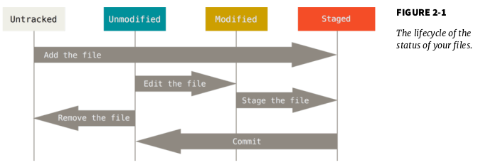
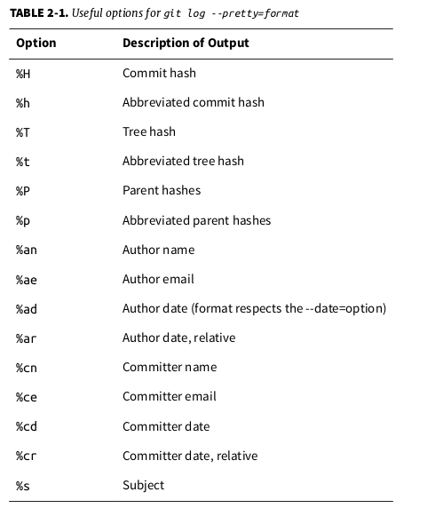
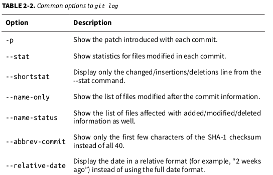
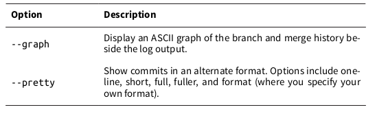
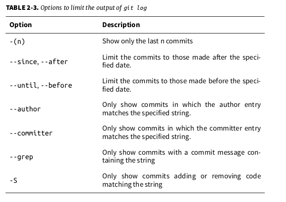

## First-Time Git Setup
```shell
sudo apt-get install git-all
```

   1./etc/gitconfig file: Contains values for every user on the system and all their repositories. If you pass the option --system to git config , it reads and writes from this file specifically.

2. ~/.gitconfig or ~/.config/git/config file: Specific to your user.
You can make Git read and write to this file specifically by passing the --global option.

3. config file in the Git directory (that is, .git/config ) of whatever repository you’re currently using: Specific to that single repository.

Each level overrides values in the previous level, so values in .git/config trump those in /etc/gitconfig .

```shell
$ git config --global user.name "John Doe"
$ git config --global user.email johndoe@example.com
```

If you want to override this with a different name or email address for spe-cific projects, you can run the command without the --global option when you’re in that project.


Now that your identity is set up, you can configure the default text editor that will be used when Git needs you to type in a message. If not configured, Git uses your system’s default editor.
If you want to use a different text editor, such as Emacs, you can do the following:

```shell
$ git config --global core.editor emacs
```

If you want to check your settings, you can use the git config --list com-
mand to list all the settings Git can find at that point:

```shell
$ git config --list
user.name=John Doe
user.email=johndoe@example.com
color.status=auto
color.branch=auto
color.interactive=auto
color.diff=auto
...
```

You can also check what Git thinks a specific key’s value is by typing git
config <key> :

```shell
$ git config user.name
John Doe
```


```
$ git help <verb>
$ git <verb> --help
$ man git-<verb>
```

# Git Basics

## Getting a Git Repository

Initializing a Repository in an Existing Directory

```
$ git init
```

You can accomplish that with a few git add commands that specify the files you want to track, followed by a git commit :

```
$ git add *.c
$ git add LICENSE
$ git commit -m 'initial project version'
```

If you want to clone the repository into a directory named something other than “libgit2”, you can specify that as the next command-line option:

```
$ git clone https://github.com/libgit2/libgit2 mylibgit
```

## Recording Changes to the Repository

working directory can be in one of two states: tracked or untracked. Tracked files are files that were in the last snap- shot; they can be unmodified, modified, or staged. Untracked files are every- thing else – any files in your working directory that were not in your last snap- shot and are not in your staging area.

As you edit files, Git sees them as modified, because you’ve changed them since your last commit. You stage these modified files and then commit all your staged changes, and the cycle repeats.



### Checking the Status of Your Files

```
$ git status
On branch master
Your branch is up-to-date with 'origin/master'.
nothing to commit, working directory clean
```

### Tracking New Files

In order to begin tracking a new file, you use the command git add . To begin tracking the README file, you can run this:

```
$ git add README
$ git status
On branch master
Your branch is up-to-date with 'origin/master'.
Changes to be committed:
(use "git reset HEAD <file>..." to unstage)
new file:
README
```

You can tell that it’s staged because it’s under the “Changes to be committed” heading. If you commit at this point, the version of the file at the time you ran git add is what will be in the historical snapshot. You may recall that when you ran git init earlier, you then ran git add (files) – that was to begin tracking files in your directory. The git add command takes a path name for either a file or a directory; if it’s a directory, the command adds all the files in that directory recursively

### Staging Modified Files

Let’s change a file that was already tracked. If you change a previously tracked file called CONTRIBUTING.md and then run your git status command again, you get something that looks like this:

```
$ git status
On branch master
Your branch is up-to-date with 'origin/master'.
Changes to be committed:
	(use "git reset HEAD <file>..." to unstage)
		new file:
README
Changes not staged for commit:
	(use "git add <file>..." to update what will be committed)
(use "git checkout -- <file>..." to discard changes in working directory)
	modified:	CONTRIBUTING.md
```

The CONTRIBUTING.md file appears under a section named “Changes not staged for commit” – which means that a file that is tracked has been modified in the working directory but not yet staged. To stage it, you run the git add command. git add is a multipurpose command – you use it to begin tracking new files, to stage files, and to do other things like marking merge-conflicted files as resolved. It may be helpful to think of it more as “add this content to the next commit” rather than “add this file to the project”. Let’s run git add now to stage the CONTRIBUTING.md file, and then run git status again:

```
$ git add CONTRIBUTING.md
$ git status
On branch master
Your branch is up-to-date with 'origin/master'.
Changes to be committed:
(use "git reset HEAD <file>..." to unstage)
new file:
modified:
README
CONTRIBUTING.md
```

Both files are staged and will go into your next commit. At this point, suppose you remember one little change that you want to make in CONTRIBUTING.md before you commit it. You open it again and make that change, and you’re ready to commit. However, let’s run git status one more time:

```
$ vim CONTRIBUTING.md
$ git status
On branch master
Your branch is up-to-date with 'origin/master'.
Changes to be committed:
	(use "git reset HEAD <file>..." to unstage)
		new file:	README
		modified:	CONTRIBUTING.md

Changes not staged for commit:
	(use "git add <file>..." to update what will be committed)
	(use "git checkout -- <file>..." to discard changes in working directory)
		modified:  CONTRIBUTING.md
```

What the heck? Now CONTRIBUTING.md is listed as both staged and unstaged. How is that possible? It turns out that Git stages a file exactly as it is when
you run the git add command. If you commit now, the version of CONTRIBUTING.md as it was when you last ran the git add command is how it will go into the commit, not the version of the file as it looks in your working directory when you run git commit . If you modify a file after you run git add , you have to run git add again to stage the latest version of the file:

```
$ git add CONTRIBUTING.md
$ git status
On branch master
Your branch is up-to-date with 'origin/master'.
Changes to be committed:
(use "git reset HEAD <file>..." to unstage)
new file:
modified:
README
CONTRIBUTING.md
```

### Short Status

If you run git status -s or git status --short you get a far more simplified output from the command:

```
$ git status -s
 M README # modified in the working directory but not yet staged
MM Rakefile # modified, staged and then modified again, so there are changes to it that are both staged and unstaged.
A lib/git.rb
M lib/simplegit.rb # modified and staged
?? LICENSE.txt
```

New files that aren’t tracked have a ?? next to them, new files that have been added to the staging area have an A , modified files have an M and so on. the left-hand column indicates the status of the staging area and the right-hand column indicates the status of the working tree.

### Ignoring Files

```
$ cat .gitignore
*.[oa]
*~
```

The first line tells Git to ignore any files ending in “.o” or “.a” – object and archive files that may be the product of building your code.

he second line tells Git to ignore all files whose names end with a tilde ( ~ ), which is used by many text editors such as Emacs to mark temporary files.

The rules for the patterns you can put in the .gitignore file are as follows:

• Blank lines or lines starting with # are ignored.
• Standard glob patterns work.
• You can start patterns with a forward slash ( / ) to avoid recursivity.
• You can end patterns with a forward slash ( / ) to specify a directory.
• You can negate a pattern by starting it with an exclamation point ( ! ).

Glob patterns are like simplified regular expressions that shells use. An aster-isk ( * ) matches zero or more characters; [abc] matches any character inside the brackets (in this case a, b, or c); a question mark ( ? ) matches a single character; and brackets enclosing characters separated by a hyphen ( [0-9] ) match-es any character between them (in this case 0 through 9). You can also use two asterisks to match nested directories; a/**/z would match a/z , a/b/z , a/b/c/z , and so on.

```
# no .a files
*.a
# but do track lib.a, even though you're ignoring .a files above
!lib.a
# only ignore the TODO file in the current directory, not subdir/TODO
/TODO
# ignore all files in the build/ directory
build/
# ignore doc/notes.txt, but not doc/server/arch.txt
doc/*.txt
# ignore all .pdf files in the doc/ directory
doc/**/*.pd
```

https://github.com/github/gitignore

### Viewing Your Staged and Unstaged Changes


ou want to know exactly what you changed, not just which files were changed – you can use the git diff command. We’ll cover git diff in more detail later, but you’ll probably use it most often to answer these two questions: What have you changed but not yet staged? And what have you staged that you are about to commit? Al- though git status answers those questions very generally by listing the file names, git diff shows you the exact lines added and removed – the patch, as it were.

Let’s say you edit and stage the README file again and then edit the CONTRIBUTING.md file without staging it. If you run your git status command, you once again see something like this:

```
$ git status
On branch master
Your branch is up-to-date with 'origin/master'.
Changes to be committed:
	(use "git reset HEAD <file>..." to unstage)
		modified:	README
Changes not staged for commit:
	(use "git add <file>..." to update what will be committed)
	(use "git checkout -- <file>..." to discard changes in working directory)
		modified:	CONTRIBUTING.md
```

To see what you’ve changed but not yet staged, type git diff with no other arguments:

```
$ git diff
diff --git a/CONTRIBUTING.md b/CONTRIBUTING.md
index 8ebb991..643e24f 100644
--- a/CONTRIBUTING.md
+++ b/CONTRIBUTING.md
@@ -65,7 +65,8 @@ branch directly, things can get messy.
 Please include a nice description of your changes when you submit your PR;
 if we have to read the whole diff to figure out why you're contributing
 in the first place, you're less likely to get feedback and have your change
-merged in.
+merged in. Also, split your changes into comprehensive chunks if your patch is
+longer than a dozen lines.

If you are starting to work on a particular area, feel free to submit a PR
that highlights your work in progress (and note in the PR title that it's
```

That command compares what is in your working directory with what is in your staging area. The result tells you the changes you’ve made that you haven’t yet staged

If you want to see what you’ve staged that will go into your next commit, you can use git diff --staged . This command compares your staged changes to your last commit:

```
$ git diff --staged
diff --git a/README b/README
new file mode 100644
index 0000000..03902a1
--- /dev/null
+++ b/README
@@ -0,0 +1 @@
+My Project
```

It’s important to note that git diff by itself doesn’t show all changes made since your last commit – only changes that are still unstaged. This can be
confusing, because if you’ve staged all of your changes, git diff will give you no output.

For another example, if you stage the CONTRIBUTING.md file and then edit it, you can use git diff to see the changes in the file that are staged and the changes that are unstaged. If our environment looks like this:

```
$ git add CONTRIBUTING.md
$ echo '# test line' >> CONTRIBUTING.md
$ git status
On branch master
Your branch is up-to-date with 'origin/master'.
Changes to be committed:
	(use "git reset HEAD <file>..." to unstage)
	
		modified:	CONTRIBUTING.md
		
Changes not staged for commit:
	(use "git add <file>..." to update what will be committed)
	(use "git checkout -- <file>..." to discard changes in working directory)
	
		modified:	CONTRIBUTING.md
```

Now you can use git diff to see what is still unstaged:

```
$ git diff
diff --git a/CONTRIBUTING.md b/CONTRIBUTING.md
index 643e24f..87f08c8 100644
--- a/CONTRIBUTING.md
+++ b/CONTRIBUTING.md
@@ -119,3 +119,4 @@ at the
 ## Starter Projects

 See our [projects list](https://github.com/libgit2/libgit2/blob/development/PROJECTS.md).
+# test line
```

and git diff --cached to see what you’ve staged so far ( --staged and --cached are synonyms):

```
$ git diff --cached
diff --git a/CONTRIBUTING.md b/CONTRIBUTING.md
index 8ebb991..643e24f 100644
--- a/CONTRIBUTING.md
+++ b/CONTRIBUTING.md
@@ -65,7 +65,8 @@ branch directly, things can get messy.
 Please include a nice description of your changes when you submit your PR;
 if we have to read the whole diff to figure out why you're contributing
in the first place, you're less likely to get feedback and have your change
-merged in.
+merged in. Also, split your changes into comprehensive chunks if your patch is
+longer than a dozen lines.

 If you are starting to work on a particular area, feel free to submit a PR
 that highlights your work in progress (and note in the PR title that it's
```

### Committing Your Changes

Remember that anything that is still unstaged – any files you have created or modified that you haven’t run git add on since you edited them won’t go into this commit.

```
$ git commit
```

Alternatively

```
$ git commit -m "Story 182: Fix benchmarks for speed"
[master 463dc4f] Story 182: Fix benchmarks for speed
2 files changed, 2 insertions(+)
create mode 100644 README
```

which branch you committed to ( master ), what SHA-1 checksum the commit has ( 463dc4f ), how many files were
changed, and statistics about lines added and removed in the commit. Remember that the commit records the snapshot you set up in your staging area. Anything you didn’t stage is still sitting there modified; you can do another commit to add it to your history. Every time you perform a commit, you’re recording a snapshot of your project that you can revert to or compare to later.

### Skipping the Staging Area

Although it can be amazingly useful for crafting commits exactly how you want them, the staging area is sometimes a bit more complex than you need in your workflow. If you want to skip the staging area, Git provides a simple shortcut. Adding the -a option to the git commit command makes Git automatically stage every file that is already tracked before doing the commit, letting you skip the git add part:

```shell
$ git status
On branch master
Your branch is up-to-date with 'origin/master'.
Changes not staged for commit:
	(use "git add <file>..." to update what will be committed)
	(use "git checkout -- <file>..." to discard changes in working directory)

		modified:	CONTRIBUTING.md
no changes added to commit (use "git add" and/or "git commit -a")
$ git commit -a -m 'added new benchmarks'
[master 83e38c7] added new benchmarks
 1 file changed, 5 insertions(+), 0 deletions(-)
```

### Removing Files

To remove a file from Git, you have to remove it from your tracked files (more accurately, remove it from your staging area) and then commit. The git rm
command does that, and also removes the file from your working directory so you don’t see it as an untracked file the next time around.

If you simply remove the file from your working directory, it shows up under the “Changed but not updated” (that is, unstaged) area of your git status output:

```shell
$ rm PROJECTS.md
$ git status
On branch master
Your branch is up-to-date with 'origin/master'.
Changes not staged for commit:
	(use "git add/rm <file>..." to update what will be committed)
	(use "git checkout -- <file>..." to discard changes in working directory)
		deleted:	PROJECTS.md
no changes added to commit (use "git add" and/or "git commit -a")
```

Then, if you run git rm , it stages the file’s removal:

```shell
$ git rm PROJECTS.md
rm 'PROJECTS.md'
$ git status
On branch master
Your branch is up-to-date with 'origin/master'.
Changes to be committed:
	(use "git reset HEAD <file>..." to unstage)
		deleted:	PROJECTS.md
```

The next time you commit, the file will be gone and no longer tracked. If you modified the file and added it to the index already, you must force the removal with the -f option. This is a safety feature to prevent accidental removal of data that hasn’t yet been recorded in a snapshot and that can’t be recovered from Git.
Another useful thing you may want to do is to keep the file in your working tree but remove it from your staging area. In other words, you may want to keep the file on your hard drive but not have Git track it anymore. This is partic- ularly useful if you forgot to add something to your .gitignore file and accidentally staged it, like a large log file or a bunch of .a compiled files. To do this,  use the --cached option:

```shell
$ git rm --cached README
```

You can pass files, directories, and file-glob patterns to the git rm command. That means you can do things such as:

```shell
$ git rm log/\*.log
```

Note the backslash ( \ ) in front of the * . This is necessary because Git does its `own filename expansion` in addition to your shell’s filename expansion. This command removes all files that have the .log extension in the log/ directory. Or, you can do something like this:

```shell
$ git rm \*~
```

This command removes all files whose names end with a ~ .

### Moving Files

Unlike many other VCS systems, Git doesn’t explicitly track file movement. If you rename a file in Git, no metadata is stored in Git that tells it you renamed the file. However, Git is pretty smart about figuring that out after the fact – we’ll deal with detecting file movement a bit later.

Thus it’s a bit confusing that Git has a mv command. If you want to rename a file in Git, you can run something like:

```shell
$ git mv file_from file_to
```

and it works fine. In fact, if you run something like this and look at the status, you’ll see that Git considers it a renamed file

```shell
$ git mv README.md README
$ git status
On branch master
Your branch is up-to-date with 'origin/master'.
Changes to be committed:
(use "git reset HEAD <file>..." to unstage)
renamed:
README.md -> README
```

However, this is equivalent to running something like this:

```shell
$ mv README.md README
$ git rm README.md
$ git add README
```

Git figures out that it’s a rename implicitly, so it doesn’t matter if you rename a file that way or with the mv command. The only real difference is that mv is one command instead of three – it’s a convenience function. More importantly, you can use any tool you like to rename a file, and address the add/rm later, before you commit.

## Viewing the Commit History

The most basic and powerful tool to do this is the git log command. These examples use a very simple project called “simplegit”. To get the project, run

```shell
$ git clone https://github.com/schacon/simplegit-progit
```

When you run git log in this project, you should get output that looks something like this:

```shell
commit ca82a6dff817ec66f44342007202690a93763949 (HEAD -> master, origin/master, origin/HEAD)
Author: Scott Chacon <schacon@gmail.com>
Date:   Mon Mar 17 21:52:11 2008 -0700

    changed the verison number

commit 085bb3bcb608e1e8451d4b2432f8ecbe6306e7e7
Author: Scott Chacon <schacon@gmail.com>
Date:   Sat Mar 15 16:40:33 2008 -0700

    removed unnecessary test code

commit a11bef06a3f659402fe7563abf99ad00de2209e6
Author: Scott Chacon <schacon@gmail.com>
Date:   Sat Mar 15 10:31:28 2008 -0700

    first commit

```

By default, with no arguments, git log lists the commits made in that repository in reverse chronological order – that is, the most recent commits show up first. As you can see, this command lists each commit with its SHA-1 checksum, the author’s name and email, the date written, and the commit message.

One of the more helpful options is -p , which shows the difference introduced in each commit. You can also use -2 , which limits the output to only the last two entries:

```shell
ommit ca82a6dff817ec66f44342007202690a93763949 (HEAD -> master, origin/master, 
origin/HEAD)
Author: Scott Chacon <schacon@gmail.com>
Date:   Mon Mar 17 21:52:11 2008 -0700

    changed the verison number

diff --git a/Rakefile b/Rakefile
index a874b73..8f94139 100644
--- a/Rakefile
+++ b/Rakefile
@@ -5,7 +5,7 @@ require 'rake/gempackagetask'
 spec = Gem::Specification.new do |s|
     s.platform  =   Gem::Platform::RUBY
     s.name      =   "simplegit"
-    s.version   =   "0.1.0"
+    s.version   =   "0.1.1"
     s.author    =   "Scott Chacon"
     s.email     =   "schacon@gmail.com"
     s.summary   =   "A simple gem for using Git in Ruby code."

commit 085bb3bcb608e1e8451d4b2432f8ecbe6306e7e7
Author: Scott Chacon <schacon@gmail.com>
Date:   Sat Mar 15 16:40:33 2008 -0700

    removed unnecessary test code

diff --git a/lib/simplegit.rb b/lib/simplegit.rb
index a0a60ae..47c6340 100644
--- a/lib/simplegit.rb
+++ b/lib/simplegit.rb
@@ -18,8 +18,3 @@ class SimpleGit
     end
   
 end
-
-if $0 == __FILE__
-  git = SimpleGit.new
-  puts git.show
-end
\ No newline at end of file

```

This option displays the same information but with a diff directly following each entry. This is very helpful for code review or to quickly browse what happened during a series of commits that a collaborator has added. You can also use a series of summarizing options with git log . For example, if you want to see some abbreviated stats for each commit, you can use the --stat option:

```shell
commit ca82a6dff817ec66f44342007202690a93763949 (HEAD -> master, origin/master, origin/HEAD)
Author: Scott Chacon <schacon@gmail.com>
Date:   Mon Mar 17 21:52:11 2008 -0700

    changed the verison number

 Rakefile | 2 +-
 1 file changed, 1 insertion(+), 1 deletion(-)

commit 085bb3bcb608e1e8451d4b2432f8ecbe6306e7e7
Author: Scott Chacon <schacon@gmail.com>
Date:   Sat Mar 15 16:40:33 2008 -0700

    removed unnecessary test code

 lib/simplegit.rb | 5 -----
 1 file changed, 5 deletions(-)

commit a11bef06a3f659402fe7563abf99ad00de2209e6
Author: Scott Chacon <schacon@gmail.com>
Date:   Sat Mar 15 10:31:28 2008 -0700

    first commit

 README           |  6 ++++++
 Rakefile         | 23 +++++++++++++++++++++++
 lib/simplegit.rb | 25 +++++++++++++++++++++++++
 3 files changed, 54 insertions(+)
```

As you can see, the --stat option prints below each commit entry a list of modified files, how many files were changed, and how many lines in those files were added and removed. It also puts a summary of the information at the end.
Another really useful option is --pretty . This option changes the log output to formats other than the default. A few prebuilt options are available for you to use. The oneline option prints each commit on a single line, which is useful if you’re looking at a lot of commits. In addition, the short , full , and fuller options show the output in roughly the same format but with less or more information, respectively:

```shell
$ git log --pretty=oneline
ca82a6dff817ec66f44342007202690a93763949 changed the version number
085bb3bcb608e1e8451d4b2432f8ecbe6306e7e7 removed unnecessary test
a11bef06a3f659402fe7563abf99ad00de2209e6 first commit
```

The most interesting option is format , which allows you to specify your own log output format. This is especially useful when you’re generating output for machine parsing – because you specify the format explicitly, you know it won’t change with updates to Git:

```shell
$ git log --pretty=format:"%h - %an, %ar : %s"
ca82a6d - Scott Chacon, 14 years ago : changed the verison number
085bb3b - Scott Chacon, 14 years ago : removed unnecessary test code
a11bef0 - Scott Chacon, 14 years ago : first commit
```



You may be wondering what the difference is between author and committer. The author is the person who originally wrote the work, whereas the committer is the person who last applied the work. So, if you send in a patch to a project and one of the core members applies the patch, both of you get credit – you as the author, and the core member as the committer. We’ll cover this distinction a bit more in Chapter 5.

The oneline and format options are particularly useful with another log option called --graph . This option adds a nice little ASCII graph showing your branch and merge history:

```shell
$ git log --pretty=format:"%h %s" --graph
* 2d3acf9 ignore errors from SIGCHLD on trap
* 5e3ee11 Merge branch 'master' of git://github.com/dustin/grit
|\
| * 420eac9 Added a method for getting the current branch.
* | 30e367c timeout code and tests
* | 5a09431 add timeout protection to grit
* | e1193f8 support for heads with slashes in them
|/
* d6016bc require time for xmlschema
* 11d191e Merge branch 'defunkt' into local
```

Those are only some simple output-formatting options to git log – there are many more. Table 2-2 lists the options we’ve covered so far, as well as some other common formatting options that may be useful, along with how they change the output of the log command.





### Limiting Log Output

In addition to output-formatting options, git log takes a number of useful limiting options – that is, options that let you show only a subset of commits. You’ve seen one such option already – the -2 option, which show only the last two commits. In fact, you can do -<n> , where n is any integer to show the last n commits. In reality, you’re unlikely to use that often, because Git by default pipes all output through a pager so you see only one page of log output at a time.

However, the time-limiting options such as --since and --until are very useful. For example, this command gets the list of commits made in the last two weeks:

```shell
$ git log --since=2.weeks
```

This command works with lots of formats – you can specify a specific date like "2008-01-15" , or a relative date such as "2 years 1 day 3 minutes ago" .

You can also filter the list to commits that match some search criteria. The --author option allows you to filter on a specific author, and the --grep option lets you search for keywords in the commit messages. (Note that if you want to specify both author and grep options, you have to add --all-match or the command will match commits with either.)

Another really helpful filter is the -S option which takes a string and only shows the commits that introduced a change to the code that added or removed that string. For instance, if you wanted to find the last commit that added or removed a reference to a specific function, you could call:

```shell
$ git log -Sfunction_name
```

The last really useful option to pass to git log as a filter is a path. If you
specify a directory or file name, you can limit the log output to commits that
introduced a change to those files. This is always the last option and is general-
ly preceded by double dashes ( -- ) to separate the paths from the options.



For example, if you want to see which commits modifying test files in the Git source code history are merged and were committed by Junio Hamano in the month of October 2008, you can run something like this:

```shell
$ git log --pretty="%h - %s" --author=gitster --since="2008-10-01" \
--before="2008-11-01" --no-merges -- t/
5610e3b - Fix testcase failure when extended attributes are in use
acd3b9e - Enhance hold_lock_file_for_{update,append}() API
f563754 - demonstrate breakage of detached checkout with symbolic link HEAD
d1a43f2 - reset --hard/read-tree --reset -u: remove unmerged new paths
51a94af - Fix "checkout --track -b newbranch" on detached HEAD
b0ad11e - pull: allow "git pull origin $something:$current_branch" into an unborn branch
```

## Undoing Things

One of the common undos takes place when you commit too early and possibly forget to add some files, or you mess up your commit message. If you want to try that commit again, you can run commit with the --amend option:

```shell
$ git commit --amend
```

This command takes your staging area and uses it for the commit. If you’ve made no changes since your last commit (for instance, you run this command
immediately after your previous commit), then your snapshot will look exactly the same, and all you’ll change is your commit message.

The same commit-message editor fires up, but it already contains the message of your previous commit. You can edit the message the same as always, but it overwrites your previous commit.

As an example, if you commit and then realize you forgot to stage the changes in a file you wanted to add to this commit, you can do something like this:

```shell
$ git commit -m 'initial commit'
$ git add forgotten_file
$ git commit --amend
```

You end up with a single commit – the second commit replaces the results of the first.

### Unstaging a Staged File

The nice part is that the command you use to determine the state of those two areas also reminds you how to undo changes to them.For example, let’s say you’ve changed two files and want to commit them as two separate changes, but you accidentally type git add * and stage them
both. How can you unstage one of the two? The git status command reminds you:

```shell
$ git add *
$ git status
On branch master
Changes to be committed:
	(use "git reset HEAD <file>..." to unstage)
		renamed:   README.md -> README
		modified:	CONTRIBUTING.md
```

So, let’s use that advice to unstage the CONTRIBUTING.md file:

```shell
$ git reset HEAD CONTRIBUTING.md
Unstaged changes after reset:
M	CONTRIBUTING.md
$ git status
On branch master
Changes to be committed:
	(use "git reset HEAD <file>..." to unstage)

		renamed:	README.md -> README
Changes not staged for commit:
	(use "git add <file>..." to update what will be committed)
	(use "git checkout -- <file>..." to discard changes in working directory)
		modified:	CONTRIBUTING.md
```

> 'While git reset can be a dangerous command if you call it with --hard , in
> this instance the file in your working directory is not touched. Calling git
> reset without an option is not dangerous - it only touches your staging
> area'


### Unmodifying a Modified File

What if you realize that you don’t want to keep your changes to the CONTRIBUTING.md file? How can you easily unmodify it – revert it back to what it looked like when you last committed (or initially cloned, or however you got it into your working directory)? Luckily, git status tells you how to do that, too. In the last example output, the unstaged area looks like this:

```shell
Changes not staged for commit:
	(use "git add <file>..." to update what will be committed)
	(use "git checkout -- <file>..." to discard changes in working directory)

		modified:	CONTRIBUTING.md
```

It tells you pretty explicitly how to discard the changes you’ve made. Let’s do
what it says:

```shell
$ git checkout -- CONTRIBUTING.md
$ git status
On branch master
Changes to be committed:
	(use "git reset HEAD <file>..." to unstage)
		renamed:	README.md -> README
```

You can see that the changes have been reverted.

>It’s important to understand that git checkout -- <file> is a dangerous
>command. Any changes you made to that file are gone – Git just copied
>another file over it. Don’t ever use this command unless you absolutely
>know that you don’t want the file.

If you would like to keep the changes you’ve made to that file but still need to get it out of the way for now, we’ll go over stashing and branching in Chap-
ter 3; these are generally better ways to go. Remember, anything that is committed in Git can almost always be recovered. Even commits that were on branches that were deleted or commits that were overwritten with an --amend commit can be recovered (see “Data Recovery” for data recovery). However, anything you lose that was never committed is likely never to be seen again.

## Working with Remotes

### Showing Your Remotes

To see which remote servers you have configured, you can run the git remote command. It lists the shortnames of each remote handle you’ve specified. If you’ve cloned your repository, you should at least see origin – that is the default name Git gives to the server you cloned from:

```shell
$ git clone https://github.com/schacon/ticgit
Cloning into 'ticgit'...
remote: Reusing existing pack: 1857, done.
remote: Total 1857 (delta 0), reused 0 (delta 0)
Receiving objects: 100% (1857/1857), 374.35 KiB | 268.00 KiB/s, done.
Resolving deltas: 100% (772/772), done.
Checking connectivity... done.
$ cd ticgit
$ git remote
origin
```

You can also specify -v , which shows you the URLs that Git has stored for the shortname to be used when reading and writing to that remote:

```shell
$ cd grit
$ git remote -v
bakkdoor https://github.com/bakkdoor/grit (fetch)
bakkdoor https://github.com/bakkdoor/grit (push)
cho45	 https://github.com/cho45/grit (fetch)
cho45    https://github.com/cho45/grit (push)
defunkt  https://github.com/defunkt/grit (fetch)
defunkt  https://github.com/defunkt/grit (push)
koke     git://github.com/koke/grit.git (fetch)
koke     git://github.com/koke/grit.git (push)
origin   git@github.com:mojombo/grit.git (fetch)
origin   git@github.com:mojombo/grit.git (push)
```

### Adding Remote Repositories

We’ve mentioned and given some demonstrations of how the clone command implicitly adds the origin remote for you. Here’s how to add a new remote explicitly. To add a new remote Git repository as a shortname you can reference easily, run git remote add <shortname> <url> :

```shell
$ git remote
origin
$ git remote add pb https://github.com/paulboone/ticgit
$ git remote -v
origin https://github.com/schacon/ticgit (fetch)
origin https://github.com/schacon/ticgit (push)
pb     https://github.com/paulboone/ticgit (fetch)
pb     https://github.com/paulboone/ticgit (push)
```

Now you can use the string pb on the command line in lieu of the whole URL. For example, if you want to fetch all the information that Paul has but that you don’t yet have in your repository, you can run git fetch pb :

```shell
$ git fetch pb
remote: Counting objects: 43, done.
remote: Compressing objects: 100% (36/36), done.
remote: Total 43 (delta 10), reused 31 (delta 5)
Unpacking objects: 100% (43/43), done.
From https://github.com/paulboone/ticgit
* [new branch]		master		-> pb/master
* [new branch]		ticgit		-> pb/ticgit
```

Paul’s master branch is now accessible locally as pb/master – you can merge it into one of your branches, or you can check out a local branch at that point if you want to inspect it. (We’ll go over what branches are and how to use them in much more detail in Chapter 3.)

### Fetching and Pulling from Your Remotes

As you just saw, to get data from your remote projects, you can run:

```shell
$ git fetch [remote-name]
```

The command goes out to that remote project and pulls down all the data from that remote project that you don’t have yet. After you do this, you should have references to all the branches from that remote, which you can merge in or inspect at any time.


If you clone a repository, the command automatically adds that remote repository under the name “origin”. So, git fetch origin fetches any new
work that has been pushed to that server since you cloned (or last fetched from) it. It’s important to note that the git fetch command only downloads
the data to your local repository – it doesn’t automatically merge it with any of your work or modify what you’re currently working on. You have to merge it manually into your work when you’re ready


If your current branch is set up to track a remote branch (see the next section and Chapter 3 for more information), you can use the git pull command
to automatically fetch and then merge that remote branch into your current branch. This may be an easier or more comfortable workflow for you; and by default, the git clone command automatically sets up your local master branch to track the remote master branch (or whatever the default branch is
called) on the server you cloned from. Running git pull generally fetches data from the server you originally cloned from and automatically tries to merge it into the code you’re currently working on.


### Pushing to Your Remotes

When you have your project at a point that you want to share, you have to push it upstream. The command for this is simple: git push [remote-name]
[branch-name] . If you want to push your master branch to your origin server (again, cloning generally sets up both of those names for you automatically), then you can run this to push any commits you’ve done back up to the server:

```shell
$ git push origin master
```


### Inspecting a Remote

If you want to see more information about a particular remote, you can use the git remote show [remote-name] command. If you run this command with a particular shortname, such as origin , you get something like this:

```shell
$ git remote show origin
* remote origin
  Fetch URL: https://github.com/schacon/ticgit
  Push URL: https://github.com/schacon/ticgit
  HEAD branch: master
  Remote branches:
    master									tracked
    dev-branch								tracked
  Local branch configured for 'git pull':
    master merges with remote master
  Local ref configured for 'git push':
    master pushes to master (up to date)
```

It lists the URL for the remote repository as well as the tracking branch information. The command helpfully tells you that if you’re on the master branch
and you run git pull , it will automatically merge in the master branch on the remote after it fetches all the remote references. It also lists all the remote references it has pulled down.

That is a simple example you’re likely to encounter. When you’re using Git more heavily, however, you may see much more information from git remote show :

```shell
$ git remote show origin
* remote origin
	URL: https://github.com/my-org/complex-project
	Fetch URL: https://github.com/my-org/complex-project
	Push URL: https://github.com/my-org/complex-project
	HEAD branch: master
	Remote branches:
		master							tracked
		dev-branch						tracked
		markdown-strip					tracked
		issue-43						new (next fetch will store in remotes/origin)
		issue-45						new (next fetch will store in remotes/origin)
		refs/remotes/origin/issue-11	stale (use 'git remote prune' to remove)
	Local branches configured for 'git pull':
		dev-branch merges with remote dev-branch
		master			merges with remote master
	Local refs configured for 'git push':
		dev-branch						pushes to dev-branch	(up to date)
		markdown-strip					pushes to markdown-strip(up to date)
		master							pushes to master		(up to date)
```

This command shows which branch is automatically pushed to when you run git push while on certain branches. It also shows you which remote
branches on the server you don’t yet have, which remote branches you have that have been removed from the server, and multiple local branches that are able to merge automatically with their remote-tracking branch when you run git pull .

### Removing and Renaming Remotes

```shell
$ git remote rename pb paul
$ git remote
origin
paul
```

It’s worth mentioning that this changes all your remote-tracking branch names, too. What used to be referenced at pb/master is now at paul/master .

If you want to remove a remote for some reason – you’ve moved the server or are no longer using a particular mirror, or perhaps a contributor isn’t contributing anymore – you can use git remote rm :

```shell
$ git remote rm paul
$ git remote
origin
```

## Tagging

Like most VCSs, Git has the ability to tag specific points in history as being important. Typically people use this functionality to mark release points (v1.0, and so on). In this section, you’ll learn how to list the available tags, how to create new tags, and what the different types of tags are.

### Listing Your Tags

Listing the available tags in Git is straightforward. Just type git tag :

```shell
$ git tag
v0.1
v1.3
```

This command lists the tags in alphabetical order; the order in which they appear has no real importance.

You can also search for tags with a particular pattern. The Git source repo, for instance, contains more than 500 tags. If you’re only interested in looking at the 1.8.5 series, you can run this:

```shell
$ git tag -l "v1.8.5*"
v1.8.5
v1.8.5-rc0
v1.8.5-rc1
v1.8.5-rc2
v1.8.5-rc3
v1.8.5.1
v1.8.5.2
v1.8.5.3
v1.8.5.4
v1.8.5.5
```

### Creating Tags

Git uses two main types of tags: lightweight and annotated.

A lightweight tag is very much like a branch that doesn’t change – it’s just a pointer to a specific commit.

Annotated tags, however, are stored as full objects in the Git database. They’re checksummed; contain the tagger name, email, and date; have a tag-
ging message; and can be signed and verified with GNU Privacy Guard (GPG). It’s generally recommended that you create annotated tags so you can have all this information; but if you want a temporary tag or for some reason don’t want to keep the other information, lightweight tags are available too.


### Annotated Tags

Creating an annotated tag in Git is simple. The easiest way is to specify -a when you run the tag command:

```shell
$ git tag -a v1.4 -m "my version 1.4"
$ git tag
v0.1
v1.3
v1.4
```

The -m specifies a tagging message, which is stored with the tag. If you don’t specify a message for an annotated tag, Git launches your editor so you can type it in.

You can see the tag data along with the commit that was tagged by using the git show command:

```shell
$ git show v1.4
tag v1.4
Tagger: Ben Straub <ben@straub.cc>
Date:	Sat May 3 20:19:12 2014 -0700

my version 1.4

commit ca82a6dff817ec66f44342007202690a93763949
Author: Scott Chacon <schacon@gee-mail.com>
Date:	Mon Mar 17 21:52:11 2008 -0700
	
	changed the version number
```

### Lightweight Tags

Another way to tag commits is with a lightweight tag. This is basically the com- mit checksum stored in a file – no other information is kept. To create a lightweight tag, don’t supply the -a , -s , or -m option:

```shell
$ git tag v1.4-lw
$ git tag
v0.1
v1.3
v1.4
v1.4-lw
v1.5
```

This time, if you run git show on the tag, you don’t see the extra tag information. The command just shows the commit:

```shell
$ git show v1.4-lw
commit ca82a6dff817ec66f44342007202690a93763949
Author: Scott Chacon <schacon@gee-mail.com>
Date:	Mon Mar 17 21:52:11 2008 -0700

	changed the version number
```

### Tagging Later

You can also tag commits after you’ve moved past them. Suppose your commit history looks like this:

```shell
$ git log --pretty=oneline
15027957951b64cf874c3557a0f3547bd83b3ff6 Merge branch 'experiment'
a6b4c97498bd301d84096da251c98a07c7723e65 beginning write support
0d52aaab4479697da7686c15f77a3d64d9165190 one more thing
6d52a271eda8725415634dd79daabbc4d9b6008e Merge branch 'experiment'
0b7434d86859cc7b8c3d5e1dddfed66ff742fcbc added a commit function
4682c3261057305bdd616e23b64b0857d832627b added a todo file
166ae0c4d3f420721acbb115cc33848dfcc2121a started write support
9fceb02d0ae598e95dc970b74767f19372d61af8 updated rakefile
964f16d36dfccde844893cac5b347e7b3d44abbc commit the todo
8a5cbc430f1a9c3d00faaeffd07798508422908a updated readme
```

Now, suppose you forgot to tag the project at v1.2, which was at the “updated rakefile” commit. You can add it after the fact. To tag that commit, you specify the commit checksum (or part of it) at the end of the command:

```shell
$ git tag -a v1.2 9fceb02
```

```shell
$ git tag
v0.1
v1.2
v1.3
v1.4
v1.4-lw
v1.5

$ git show v1.2
tag v1.2
Tagger: Scott Chacon <schacon@gee-mail.com>
Date:	Mon Feb 9 15:32:16 2009 -0800

version 1.2
commit 9fceb02d0ae598e95dc970b74767f19372d61af8
Author: Magnus Chacon <mchacon@gee-mail.com>
Date:
Sun Apr 27 20:43:35 2008 -0700

	updated rakefile
...
```

### Sharing Tags

By default, the git push command doesn’t transfer tags to remote servers.You will have to explicitly push tags to a shared server after you have created them. This process is just like sharing remote branches – you can run git push origin [tagname] .

```shell
$ git push origin v1.5
Counting objects: 14, done.
Delta compression using up to 8 threads.
Compressing objects: 100% (12/12), done.
Writing objects: 100% (14/14), 2.05 KiB | 0 bytes/s, done.
Total 14 (delta 3), reused 0 (delta 0)
To git@github.com:schacon/simplegit.git
 * [new tag]		v1.5 -> v1.5
```

If you have a lot of tags that you want to push up at once, you can also use the --tags option to the git push command. This will transfer all of your tags to the remote server that are not already there.

```shell
$ git push origin --tags
Counting objects: 1, done.
Writing objects: 100% (1/1), 160 bytes | 0 bytes/s, done.
Total 1 (delta 0), reused 0 (delta 0)
To git@github.com:schacon/simplegit.git
 * [new tag]			v1.4 -> v1.4
 * [new tag]			v1.4-lw -> v1.4-lw
```

### Checking out Tags

You can’t really check out a tag in Git, since they can’t be moved around. If you want to put a version of your repository in your working directory that looks like a specific tag, you can create a new branch at a specific tag with git checkout -b [branchname] [tagname] :

```shell
$ git checkout -b version2 v2.0.0
Switched to a new branch 'version2'
```

Of course if you do this and do a commit, your version2 branch will be slightly different than your v2.0.0 tag since it will move forward with your new changes, so do be careful.

## Git Aliases

Before we finish this chapter on basic Git, there’s just one little tip that can make your Git experience simpler, easier, and more familiar: aliases. We won’t refer to them or assume you’ve used them later in the book, but you should probably know how to use them.

Git doesn’t automatically infer your command if you type it in partially. If you don’t want to type the entire text of each of the Git commands, you can easily set up an alias for each command using git config . Here are a couple of examples you may want to set up:

```shell
$ git config --global alias.co checkout
$ git config --global alias.br branch
$ git config --global alias.ci commit
$ git config --global alias.st status
```


This means that, for example, instead of typing git commit , you just need to type git ci . As you go on using Git, you’ll probably use other commands
frequently as well; don’t hesitate to create new aliases. This technique can also be very useful in creating commands that you think should exist. For example, to correct the usability problem you encountered with unstaging a file, you can add your own unstage alias to Git:

```shell
$ git config --global alias.unstage 'reset HEAD --'
```

This makes the following two commands equivalent:

```shell
$ git unstage fileA
$ git reset HEAD -- fileA
```

This seems a bit clearer. It’s also common to add a last command, like this:

```shell
$ git config --global alias.last 'log -1 HEAD'
```

This way, you can see the last commit easily:

```shell
$ git last
commit 66938dae3329c7aebe598c2246a8e6af90d04646
Author: Josh Goebel <dreamer3@example.com>
Date:	Tue Aug 26 19:48:51 2008 +0800

	test for current head
	Signed-off-by: Scott Chacon <schacon@example.com>
```


As you can tell, Git simply replaces the new command with whatever you alias it for. However, maybe you want to run an external command, rather than a Git subcommand. In that case, you start the command with a ! character. This is useful if you write your own tools that work with a Git repository. We can demonstrate by aliasing git visual to run gitk :

```shell
$ git config --global alias.visual '!gitk'
```

### Summary

At this point, you can do all the basic local Git operations – creating or cloning a repository, making changes, staging and committing those changes, and viewing the history of all the changes the repository has been through. Next, we’ll cover Git’s killer feature: its branching model.


