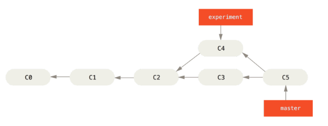
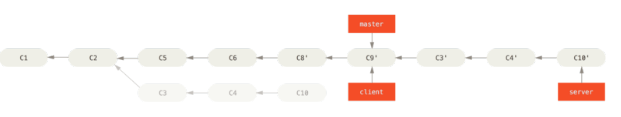
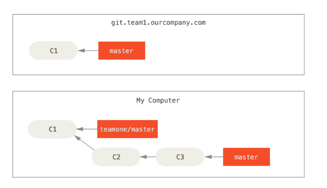

# Chapter 1. Getting Started

## Git Basics

### Snapshots, Not Differences

The major difference between Git and any other VCS (Subversion and friends included) is the way Git thinks about its data. Conceptually, most other systems
store information as a list of file-based changes. These systems (CVS, Subversion, Perforce, Bazaar, and so on) think of the information they keep as a set of files and the changes made to each file over time.


Git doesn’t think of or store its data this way. Instead, Git thinks of its data more like a set of snapshots of a miniature filesystem. Every time you commit,
or save the state of your project in Git, it basically takes a picture of what all your files look like at that moment and stores a reference to that snapshot. To be efficient, if files have not changed, Git doesn’t store the file again, just a link to the previous identical file it has already stored. Git thinks about its data more like a**stream of snapshots.**


This is an important distinction between Git and nearly all other VCSs. It makes Git reconsider almost every aspect of version control that most other systems copied from the previous generation. This makes Git more like a mini filesystem with some incredibly powerful tools built on top of it, rather than simply a VCS. We’ll explore some of the benefits you gain by thinking of your data this way when we cover Git branching in Chapter 3.

### Nearly Every Operation Is Local

Most operations in Git only need local files and resources to operate – generally no information is needed from another computer on your network. If you’re used to a CVCS where most operations have that network latency overhead, this aspect of Git will make you think that the gods of speed have blessed Git with unworldly powers. Because you have the entire history of the project right there on your local disk, most operations seem almost instantaneous.

For example, to browse the history of the project, Git doesn’t need to go out to the server to get the history and display it for you – it simply reads it directly
from your local database. This means you see the project history almost instantly. If you want to see the changes introduced between the current version of a file and the file a month ago, Git can look up the file a month ago and do a local difference calculation, instead of having to either ask a remote server to do it or pull an older version of the file from the remote server to do it locally.

This also means that there is very little you can’t do if you’re offline or off VPN. If you get on an airplane or a train and want to do a little work, you can commit happily until you get to a network connection to upload. If you go home and can’t get your VPN client working properly, you can still work. In many other systems, doing so is either impossible or painful. In Perforce, for example, you can’t do much when you aren’t connected to the server; and in Subversion and CVS, you can edit files, but you can’t commit changes to your database (because your database is offline). This may not seem like a huge deal, but you may be surprised what a big difference it can make.


### Git Has Integrity

Everything in Git is check-summed before it is stored and is then referred to by that checksum. This means it’s impossible to change the contents of any file or
directory without Git knowing about it. This functionality is built into Git at the lowest levels and is integral to its philosophy. You can’t lose information in transit or get file corruption without Git being able to detect it.

The mechanism that Git uses for this checksumming is called a SHA-1 hash. This is a 40-character string composed of hexadecimal characters (0–9 and a–f) and calculated based on the contents of a file or directory structure in Git. A SHA-1 hash looks something like this:

​		24b9da6552252987aa493b52f8696cd6d3b00373

You will see these hash values all over the place in Git because it uses them so much. In fact, Git stores everything in its database not by file name but by the hash value of its contents.

### Git Generally Only Adds Data

When you do actions in Git, nearly all of them only add data to the Git database. It is hard to get the system to do anything that is not undoable or to make it erase data in any way. As in any VCS, you can lose or mess up changes you haven’t committed yet; but after you commit a snapshot into Git, it is very difficult to lose, especially if you regularly push your database to another repository. 

This makes using Git a joy because we know we can experiment without the danger of severely screwing things up. For a more in-depth look at how Git stores its data and how you can recover data that seems lost, see “Undoing Things”.

### The Three States

Now, pay attention. This is the main thing to remember about Git if you want the rest of your learning process to go smoothly. Git has three main states that
your files can reside in: committed, modified, and staged. Committed means that the data is safely stored in your local database. Modified means that you have changed the file but have not committed it to your database yet. Staged means that you have marked a modified file in its current version to go into your next commit snapshot.

This leads us to the three main sections of a Git project: the Git directory, the working directory, and the staging area.


The Git directory is where Git stores the metadata and object database for your project. This is the most important part of Git, and it is what is copied when you clone a repository from another computer.

The working directory is a single checkout of one version of the project.

These files are pulled out of the compressed database in the Git directory and placed on disk for you to use or modify.

The staging area is a file, generally contained in your Git directory, that stores information about what will go into your next commit. It’s sometimes referred to as the “index”, but it’s also common to refer to it as the staging area.

The basic Git workflow goes something like this:

1. You modify files in your working directory.
2. You stage the files, adding snapshots of them to your staging area.
3. You do a commit, which takes the files as they are in the staging area and
stores that snapshot permanently to your Git directory.

If a particular version of a file is in the Git directory, it’s considered committed. If it has been modified and was added to the staging area, it is staged. And if it was changed since it was checked out but has not been staged, it is modified. In Chapter 2, you’ll learn more about these states and how you can either take advantage of them or skip the staged part entirely.

## First-Time Git Setup

```shell
sudo apt-get install git-all
```

   1./etc/gitconfig file: Contains values for every user on the system and all their repositories. If you pass the option --system to git config , it reads and writes from this file specifically.

2. ~/.gitconfig or ~/.config/git/config file: Specific to your user.
You can make Git read and write to this file specifically by passing the --global option.

3. config file in the Git directory (that is, .git/config ) of whatever repository you’re currently using: Specific to that single repository.

Each level overrides values in the previous level, so values in .git/config trump those in /etc/gitconfig .

```shell
$ git config --global user.name "John Doe"
$ git config --global user.email johndoe@example.com
```

If you want to override this with a different name or email address for spe-cific projects, you can run the command without the --global option when you’re in that project.


Now that your identity is set up, you can configure the default text editor that will be used when Git needs you to type in a message. If not configured, Git uses your system’s default editor.
If you want to use a different text editor, such as Emacs, you can do the following:

```shell
$ git config --global core.editor emacs
```

If you want to check your settings, you can use the git config --list com-
mand to list all the settings Git can find at that point:

```shell
$ git config --list
user.name=John Doe
user.email=johndoe@example.com
color.status=auto
color.branch=auto
color.interactive=auto
color.diff=auto
...
```

You can also check what Git thinks a specific key’s value is by typing git
config <key> :

```shell
$ git config user.name
John Doe
```


```
$ git help <verb>
$ git <verb> --help
$ man git-<verb>
```

# Chapter 2. Git Basics

## Getting a Git Repository

Initializing a Repository in an Existing Directory

```
$ git init
```

You can accomplish that with a few git add commands that specify the files you want to track, followed by a git commit :

```
$ git add *.c
$ git add LICENSE
$ git commit -m 'initial project version'
```

If you want to clone the repository into a directory named something other than “libgit2”, you can specify that as the next command-line option:

```
$ git clone https://github.com/libgit2/libgit2 mylibgit
```

## Recording Changes to the Repository

working directory can be in one of two states: tracked or untracked. Tracked files are files that were in the last snap- shot; they can be unmodified, modified, or staged. Untracked files are every- thing else – any files in your working directory that were not in your last snap- shot and are not in your staging area.

As you edit files, Git sees them as modified, because you’ve changed them since your last commit. You stage these modified files and then commit all your staged changes, and the cycle repeats.


### Checking the Status of Your Files

```
$ git status
On branch master
Your branch is up-to-date with 'origin/master'.
nothing to commit, working directory clean
```

### Tracking New Files

In order to begin tracking a new file, you use the command git add . To begin tracking the README file, you can run this:

```
$ git add README
$ git status
On branch master
Your branch is up-to-date with 'origin/master'.
Changes to be committed:
(use "git reset HEAD <file>..." to unstage)
new file:
README
```

You can tell that it’s staged because it’s under the “Changes to be committed” heading. If you commit at this point, the version of the file at the time you ran git add is what will be in the historical snapshot. You may recall that when you ran git init earlier, you then ran git add (files) – that was to begin tracking files in your directory. The git add command takes a path name for either a file or a directory; if it’s a directory, the command adds all the files in that directory recursively

### Staging Modified Files

Let’s change a file that was already tracked. If you change a previously tracked file called CONTRIBUTING.md and then run your git status command again, you get something that looks like this:

```
$ git status
On branch master
Your branch is up-to-date with 'origin/master'.
Changes to be committed:
	(use "git reset HEAD <file>..." to unstage)
		new file:
README
Changes not staged for commit:
	(use "git add <file>..." to update what will be committed)
(use "git checkout -- <file>..." to discard changes in working directory)
	modified:	CONTRIBUTING.md
```

The CONTRIBUTING.md file appears under a section named “Changes not staged for commit” – which means that a file that is tracked has been modified in the working directory but not yet staged. To stage it, you run the git add command. git add is a multipurpose command – you use it to begin tracking new files, to stage files, and to do other things like marking merge-conflicted files as resolved. It may be helpful to think of it more as “add this content to the next commit” rather than “add this file to the project”. Let’s run git add now to stage the CONTRIBUTING.md file, and then run git status again:

```
$ git add CONTRIBUTING.md
$ git status
On branch master
Your branch is up-to-date with 'origin/master'.
Changes to be committed:
(use "git reset HEAD <file>..." to unstage)
new file:
modified:
README
CONTRIBUTING.md
```

Both files are staged and will go into your next commit. At this point, suppose you remember one little change that you want to make in CONTRIBUTING.md before you commit it. You open it again and make that change, and you’re ready to commit. However, let’s run git status one more time:

```
$ vim CONTRIBUTING.md
$ git status
On branch master
Your branch is up-to-date with 'origin/master'.
Changes to be committed:
	(use "git reset HEAD <file>..." to unstage)
		new file:	README
		modified:	CONTRIBUTING.md

Changes not staged for commit:
	(use "git add <file>..." to update what will be committed)
	(use "git checkout -- <file>..." to discard changes in working directory)
		modified:  CONTRIBUTING.md
```

What the heck? Now CONTRIBUTING.md is listed as both staged and unstaged. How is that possible? It turns out that Git stages a file exactly as it is when
you run the git add command. If you commit now, the version of CONTRIBUTING.md as it was when you last ran the git add command is how it will go into the commit, not the version of the file as it looks in your working directory when you run git commit . If you modify a file after you run git add , you have to run git add again to stage the latest version of the file:

```
$ git add CONTRIBUTING.md
$ git status
On branch master
Your branch is up-to-date with 'origin/master'.
Changes to be committed:
(use "git reset HEAD <file>..." to unstage)
new file:
modified:
README
CONTRIBUTING.md
```

### Short Status

If you run git status -s or git status --short you get a far more simplified output from the command:

```
$ git status -s
 M README # modified in the working directory but not yet staged
MM Rakefile # modified, staged and then modified again, so there are changes to it that are both staged and unstaged.
A lib/git.rb
M lib/simplegit.rb # modified and staged
?? LICENSE.txt
```

New files that aren’t tracked have a ?? next to them, new files that have been added to the staging area have an A , modified files have an M and so on. the left-hand column indicates the status of the staging area and the right-hand column indicates the status of the working tree.

### Ignoring Files

```
$ cat .gitignore
*.[oa]
*~
```

The first line tells Git to ignore any files ending in “.o” or “.a” – object and archive files that may be the product of building your code.

he second line tells Git to ignore all files whose names end with a tilde ( ~ ), which is used by many text editors such as Emacs to mark temporary files.

The rules for the patterns you can put in the .gitignore file are as follows:

• Blank lines or lines starting with # are ignored.
• Standard glob patterns work.
• You can start patterns with a forward slash ( / ) to avoid recursivity.
• You can end patterns with a forward slash ( / ) to specify a directory.
• You can negate a pattern by starting it with an exclamation point ( ! ).

Glob patterns are like simplified regular expressions that shells use. An aster-isk ( * ) matches zero or more characters; [abc] matches any character inside the brackets (in this case a, b, or c); a question mark ( ? ) matches a single character; and brackets enclosing characters separated by a hyphen ( [0-9] ) match-es any character between them (in this case 0 through 9). You can also use two asterisks to match nested directories; a/**/z would match a/z , a/b/z , a/b/c/z , and so on.

```
# no .a files
*.a
# but do track lib.a, even though you're ignoring .a files above
!lib.a
# only ignore the TODO file in the current directory, not subdir/TODO
/TODO
# ignore all files in the build/ directory
build/
# ignore doc/notes.txt, but not doc/server/arch.txt
doc/*.txt
# ignore all .pdf files in the doc/ directory
doc/**/*.pd
```

https://github.com/github/gitignore

### Viewing Your Staged and Unstaged Changes


ou want to know exactly what you changed, not just which files were changed – you can use the git diff command. We’ll cover git diff in more detail later, but you’ll probably use it most often to answer these two questions: What have you changed but not yet staged? And what have you staged that you are about to commit? Al- though git status answers those questions very generally by listing the file names, git diff shows you the exact lines added and removed – the patch, as it were.

Let’s say you edit and stage the README file again and then edit the CONTRIBUTING.md file without staging it. If you run your git status command, you once again see something like this:

```
$ git status
On branch master
Your branch is up-to-date with 'origin/master'.
Changes to be committed:
	(use "git reset HEAD <file>..." to unstage)
		modified:	README
Changes not staged for commit:
	(use "git add <file>..." to update what will be committed)
	(use "git checkout -- <file>..." to discard changes in working directory)
		modified:	CONTRIBUTING.md
```

To see what you’ve changed but not yet staged, type git diff with no other arguments:

```
$ git diff
diff --git a/CONTRIBUTING.md b/CONTRIBUTING.md
index 8ebb991..643e24f 100644
--- a/CONTRIBUTING.md
+++ b/CONTRIBUTING.md
@@ -65,7 +65,8 @@ branch directly, things can get messy.
 Please include a nice description of your changes when you submit your PR;
 if we have to read the whole diff to figure out why you're contributing
 in the first place, you're less likely to get feedback and have your change
-merged in.
+merged in. Also, split your changes into comprehensive chunks if your patch is
+longer than a dozen lines.

If you are starting to work on a particular area, feel free to submit a PR
that highlights your work in progress (and note in the PR title that it's
```

That command compares what is in your working directory with what is in your staging area. The result tells you the changes you’ve made that you haven’t yet staged

If you want to see what you’ve staged that will go into your next commit, you can use git diff --staged . This command compares your staged changes to your last commit:

```
$ git diff --staged
diff --git a/README b/README
new file mode 100644
index 0000000..03902a1
--- /dev/null
+++ b/README
@@ -0,0 +1 @@
+My Project
```

It’s important to note that git diff by itself doesn’t show all changes made since your last commit – only changes that are still unstaged. This can be
confusing, because if you’ve staged all of your changes, git diff will give you no output.

For another example, if you stage the CONTRIBUTING.md file and then edit it, you can use git diff to see the changes in the file that are staged and the changes that are unstaged. If our environment looks like this:

```
$ git add CONTRIBUTING.md
$ echo '# test line' >> CONTRIBUTING.md
$ git status
On branch master
Your branch is up-to-date with 'origin/master'.
Changes to be committed:
	(use "git reset HEAD <file>..." to unstage)
	
		modified:	CONTRIBUTING.md
		
Changes not staged for commit:
	(use "git add <file>..." to update what will be committed)
	(use "git checkout -- <file>..." to discard changes in working directory)
	
		modified:	CONTRIBUTING.md
```

Now you can use git diff to see what is still unstaged:

```
$ git diff
diff --git a/CONTRIBUTING.md b/CONTRIBUTING.md
index 643e24f..87f08c8 100644
--- a/CONTRIBUTING.md
+++ b/CONTRIBUTING.md
@@ -119,3 +119,4 @@ at the
 ## Starter Projects

 See our [projects list](https://github.com/libgit2/libgit2/blob/development/PROJECTS.md).
+# test line
```

and git diff --cached to see what you’ve staged so far ( --staged and --cached are synonyms):

```
$ git diff --cached
diff --git a/CONTRIBUTING.md b/CONTRIBUTING.md
index 8ebb991..643e24f 100644
--- a/CONTRIBUTING.md
+++ b/CONTRIBUTING.md
@@ -65,7 +65,8 @@ branch directly, things can get messy.
 Please include a nice description of your changes when you submit your PR;
 if we have to read the whole diff to figure out why you're contributing
in the first place, you're less likely to get feedback and have your change
-merged in.
+merged in. Also, split your changes into comprehensive chunks if your patch is
+longer than a dozen lines.

 If you are starting to work on a particular area, feel free to submit a PR
 that highlights your work in progress (and note in the PR title that it's
```

### Committing Your Changes

Remember that anything that is still unstaged – any files you have created or modified that you haven’t run git add on since you edited them won’t go into this commit.

```
$ git commit
```

Alternatively

```
$ git commit -m "Story 182: Fix benchmarks for speed"
[master 463dc4f] Story 182: Fix benchmarks for speed
2 files changed, 2 insertions(+)
create mode 100644 README
```

which branch you committed to ( master ), what SHA-1 checksum the commit has ( 463dc4f ), how many files were
changed, and statistics about lines added and removed in the commit. Remember that the commit records the snapshot you set up in your staging area. Anything you didn’t stage is still sitting there modified; you can do another commit to add it to your history. Every time you perform a commit, you’re recording a snapshot of your project that you can revert to or compare to later.

### Skipping the Staging Area

Although it can be amazingly useful for crafting commits exactly how you want them, the staging area is sometimes a bit more complex than you need in your workflow. If you want to skip the staging area, Git provides a simple shortcut. Adding the -a option to the git commit command makes Git automatically stage every file that is already tracked before doing the commit, letting you skip the git add part:

```shell
$ git status
On branch master
Your branch is up-to-date with 'origin/master'.
Changes not staged for commit:
	(use "git add <file>..." to update what will be committed)
	(use "git checkout -- <file>..." to discard changes in working directory)

		modified:	CONTRIBUTING.md
no changes added to commit (use "git add" and/or "git commit -a")
$ git commit -a -m 'added new benchmarks'
[master 83e38c7] added new benchmarks
 1 file changed, 5 insertions(+), 0 deletions(-)
```

### Removing Files

To remove a file from Git, you have to remove it from your tracked files (more accurately, remove it from your staging area) and then commit. The git rm
command does that, and also removes the file from your working directory so you don’t see it as an untracked file the next time around.

If you simply remove the file from your working directory, it shows up under the “Changed but not updated” (that is, unstaged) area of your git status output:

```shell
$ rm PROJECTS.md
$ git status
On branch master
Your branch is up-to-date with 'origin/master'.
Changes not staged for commit:
	(use "git add/rm <file>..." to update what will be committed)
	(use "git checkout -- <file>..." to discard changes in working directory)
		deleted:	PROJECTS.md
no changes added to commit (use "git add" and/or "git commit -a")
```

Then, if you run git rm , it stages the file’s removal:

```shell
$ git rm PROJECTS.md
rm 'PROJECTS.md'
$ git status
On branch master
Your branch is up-to-date with 'origin/master'.
Changes to be committed:
	(use "git reset HEAD <file>..." to unstage)
		deleted:	PROJECTS.md
```

The next time you commit, the file will be gone and no longer tracked. If you modified the file and added it to the index already, you must force the removal with the -f option. This is a safety feature to prevent accidental removal of data that hasn’t yet been recorded in a snapshot and that can’t be recovered from Git.
Another useful thing you may want to do is to keep the file in your working tree but remove it from your staging area. In other words, you may want to keep the file on your hard drive but not have Git track it anymore. This is partic- ularly useful if you forgot to add something to your .gitignore file and accidentally staged it, like a large log file or a bunch of .a compiled files. To do this,  use the --cached option:

```shell
$ git rm --cached README
```

You can pass files, directories, and file-glob patterns to the git rm command. That means you can do things such as:

```shell
$ git rm log/\*.log
```

Note the backslash ( \ ) in front of the * . This is necessary because Git does its `own filename expansion` in addition to your shell’s filename expansion. This command removes all files that have the .log extension in the log/ directory. Or, you can do something like this:

```shell
$ git rm \*~
```

This command removes all files whose names end with a ~ .

### Moving Files

Unlike many other VCS systems, Git doesn’t explicitly track file movement. If you rename a file in Git, no metadata is stored in Git that tells it you renamed the file. However, Git is pretty smart about figuring that out after the fact – we’ll deal with detecting file movement a bit later.

Thus it’s a bit confusing that Git has a mv command. If you want to rename a file in Git, you can run something like:

```shell
$ git mv file_from file_to
```

and it works fine. In fact, if you run something like this and look at the status, you’ll see that Git considers it a renamed file

```shell
$ git mv README.md README
$ git status
On branch master
Your branch is up-to-date with 'origin/master'.
Changes to be committed:
(use "git reset HEAD <file>..." to unstage)
renamed:
README.md -> README
```

However, this is equivalent to running something like this:

```shell
$ mv README.md README
$ git rm README.md
$ git add README
```

Git figures out that it’s a rename implicitly, so it doesn’t matter if you rename a file that way or with the mv command. The only real difference is that mv is one command instead of three – it’s a convenience function. More importantly, you can use any tool you like to rename a file, and address the add/rm later, before you commit.

## Viewing the Commit History

The most basic and powerful tool to do this is the git log command. These examples use a very simple project called “simplegit”. To get the project, run

```shell
$ git clone https://github.com/schacon/simplegit-progit
```

When you run git log in this project, you should get output that looks something like this:

```shell
commit ca82a6dff817ec66f44342007202690a93763949 (HEAD -> master, origin/master, origin/HEAD)
Author: Scott Chacon <schacon@gmail.com>
Date:   Mon Mar 17 21:52:11 2008 -0700

    changed the verison number

commit 085bb3bcb608e1e8451d4b2432f8ecbe6306e7e7
Author: Scott Chacon <schacon@gmail.com>
Date:   Sat Mar 15 16:40:33 2008 -0700

    removed unnecessary test code

commit a11bef06a3f659402fe7563abf99ad00de2209e6
Author: Scott Chacon <schacon@gmail.com>
Date:   Sat Mar 15 10:31:28 2008 -0700

    first commit

```

By default, with no arguments, git log lists the commits made in that repository in reverse chronological order – that is, the most recent commits show up first. As you can see, this command lists each commit with its SHA-1 checksum, the author’s name and email, the date written, and the commit message.

One of the more helpful options is -p , which shows the difference introduced in each commit. You can also use -2 , which limits the output to only the last two entries:

```shell
ommit ca82a6dff817ec66f44342007202690a93763949 (HEAD -> master, origin/master, 
origin/HEAD)
Author: Scott Chacon <schacon@gmail.com>
Date:   Mon Mar 17 21:52:11 2008 -0700

    changed the verison number

diff --git a/Rakefile b/Rakefile
index a874b73..8f94139 100644
--- a/Rakefile
+++ b/Rakefile
@@ -5,7 +5,7 @@ require 'rake/gempackagetask'
 spec = Gem::Specification.new do |s|
     s.platform  =   Gem::Platform::RUBY
     s.name      =   "simplegit"
-    s.version   =   "0.1.0"
+    s.version   =   "0.1.1"
     s.author    =   "Scott Chacon"
     s.email     =   "schacon@gmail.com"
     s.summary   =   "A simple gem for using Git in Ruby code."

commit 085bb3bcb608e1e8451d4b2432f8ecbe6306e7e7
Author: Scott Chacon <schacon@gmail.com>
Date:   Sat Mar 15 16:40:33 2008 -0700

    removed unnecessary test code

diff --git a/lib/simplegit.rb b/lib/simplegit.rb
index a0a60ae..47c6340 100644
--- a/lib/simplegit.rb
+++ b/lib/simplegit.rb
@@ -18,8 +18,3 @@ class SimpleGit
     end
   
 end
-
-if $0 == __FILE__
-  git = SimpleGit.new
-  puts git.show
-end
\ No newline at end of file

```

This option displays the same information but with a diff directly following each entry. This is very helpful for code review or to quickly browse what happened during a series of commits that a collaborator has added. You can also use a series of summarizing options with git log . For example, if you want to see some abbreviated stats for each commit, you can use the --stat option:

```shell
commit ca82a6dff817ec66f44342007202690a93763949 (HEAD -> master, origin/master, origin/HEAD)
Author: Scott Chacon <schacon@gmail.com>
Date:   Mon Mar 17 21:52:11 2008 -0700

    changed the verison number

 Rakefile | 2 +-
 1 file changed, 1 insertion(+), 1 deletion(-)

commit 085bb3bcb608e1e8451d4b2432f8ecbe6306e7e7
Author: Scott Chacon <schacon@gmail.com>
Date:   Sat Mar 15 16:40:33 2008 -0700

    removed unnecessary test code

 lib/simplegit.rb | 5 -----
 1 file changed, 5 deletions(-)

commit a11bef06a3f659402fe7563abf99ad00de2209e6
Author: Scott Chacon <schacon@gmail.com>
Date:   Sat Mar 15 10:31:28 2008 -0700

    first commit

 README           |  6 ++++++
 Rakefile         | 23 +++++++++++++++++++++++
 lib/simplegit.rb | 25 +++++++++++++++++++++++++
 3 files changed, 54 insertions(+)
```

As you can see, the --stat option prints below each commit entry a list of modified files, how many files were changed, and how many lines in those files were added and removed. It also puts a summary of the information at the end.
Another really useful option is --pretty . This option changes the log output to formats other than the default. A few prebuilt options are available for you to use. The oneline option prints each commit on a single line, which is useful if you’re looking at a lot of commits. In addition, the short , full , and fuller options show the output in roughly the same format but with less or more information, respectively:

```shell
$ git log --pretty=oneline
ca82a6dff817ec66f44342007202690a93763949 changed the version number
085bb3bcb608e1e8451d4b2432f8ecbe6306e7e7 removed unnecessary test
a11bef06a3f659402fe7563abf99ad00de2209e6 first commit
```

The most interesting option is format , which allows you to specify your own log output format. This is especially useful when you’re generating output for machine parsing – because you specify the format explicitly, you know it won’t change with updates to Git:

```shell
$ git log --pretty=format:"%h - %an, %ar : %s"
ca82a6d - Scott Chacon, 14 years ago : changed the verison number
085bb3b - Scott Chacon, 14 years ago : removed unnecessary test code
a11bef0 - Scott Chacon, 14 years ago : first commit
```


You may be wondering what the difference is between author and committer. The author is the person who originally wrote the work, whereas the committer is the person who last applied the work. So, if you send in a patch to a project and one of the core members applies the patch, both of you get credit – you as the author, and the core member as the committer. We’ll cover this distinction a bit more in Chapter 5.

The oneline and format options are particularly useful with another log option called --graph . This option adds a nice little ASCII graph showing your branch and merge history:

```shell
$ git log --pretty=format:"%h %s" --graph
* 2d3acf9 ignore errors from SIGCHLD on trap
* 5e3ee11 Merge branch 'master' of git://github.com/dustin/grit
|\
| * 420eac9 Added a method for getting the current branch.
* | 30e367c timeout code and tests
* | 5a09431 add timeout protection to grit
* | e1193f8 support for heads with slashes in them
|/
* d6016bc require time for xmlschema
* 11d191e Merge branch 'defunkt' into local
```

Those are only some simple output-formatting options to git log – there are many more. Table 2-2 lists the options we’ve covered so far, as well as some other common formatting options that may be useful, along with how they change the output of the log command.


### Limiting Log Output

In addition to output-formatting options, git log takes a number of useful limiting options – that is, options that let you show only a subset of commits. You’ve seen one such option already – the -2 option, which show only the last two commits. In fact, you can do -<n> , where n is any integer to show the last n commits. In reality, you’re unlikely to use that often, because Git by default pipes all output through a pager so you see only one page of log output at a time.

However, the time-limiting options such as --since and --until are very useful. For example, this command gets the list of commits made in the last two weeks:

```shell
$ git log --since=2.weeks
```

This command works with lots of formats – you can specify a specific date like "2008-01-15" , or a relative date such as "2 years 1 day 3 minutes ago" .

You can also filter the list to commits that match some search criteria. The --author option allows you to filter on a specific author, and the --grep option lets you search for keywords in the commit messages. (Note that if you want to specify both author and grep options, you have to add --all-match or the command will match commits with either.)

Another really helpful filter is the -S option which takes a string and only shows the commits that introduced a change to the code that added or removed that string. For instance, if you wanted to find the last commit that added or removed a reference to a specific function, you could call:

```shell
$ git log -Sfunction_name
```

The last really useful option to pass to git log as a filter is a path. If you
specify a directory or file name, you can limit the log output to commits that
introduced a change to those files. This is always the last option and is general-
ly preceded by double dashes ( -- ) to separate the paths from the options.


For example, if you want to see which commits modifying test files in the Git source code history are merged and were committed by Junio Hamano in the month of October 2008, you can run something like this:

```shell
$ git log --pretty="%h - %s" --author=gitster --since="2008-10-01" \
--before="2008-11-01" --no-merges -- t/
5610e3b - Fix testcase failure when extended attributes are in use
acd3b9e - Enhance hold_lock_file_for_{update,append}() API
f563754 - demonstrate breakage of detached checkout with symbolic link HEAD
d1a43f2 - reset --hard/read-tree --reset -u: remove unmerged new paths
51a94af - Fix "checkout --track -b newbranch" on detached HEAD
b0ad11e - pull: allow "git pull origin $something:$current_branch" into an unborn branch
```

## Undoing Things

One of the common undos takes place when you commit too early and possibly forget to add some files, or you mess up your commit message. If you want to try that commit again, you can run commit with the --amend option:

```shell
$ git commit --amend
```

This command takes your staging area and uses it for the commit. If you’ve made no changes since your last commit (for instance, you run this command
immediately after your previous commit), then your snapshot will look exactly the same, and all you’ll change is your commit message.

The same commit-message editor fires up, but it already contains the message of your previous commit. You can edit the message the same as always, but it overwrites your previous commit.

As an example, if you commit and then realize you forgot to stage the changes in a file you wanted to add to this commit, you can do something like this:

```shell
$ git commit -m 'initial commit'
$ git add forgotten_file
$ git commit --amend
```

You end up with a single commit – the second commit replaces the results of the first.

### Unstaging a Staged File

The nice part is that the command you use to determine the state of those two areas also reminds you how to undo changes to them.For example, let’s say you’ve changed two files and want to commit them as two separate changes, but you accidentally type git add * and stage them
both. How can you unstage one of the two? The git status command reminds you:

```shell
$ git add *
$ git status
On branch master
Changes to be committed:
	(use "git reset HEAD <file>..." to unstage)
		renamed:   README.md -> README
		modified:	CONTRIBUTING.md
```

So, let’s use that advice to unstage the CONTRIBUTING.md file:

```shell
$ git reset HEAD CONTRIBUTING.md
Unstaged changes after reset:
M	CONTRIBUTING.md
$ git status
On branch master
Changes to be committed:
	(use "git reset HEAD <file>..." to unstage)

		renamed:	README.md -> README
Changes not staged for commit:
	(use "git add <file>..." to update what will be committed)
	(use "git checkout -- <file>..." to discard changes in working directory)
		modified:	CONTRIBUTING.md
```

> 'While git reset can be a dangerous command if you call it with --hard , in
> this instance the file in your working directory is not touched. Calling git
> reset without an option is not dangerous - it only touches your staging
> area'


### Unmodifying a Modified File

What if you realize that you don’t want to keep your changes to the CONTRIBUTING.md file? How can you easily unmodify it – revert it back to what it looked like when you last committed (or initially cloned, or however you got it into your working directory)? Luckily, git status tells you how to do that, too. In the last example output, the unstaged area looks like this:

```shell
Changes not staged for commit:
	(use "git add <file>..." to update what will be committed)
	(use "git checkout -- <file>..." to discard changes in working directory)

		modified:	CONTRIBUTING.md
```

It tells you pretty explicitly how to discard the changes you’ve made. Let’s do
what it says:

```shell
$ git checkout -- CONTRIBUTING.md
$ git status
On branch master
Changes to be committed:
	(use "git reset HEAD <file>..." to unstage)
		renamed:	README.md -> README
```

You can see that the changes have been reverted.

>It’s important to understand that git checkout -- <file> is a dangerous
>command. Any changes you made to that file are gone – Git just copied
>another file over it. Don’t ever use this command unless you absolutely
>know that you don’t want the file.

If you would like to keep the changes you’ve made to that file but still need to get it out of the way for now, we’ll go over stashing and branching in Chap-
ter 3; these are generally better ways to go. Remember, anything that is committed in Git can almost always be recovered. Even commits that were on branches that were deleted or commits that were overwritten with an --amend commit can be recovered (see “Data Recovery” for data recovery). However, anything you lose that was never committed is likely never to be seen again.

## Working with Remotes

### Showing Your Remotes

To see which remote servers you have configured, you can run the git remote command. It lists the shortnames of each remote handle you’ve specified. If you’ve cloned your repository, you should at least see origin – that is the default name Git gives to the server you cloned from:

```shell
$ git clone https://github.com/schacon/ticgit
Cloning into 'ticgit'...
remote: Reusing existing pack: 1857, done.
remote: Total 1857 (delta 0), reused 0 (delta 0)
Receiving objects: 100% (1857/1857), 374.35 KiB | 268.00 KiB/s, done.
Resolving deltas: 100% (772/772), done.
Checking connectivity... done.
$ cd ticgit
$ git remote
origin
```

You can also specify -v , which shows you the URLs that Git has stored for the shortname to be used when reading and writing to that remote:

```shell
$ cd grit
$ git remote -v
bakkdoor https://github.com/bakkdoor/grit (fetch)
bakkdoor https://github.com/bakkdoor/grit (push)
cho45	 https://github.com/cho45/grit (fetch)
cho45    https://github.com/cho45/grit (push)
defunkt  https://github.com/defunkt/grit (fetch)
defunkt  https://github.com/defunkt/grit (push)
koke     git://github.com/koke/grit.git (fetch)
koke     git://github.com/koke/grit.git (push)
origin   git@github.com:mojombo/grit.git (fetch)
origin   git@github.com:mojombo/grit.git (push)
```

### Adding Remote Repositories

We’ve mentioned and given some demonstrations of how the clone command implicitly adds the origin remote for you. Here’s how to add a new remote explicitly. To add a new remote Git repository as a shortname you can reference easily, run git remote add <shortname> <url> :

```shell
$ git remote
origin
$ git remote add pb https://github.com/paulboone/ticgit
$ git remote -v
origin https://github.com/schacon/ticgit (fetch)
origin https://github.com/schacon/ticgit (push)
pb     https://github.com/paulboone/ticgit (fetch)
pb     https://github.com/paulboone/ticgit (push)
```

Now you can use the string pb on the command line in lieu of the whole URL. For example, if you want to fetch all the information that Paul has but that you don’t yet have in your repository, you can run git fetch pb :

```shell
$ git fetch pb
remote: Counting objects: 43, done.
remote: Compressing objects: 100% (36/36), done.
remote: Total 43 (delta 10), reused 31 (delta 5)
Unpacking objects: 100% (43/43), done.
From https://github.com/paulboone/ticgit
* [new branch]		master		-> pb/master
* [new branch]		ticgit		-> pb/ticgit
```

Paul’s master branch is now accessible locally as pb/master – you can merge it into one of your branches, or you can check out a local branch at that point if you want to inspect it. (We’ll go over what branches are and how to use them in much more detail in Chapter 3.)

### Fetching and Pulling from Your Remotes

As you just saw, to get data from your remote projects, you can run:

```shell
$ git fetch [remote-name]
```

The command goes out to that remote project and pulls down all the data from that remote project that you don’t have yet. After you do this, you should have references to all the branches from that remote, which you can merge in or inspect at any time.


If you clone a repository, the command automatically adds that remote repository under the name “origin”. So, git fetch origin fetches any new
work that has been pushed to that server since you cloned (or last fetched from) it. It’s important to note that the git fetch command only downloads
the data to your local repository – it doesn’t automatically merge it with any of your work or modify what you’re currently working on. You have to merge it manually into your work when you’re ready


If your current branch is set up to track a remote branch (see the next section and Chapter 3 for more information), you can use the git pull command
to automatically fetch and then merge that remote branch into your current branch. This may be an easier or more comfortable workflow for you; and by default, the git clone command automatically sets up your local master branch to track the remote master branch (or whatever the default branch is
called) on the server you cloned from. Running git pull generally fetches data from the server you originally cloned from and automatically tries to merge it into the code you’re currently working on.


### Pushing to Your Remotes

When you have your project at a point that you want to share, you have to push it upstream. The command for this is simple: git push [remote-name]
[branch-name] . If you want to push your master branch to your origin server (again, cloning generally sets up both of those names for you automatically), then you can run this to push any commits you’ve done back up to the server:

```shell
$ git push origin master
```


### Inspecting a Remote

If you want to see more information about a particular remote, you can use the git remote show [remote-name] command. If you run this command with a particular shortname, such as origin , you get something like this:

```shell
$ git remote show origin
* remote origin
  Fetch URL: https://github.com/schacon/ticgit
  Push URL: https://github.com/schacon/ticgit
  HEAD branch: master
  Remote branches:
    master									tracked
    dev-branch								tracked
  Local branch configured for 'git pull':
    master merges with remote master
  Local ref configured for 'git push':
    master pushes to master (up to date)
```

It lists the URL for the remote repository as well as the tracking branch information. The command helpfully tells you that if you’re on the master branch
and you run git pull , it will automatically merge in the master branch on the remote after it fetches all the remote references. It also lists all the remote references it has pulled down.

That is a simple example you’re likely to encounter. When you’re using Git more heavily, however, you may see much more information from git remote show :

```shell
$ git remote show origin
* remote origin
	URL: https://github.com/my-org/complex-project
	Fetch URL: https://github.com/my-org/complex-project
	Push URL: https://github.com/my-org/complex-project
	HEAD branch: master
	Remote branches:
		master							tracked
		dev-branch						tracked
		markdown-strip					tracked
		issue-43						new (next fetch will store in remotes/origin)
		issue-45						new (next fetch will store in remotes/origin)
		refs/remotes/origin/issue-11	stale (use 'git remote prune' to remove)
	Local branches configured for 'git pull':
		dev-branch merges with remote dev-branch
		master			merges with remote master
	Local refs configured for 'git push':
		dev-branch						pushes to dev-branch	(up to date)
		markdown-strip					pushes to markdown-strip(up to date)
		master							pushes to master		(up to date)
```

This command shows which branch is automatically pushed to when you run git push while on certain branches. It also shows you which remote
branches on the server you don’t yet have, which remote branches you have that have been removed from the server, and multiple local branches that are able to merge automatically with their remote-tracking branch when you run git pull .

### Removing and Renaming Remotes

```shell
$ git remote rename pb paul
$ git remote
origin
paul
```

It’s worth mentioning that this changes all your remote-tracking branch names, too. What used to be referenced at pb/master is now at paul/master .

If you want to remove a remote for some reason – you’ve moved the server or are no longer using a particular mirror, or perhaps a contributor isn’t contributing anymore – you can use git remote rm :

```shell
$ git remote rm paul
$ git remote
origin
```

## Tagging

Like most VCSs, Git has the ability to tag specific points in history as being important. Typically people use this functionality to mark release points (v1.0, and so on). In this section, you’ll learn how to list the available tags, how to create new tags, and what the different types of tags are.

### Listing Your Tags

Listing the available tags in Git is straightforward. Just type git tag :

```shell
$ git tag
v0.1
v1.3
```

This command lists the tags in alphabetical order; the order in which they appear has no real importance.

You can also search for tags with a particular pattern. The Git source repo, for instance, contains more than 500 tags. If you’re only interested in looking at the 1.8.5 series, you can run this:

```shell
$ git tag -l "v1.8.5*"
v1.8.5
v1.8.5-rc0
v1.8.5-rc1
v1.8.5-rc2
v1.8.5-rc3
v1.8.5.1
v1.8.5.2
v1.8.5.3
v1.8.5.4
v1.8.5.5
```

### Creating Tags

Git uses two main types of tags: lightweight and annotated.

A lightweight tag is very much like a branch that doesn’t change – it’s just a pointer to a specific commit.

Annotated tags, however, are stored as full objects in the Git database. They’re checksummed; contain the tagger name, email, and date; have a tag-
ging message; and can be signed and verified with GNU Privacy Guard (GPG). It’s generally recommended that you create annotated tags so you can have all this information; but if you want a temporary tag or for some reason don’t want to keep the other information, lightweight tags are available too.


### Annotated Tags

Creating an annotated tag in Git is simple. The easiest way is to specify -a when you run the tag command:

```shell
$ git tag -a v1.4 -m "my version 1.4"
$ git tag
v0.1
v1.3
v1.4
```

The -m specifies a tagging message, which is stored with the tag. If you don’t specify a message for an annotated tag, Git launches your editor so you can type it in.

You can see the tag data along with the commit that was tagged by using the git show command:

```shell
$ git show v1.4
tag v1.4
Tagger: Ben Straub <ben@straub.cc>
Date:	Sat May 3 20:19:12 2014 -0700

my version 1.4

commit ca82a6dff817ec66f44342007202690a93763949
Author: Scott Chacon <schacon@gee-mail.com>
Date:	Mon Mar 17 21:52:11 2008 -0700
	
	changed the version number
```

### Lightweight Tags

Another way to tag commits is with a lightweight tag. This is basically the com- mit checksum stored in a file – no other information is kept. To create a lightweight tag, don’t supply the -a , -s , or -m option:

```shell
$ git tag v1.4-lw
$ git tag
v0.1
v1.3
v1.4
v1.4-lw
v1.5
```

This time, if you run git show on the tag, you don’t see the extra tag information. The command just shows the commit:

```shell
$ git show v1.4-lw
commit ca82a6dff817ec66f44342007202690a93763949
Author: Scott Chacon <schacon@gee-mail.com>
Date:	Mon Mar 17 21:52:11 2008 -0700

	changed the version number
```

### Tagging Later

You can also tag commits after you’ve moved past them. Suppose your commit history looks like this:

```shell
$ git log --pretty=oneline
15027957951b64cf874c3557a0f3547bd83b3ff6 Merge branch 'experiment'
a6b4c97498bd301d84096da251c98a07c7723e65 beginning write support
0d52aaab4479697da7686c15f77a3d64d9165190 one more thing
6d52a271eda8725415634dd79daabbc4d9b6008e Merge branch 'experiment'
0b7434d86859cc7b8c3d5e1dddfed66ff742fcbc added a commit function
4682c3261057305bdd616e23b64b0857d832627b added a todo file
166ae0c4d3f420721acbb115cc33848dfcc2121a started write support
9fceb02d0ae598e95dc970b74767f19372d61af8 updated rakefile
964f16d36dfccde844893cac5b347e7b3d44abbc commit the todo
8a5cbc430f1a9c3d00faaeffd07798508422908a updated readme
```

Now, suppose you forgot to tag the project at v1.2, which was at the “updated rakefile” commit. You can add it after the fact. To tag that commit, you specify the commit checksum (or part of it) at the end of the command:

```shell
$ git tag -a v1.2 9fceb02
```

```shell
$ git tag
v0.1
v1.2
v1.3
v1.4
v1.4-lw
v1.5

$ git show v1.2
tag v1.2
Tagger: Scott Chacon <schacon@gee-mail.com>
Date:	Mon Feb 9 15:32:16 2009 -0800

version 1.2
commit 9fceb02d0ae598e95dc970b74767f19372d61af8
Author: Magnus Chacon <mchacon@gee-mail.com>
Date:
Sun Apr 27 20:43:35 2008 -0700

	updated rakefile
...
```

### Sharing Tags

By default, the git push command doesn’t transfer tags to remote servers.You will have to explicitly push tags to a shared server after you have created them. This process is just like sharing remote branches – you can run git push origin [tagname] .

```shell
$ git push origin v1.5
Counting objects: 14, done.
Delta compression using up to 8 threads.
Compressing objects: 100% (12/12), done.
Writing objects: 100% (14/14), 2.05 KiB | 0 bytes/s, done.
Total 14 (delta 3), reused 0 (delta 0)
To git@github.com:schacon/simplegit.git
 * [new tag]		v1.5 -> v1.5
```

If you have a lot of tags that you want to push up at once, you can also use the --tags option to the git push command. This will transfer all of your tags to the remote server that are not already there.

```shell
$ git push origin --tags
Counting objects: 1, done.
Writing objects: 100% (1/1), 160 bytes | 0 bytes/s, done.
Total 1 (delta 0), reused 0 (delta 0)
To git@github.com:schacon/simplegit.git
 * [new tag]			v1.4 -> v1.4
 * [new tag]			v1.4-lw -> v1.4-lw
```

### Checking out Tags

You can’t really check out a tag in Git, since they can’t be moved around. If you want to put a version of your repository in your working directory that looks like a specific tag, you can create a new branch at a specific tag with git checkout -b [branchname] [tagname] :

```shell
$ git checkout -b version2 v2.0.0
Switched to a new branch 'version2'
```

Of course if you do this and do a commit, your version2 branch will be slightly different than your v2.0.0 tag since it will move forward with your new changes, so do be careful.

## Git Aliases

Before we finish this chapter on basic Git, there’s just one little tip that can make your Git experience simpler, easier, and more familiar: aliases. We won’t refer to them or assume you’ve used them later in the book, but you should probably know how to use them.

Git doesn’t automatically infer your command if you type it in partially. If you don’t want to type the entire text of each of the Git commands, you can easily set up an alias for each command using git config . Here are a couple of examples you may want to set up:

```shell
$ git config --global alias.co checkout
$ git config --global alias.br branch
$ git config --global alias.ci commit
$ git config --global alias.st status
```


This means that, for example, instead of typing git commit , you just need to type git ci . As you go on using Git, you’ll probably use other commands
frequently as well; don’t hesitate to create new aliases. This technique can also be very useful in creating commands that you think should exist. For example, to correct the usability problem you encountered with unstaging a file, you can add your own unstage alias to Git:

```shell
$ git config --global alias.unstage 'reset HEAD --'
```

This makes the following two commands equivalent:

```shell
$ git unstage fileA
$ git reset HEAD -- fileA
```

This seems a bit clearer. It’s also common to add a last command, like this:

```shell
$ git config --global alias.last 'log -1 HEAD'
```

This way, you can see the last commit easily:

```shell
$ git last
commit 66938dae3329c7aebe598c2246a8e6af90d04646
Author: Josh Goebel <dreamer3@example.com>
Date:	Tue Aug 26 19:48:51 2008 +0800

	test for current head
	Signed-off-by: Scott Chacon <schacon@example.com>
```


As you can tell, Git simply replaces the new command with whatever you alias it for. However, maybe you want to run an external command, rather than a Git subcommand. In that case, you start the command with a ! character. This is useful if you write your own tools that work with a Git repository. We can demonstrate by aliasing git visual to run gitk :

```shell
$ git config --global alias.visual '!gitk'
```

### Summary

At this point, you can do all the basic local Git operations – creating or cloning a repository, making changes, staging and committing those changes, and viewing the history of all the changes the repository has been through. Next, we’ll cover Git’s killer feature: its branching model.

# Chapter 3. Git Branching

Some people refer to Git’s branching model as its “killer feature,” and it cer-
tainly sets Git apart in the VCS community.The way Git
branches is incredibly lightweight, making branching operations nearly instan-
taneous, and switching back and forth between branches generally just as fast.

## Branches in a Nutshell

Git then creates a commit object that has the metadata and a pointer to the root project tree so it can re-create that snapshot when needed.

Your Git repository now contains five objects: one blob for the contents of each of your three files, one tree that lists the contents of the directory and
specifies which file names are stored as which blobs, and one commit with the pointer to that root tree and all the commit metadata.


If you make some changes and commit again, the next commit stores a pointer to the commit that came immediately before it.


A branch in Git is simply a lightweight movable pointer to one of these commits. The default branch name in Git is master . As you start making commits, you’re given a master branch that points to the last commit you made. Every time you commit, it moves forward automatically.

>The “master” branch in Git is not a special branch. It is exactly like any
>other branch. The only reason nearly every repository has one is that the
>git init command creates it by default and most people don’t bother to
>change it.


### Creating a New Branch

```shell
$ git branch testing
```

This creates a new pointer to the same commit you’re currently on.


How does Git know what branch you’re currently on? It keeps a special pointer called HEAD . Note that this is a lot different than the concept of HEAD in
other VCSs you may be used to, such as Subversion or CVS. In Git, this is a pointer to the local branch you’re currently on. In this case, you’re still on master . The git branch command only created a new branch – it didn’t switch to that branch.


You can easily see this by running a simple git log command that shows you where the branch pointers are pointing. This option is called --decorate .

```shell
$ git log --oneline --decorate
f30ab (HEAD -> master, testing) add feature #32 - ability to add new formats to the central
34ac2 Fixed bug #1328 - stack overflow under certain conditions
98ca9 The initial commit of my project
```

### Switching Branches

```shell
$ git checkout testing
```

This moves HEAD to point to the testing branch.


What is the significance of that? Well, let’s do another commit:
```cpp
$ vim test.rb
$ git commit -a -m 'made a change'
```


This is interesting, because now your testing branch has moved forward, but your master branch still points to the commit you were on when you ran git checkout to switch branches. Let’s switch back to the master branch:

```shell
$ git checkout master
```


That command did two things. It moved the HEAD pointer back to point to the master branch, and it reverted the files in your working directory back to
the snapshot that master points to. This also means the changes you make from this point forward will diverge from an older version of the project. It essentially rewinds the work you’ve done in your testing branch so you can go in a different direction

Let’s make a few changes and commit again:

```shell
$ vim test.rb
$ git commit -a -m 'made other changes'
```


You can also see this easily with the git log command. If you run git log --oneline --decorate --graph --all it will print out the history of your commits, showing where your branch pointers are and how your history has diverged.

```shell
$ git log --oneline --decorate --graph --all
* c2b9e (HEAD, master) made other changes
| * 87ab2 (testing) made a change
|/
* f30ab add feature #32 - ability to add new formats to the
* 34ac2 fixed bug #1328 - stack overflow under certain conditions
* 98ca9 initial commit of my project
```

Because a branch in Git is in actuality a simple file that contains the 40 character SHA-1 checksum of the commit it points to, branches are cheap to create and destroy. Creating a new branch is as quick and simple as writing 41 bytes to a file (40 characters and a newline).

## Basic Branching and Merging

Let’s go through a simple example of branching and merging with a workflow that you might use in the real world. You’ll follow these steps:
1. Do work on a web site.
2. Create a branch for a new story you’re working on.
3. Do some work in that branch.
At this stage, you’ll receive a call that another issue is critical and you need a
hotfix. You’ll do the following:
1. Switch to your production branch.
2. Create a branch to add the hotfix.
3. After it’s tested, merge the hotfix branch, and push to production.
4. Switch back to your original story and continue working.

### Basic Branching


```shell
$ git checkout -b iss53
Switched to a new branch "iss53"
```

This is shorthand for:

```shell
$ git branch iss53
$ git checkout iss53
```


```shell
$ vim index.html
$ git commit -a -m 'added a new footer [issue 53]'
```


note that if your working directory or staging area has uncommitted changes that conflict with the branch you’re checking
out, Git won’t let you switch branches.

It’s best to have a clean working state when you switch branches. There are ways to get around this (namely, stashing and commit amending) that we’ll cover later on, in “Stashing and Cleaning”. For now, let’s assume you’ve committed all your changes, so you can switch back to your master branch:

> $ git stash
>
>$ git stash list
>
>$ git stash apply stash@{2} 
>
>$ git stash apply # recent

```shell
$ git checkout master
Switched to branch 'master'
```

```shell
$ git checkout -b hotfix
Switched to a new branch 'hotfix'
$ vim index.html
$ git commit -a -m 'fixed the broken email address'
[hotfix 1fb7853] fixed the broken email address
 1 file changed, 2 insertions(+)
```


```shell
$ git checkout master
$ git merge hotfix
Updating f42c576..3a0874c
Fast-forward
index.html | 2 ++
1 file changed, 2 insertions(+)
```


After your super-important fix is deployed, you’re ready to switch back to the work you were doing before you were interrupted. However, first you’ll delete the hotfix branch, because you no longer need it – the master branch points at the same place. You can delete it with the -d option to git branch :

```shell
$ git branch -d hotfix
Deleted branch hotfix (3a0874c).
```

Now you can switch back to your work-in-progress branch on issue #53 and continue working on it.

```shell
$ git checkout iss53
Switched to branch "iss53"
$ vim index.html
$ git commit -a -m 'finished the new footer [issue 53]'
[iss53 ad82d7a] finished the new footer [issue 53]
 1 file changed, 1 insertion(+)
```


It’s worth noting here that the work you did in your hotfix branch is not  contained in the files in your iss53 branch. If you need to pull it in, you can
merge your master branch into your iss53 branch by running git merge master , or you can wait to integrate those changes until you decide to pull the iss53 branch back into master later.

### Basic Merging

Suppose you’ve decided that your issue #53 work is complete and ready to be merged into your master branch. In order to do that, you’ll merge your iss53 branch into master , much like you merged your hotfix branch earlier. All you have to do is check out the branch you wish to merge into and then run the git merge command:

```shell
$ git checkout master
Switched to branch 'master'
$ git merge iss53
Merge made by the 'recursive' strategy.
index.html |	1 +
1 file changed, 1 insertion(+)
```

This looks a bit different than the hotfix merge you did earlier. In this case, your development history has diverged from some older point. Because the
commit on the branch you’re on isn’t a direct ancestor of the branch you’re merging in, Git has to do some work. In this case, Git does a simple three-way merge, using the two snapshots pointed to by the branch tips and the common ancestor of the two.


Instead of just moving the branch pointer forward, Git creates a new snap- shot that results from this three-way merge and automatically creates a new commit that points to it. This is referred to as a merge commit, and is special in that it has more than one parent.


It’s worth pointing out that Git determines the best common ancestor to use for its merge base; this is different than older tools like CVS or Subversion (before version 1.5), where the developer doing the merge had to figure out the best merge base for themselves. This makes merging a heck of a lot easier in Git than in these other systems.

Now that your work is merged in, you have no further need for the iss53 branch. You can close the ticket in your ticket-tracking system, and delete the branch:

```shell
$ git branch -d iss53
```

### Basic Merge Conflicts

Occasionally, this process doesn’t go smoothly. If you changed the same part of the same file differently in the two branches you’re merging together, Git won’t be able to merge them cleanly. If your fix for issue #53 modified the same part of a file as the hotfix , you’ll get a merge conflict that looks something like this:

```shell
$ git merge iss53
Auto-merging index.html
CONFLICT (content): Merge conflict in index.html
Automatic merge failed; fix conflicts and then commit the result.
```

Git hasn’t automatically created a new merge commit. It has paused the process while you resolve the conflict. If you want to see which files are unmerged at any point after a merge conflict, you can run git status :

```shell
$ git status
On branch master
You have unmerged paths.
	(fix conflicts and run "git commit")
Unmerged paths:
	(use "git add <file>..." to mark resolution)
		
		both modified:		index.html
		
no changes added to commit (use "git add" and/or "git commit -a")
```

Anything that has merge conflicts and hasn’t been resolved is listed as unmerged. Git adds standard conflict-resolution markers to the files that have
conflicts, so you can open them manually and resolve those conflicts. Your file contains a section that looks something like this:

```shell
<<<<<<< HEAD:index.html
<div id="footer">contact : email.support@github.com</div>
=======
<div id="footer">
please contact us at support@github.com
</div>
>>>>>>> iss53:index.html
```

This means the version in HEAD (your master branch, because that was what you had checked out when you ran your merge command) is the top part of
that block (everything above the ======= ), while the version in your iss53 branch looks like everything in the bottom part. In order to resolve the conflict, you have to either choose one side or the other or merge the contents yourself. For instance, you might resolve this conflict by replacing the entire block with this:

```shell
<div id="footer">
please contact us at email.support@github.com
</div>
```

This resolution has a little of each section, and the` <<<<<<<` ,` =======` , and `>>>>>>>` lines have been completely removed. After you’ve resolved each of these sections in each conflicted file, run `git add` on each file to mark it as resolved. Staging the file marks it as resolved in Git.

If you want to use a graphical tool to resolve these issues, you can run git mergetool , which fires up an appropriate visual merge tool and walks you through the conflicts:

```shell
$ git mergetool

This message is displayed because 'merge.tool' is not configured.
See 'git mergetool --tool-help' or 'git help config' for more details.
'git mergetool' will now attempt to use one of the following tools:
opendiff kdiff3 tkdiff xxdiff meld tortoisemerge gvimdiff diffuse diffmerge ecmerge p4merge
Merging:
index.html

Normal merge conflict for 'index.html':
  {local}: modified file
  {remote}: modified file
Hit return to start merge resolution tool (opendiff):
```

If you want to use a merge tool other than the default (Git chose opendiff in this case because the command was run on a Mac), you can see all the sup-
ported tools listed at the top after “one of the following tools.” Just type the name of the tool you’d rather use.

>If you need more advanced tools for resolving tricky merge conflicts, we
>cover more on merging in “Advanced Merging”.


After you exit the merge tool, Git asks you if the merge was successful. If you tell the script that it was, it stages the file to mark it as resolved for you. You can run git status again to verify that all conflicts have been resolved:

```shell
$ git status
On branch master
All conflicts fixed but you are still merging.
	(use "git commit" to conclude merge)

Changes to be committed:

	modified:		index.html
```


If you’re happy with that, and you verify that everything that had conflicts has been staged, you can type git commit to finalize the merge commit. The commit message by default looks something like this:

```shell
Merge branch 'iss53'
Conflicts:
index.html
#
# It looks like you may be committing a merge.
# If this is not correct, please remove the file
#		.git/MERGE_HEAD
# and try again.
# Please enter the commit message for your changes. Lines starting
# with '#' will be ignored, and an empty message aborts the commit.
# On branch master
# All conflicts fixed but you are still merging.
#
# Changes to be committed:
# 		modified:	index.html
#
```

You can modify that message with details about how you resolved the merge if you think it would be helpful to others looking at this merge in the future  why you did what you did, if it’s not obvious.

## Branch Management

The `git branch` command does more than just create and delete branches. If you run it with no arguments, you get a simple listing of your current branches:

```shell
$ git branch
  iss53
* master
  testing
```

To see the last commit on each branch, you can run git branch -v :

```shell
$ git branch -v
  iss53   93b412c fix javascript issue
* master  7a98805 Merge branch 'iss53'
  testing 782fd34 add scott to the author list in the readmes
```

The useful --merged and --no-merged options can filter this list to branches that you have or have not yet merged into the branch you’re currently on. To
see which branches are already merged into the branch you’re on, you can run `git branch --merged` :

```shell
$ git branch --merged
  iss53
* master
```

Branch-
es on this list without the * in front of them are generally fine to delete with git `branch -d` ; you’ve already incorporated their work into another branch, so you’re not going to lose anything.

To see all the branches that contain work you haven’t yet merged in, you can run git branch `--no-merged `:

```shell
$ git branch --no-merged
testing
```

This shows your other branch. Because it contains work that isn’t merged in yet, trying to delete it with git branch -d will fail:

```shell
$ git branch -d testing
error: The branch 'testing' is not fully merged.
If you are sure you want to delete it, run 'git branch -D testing'.
```

## Branching Workflows

### Long-Running Branches

Many Git developers have a workflow that embraces this approach, such as having only code that is entirely stable in their master branch – possibly only
code that has been or will be released. They have another parallel branch named develop or next that they work from or use to test stability – it isn’t
necessarily always stable, but whenever it gets to a stable state, it can be merged into master . It’s used to pull in topic branches (short-lived branches, like your earlier iss53 branch) when they’re ready, to make sure they pass all the tests and don’t introduce bugs.


It’s generally easier to think about them as work silos, where sets of commits graduate to a more stable silo when they’re fully tested.


### Topic Branches

Topic branches, however, are useful in projects of any size. A topic branch is a short-lived branch that you create and use for a single particular feature or related work. This is something you’ve likely never done with a VCS before because it’s generally too expensive to create and merge branches. But in Git it’s common to create, work on, merge, and delete branches several times a day.


Now, let’s say you decide you like the second solution to your issue best ( iss91v2 ); and you showed the dumbidea branch to your coworkers, and it
turns out to be genius. You can throw away the original iss91 branch (losing commits C5 and C6 ) and merge in the other two. Your history then looks like this:


We will go into more detail about the various possible workflows for your Git project in Chapter 5, so before you decide which branching scheme your next project will use, be sure to read that chapter. It’s important to remember when you’re doing all this that these branches are completely local. When you’re branching and merging, everything is being done only in your Git repository – no server communication is happening.


## Remote Branches

Remote references are references (pointers) in your remote repositories, including branches, tags, and so on. You can get a full list of remote references explicitly with `git ls-remote [remote] `, or` git remote show [remote]` for remote branches as well as more information. Nevertheless, a more common way is to take advantage of remote-tracking branches.

Remote-tracking branches are references to the state of remote branches. They’re local references that you can’t move; they’re moved automatically for you whenever you do any network communication. Remote-tracking branches act as bookmarks to remind you where the branches in your remote repositories were the last time you connected to them

They take the form (remote)/(branch) . For instance, if you wanted to see what the master branch on your origin remote looked like as of the last time you communicated with it, you would check the origin/master branch. If you were working on an issue with a partner and they pushed up an iss53 branch, you might have your own local iss53 branch; but the branch on the server would point to the commit at origin/iss53 .

This may be a bit confusing, so let’s look at an example. Let’s say you have a Git server on your network at git.ourcompany.com . If you clone from this, Git’s clone command automatically names it origin for you, pulls down all its data, creates a pointer to where its master branch is, and names it origin/master locally. Git also gives you your own local master branch starting at the same place as origin’s master branch, so you have something to work from.

>“ORIGIN” IS NOT SPECIAL
>
>Just like the branch name “master” does not have any special meaning in Git, neither does “origin”. While “master” is the default name for a
>starting branch when you run git init which is the only reason it’s widely used, “origin” is the default name for a remote when you run git clone . If you run git clone -o booyah instead, then you will have booyah/master as your default remote branch.


If you do some work on your local master branch, and, in the meantime, someone else pushes to git.ourcompany.com and updates its master branch, then your histories move forward differently. Also, as long as you stay out of contact with your origin server, your origin/master pointer doesn’t move.


To synchronize your work, you run a git fetch origin command. This command looks up which server “origin” is (in this case, it’s git.ourcompany.com ), fetches any data from it that you don’t yet have, and updates your lo- cal database, moving your origin/master pointer to its new, more up-to-date position.

### Pushing

When you want to share a branch with the world, you need to push it up to a remote that you have write access to. Your local branches aren’t automatically synchronized to the remotes you write to – you have to explicitly push the branches you want to share. That way, you can use private branches for work you don’t want to share, and push up only the topic branches you want to collaborate on.

If you have a branch named serverfix that you want to work on with others, you can push it up the same way you pushed your first branch. Run git push`<remote> <branch> `:

```shell
$ git push origin serverfix
Counting objects: 24, done.
Delta compression using up to 8 threads.
Compressing objects: 100% (15/15), done.
Writing objects: 100% (24/24), 1.91 KiB | 0 bytes/s, done.
Total 24 (delta 2), reused 0 (delta 0)
To https://github.com/schacon/simplegit
 * [new branch]		serverfix -> serverfix
```

This is a bit of a shortcut. Git automatically expands the serverfix branchname out to refs/heads/serverfix:refs/heads/serverfix , which means, “Take my serverfix local branch and push it to update the remote’s serverfix branch.” We’ll go over the refs/heads/ part in detail in Chapter 10, but you can generally leave it off. You can also do git push origin serverfix:serverfix , which does the same thing – it says, “Take my serverfix and make it the remote’s serverfix.” You can use this format to push a local branch into a remote branch that is named differently. If you didn’t want it to be called serverfix on the remote, you could instead run git push origin server- fix:awesomebranch to push your local serverfix branch to the awesome- branch branch on the remote project.

>DON’T TYPE YOUR PASSWORD EVERY TIME
>
>If you’re using an HTTPS URL to push over, the Git server will ask you for your username and password for authentication. By default it will prompt you on the terminal for this information so the server can tell if you’re allowed to push.
>
>If you don’t want to type it every single time you push, you can set up a “credential cache”. The simplest is just to keep it in memory for a few minutes, which you can easily set up by running git config --global credential.helper cache .
>
>For more information on the various credential caching options avail-
>able, see “Credential Storage”.

The next time one of your collaborators fetches from the server, they will get a reference to where the server’s version of serverfix is under the remote branch origin/serverfix :

```shell
$ git fetch origin
remote: Counting objects: 7, done.
remote: Compressing objects: 100% (2/2), done.
remote: Total 3 (delta 0), reused 3 (delta 0)
Unpacking objects: 100% (3/3), done.
From https://github.com/schacon/simplegit
* [new branch]		serverfix		-> origin/serverfix
```

It’s important to note that when you do a fetch that brings down new remote-tracking branches, you don’t automatically have local, editable copies of them. In other words, in this case, you don’t have a new serverfix branch – you only have an origin/serverfix pointer that you can’t modify.

To merge this work into your current working branch, you can run git merge origin/serverfix . If you want your own serverfix branch that you can work on, you can base it off your remote-tracking branch:

```shell
$ git checkout -b serverfix origin/serverfix
Branch serverfix set up to track remote branch serverfix from origin.
Switched to a new branch 'serverfix'
```

This gives you a local branch that you can work on that starts where origin/serverfix is.

### Tracking Branches

Checking out a local branch from a remote-tracking branch automatically cre- ates what is called a “tracking branch” (and the branch it tracks is called an “upstream branch”). Tracking branches are local branches that have a direct re- lationship to a remote branch. If you’re on a tracking branch and type git pull , Git automatically knows which server to fetch from and branch to merge into.

 When you clone a repository, it generally automatically creates a master branch that tracks origin/master . However, you can set up other tracking branches if you wish – ones that track branches on other remotes, or don’t track the master branch. The simple case is the example you just saw, running git checkout -b [branch] [remotename]/[branch] . This is a common enough operation that git provides the --track shorthand:

```shell
$ git checkout --track origin/serverfix
Branch serverfix set up to track remote branch serverfix from origin.
Switched to a new branch 'serverfix'
```

In fact, this is so common that there’s even a shortcut for that shortcut. If the branch name you’re trying to checkout (a) doesn’t exist and (b) exactly matches a name on only one remote, Git will create a tracking branch for you:

```shell
$ git checkout serverfix
Branch serverfix set up to track remote branch serverfix from origin.
Switched to a new branch 'serverfix'
```

To set up a local branch with a different name than the remote branch, you can easily use the first version with a different local branch name:

```shell
$ git checkout -b sf origin/serverfix
Branch sf set up to track remote branch serverfix from origin.
Switched to a new branch 'sf'
```

Now, your local branch sf will automatically pull from origin/serverfix . If you already have a local branch and want to set it to a remote branch you just pulled down, or want to change the upstream branch you’re tracking, you can use the -u or --set-upstream-to option to git branch to explicitly set it at any time

```shell
$ git branch -u origin/serverfix
Branch serverfix set up to track remote branch serverfix from origin.
```

>UPSTREAM SHORTHAND
>
>When you have a tracking branch set up, you can reference its upstream branch with the @{upstream} or @{u} shorthand. So if you’re on the master branch and it’s tracking origin/master , you can say something like git merge @{u} instead of git merge origin/master if you wish.

If you want to see what tracking branches you have set up, you can use the -vv option to git branch . This will list out your local branches with more information including what each branch is tracking and if your local branch is ahead, behind or both.

```shell
$ git branch -vv
  iss53		7e424c3 [origin/iss53: ahead 2] forgot the brackets
  master	1ae2a45 [origin/master] deploying index fix
* serverfix f8674d9 [teamone/server-fix-good: ahead 3, behind 1] this should do it
  testing	5ea463a trying something new
```

So here we can see that our iss53 branch is tracking origin/iss53 and is “ahead” by two, meaning that we have two commits locally that are not pushed to the server. We can also see that our master branch is tracking origin/master and is up to date. Next we can see that our serverfix branch is tracking the server-fix-good branch on our teamone server and is ahead by three and behind by one, meaning that there is one commit on the server we haven’t merged in yet and three commits locally that we haven’t pushed. Finally we can see that our testing branch is not tracking any remote branch.

It’s important to note that these numbers are only since the last time you fetched from each server. This command does not reach out to the servers, it’s telling you about what it has cached from these servers locally. If you want totally up to date ahead and behind numbers, you’ll need to fetch from all your remotes right before running this. You could do that like this: `git fetch --all; git branch -vv`

### Pulling

While the git fetch command will fetch down all the changes on the server that you don’t have yet, it will not modify your working directory at all. It will simply get the data for you and let you merge it yourself. However, there is a command called git pull which is essentially a git fetch immediately followed by a git merge in most cases. If you have a tracking branch set up as demonstrated in the last section, either by explicitly setting it or by having it created for you by the clone or checkout commands, git pull will look up what server and branch your current branch is tracking, fetch from that server and then try to merge in that remote branch.

Generally it’s better to simply use the fetch and merge commands explicitly as the magic of git pull can often be confusing.

## Rebasing

In Git, there are two main ways to integrate changes from one branch into another: the merge and the rebase . In this section you’ll learn what rebasing is, how to do it, why it’s a pretty amazing tool, and in what cases you won’t want to use it.

### The Basic Rebase

If you go back to an earlier example from “Basic Merging”, you can see that you diverged your work and made commits on two different branches.


The easiest way to integrate the branches, as we’ve already covered, is the merge command. It performs a three-way merge between the two latest branch snapshots ( C3 and C4 ) and the most recent common ancestor of the two ( C2 ), creating a new snapshot (and commit).



However, there is another way: you can take the patch of the change that was introduced in C4 and reapply it on top of C3 . In Git, this is called rebasing. With the rebase command, you can take all the changes that were committed on one branch and replay them on another one.

In this example, you’d run the following:

```shell
$ git checkout experiment
$ git rebase master
First, rewinding head to replay your work on top of it...
Applying: added staged command
```

It works by going to the common ancestor of the two branches (the one you’re on and the one you’re rebasing onto), getting the diff introduced by each commit of the branch you’re on, saving those diffs to temporary files, resetting the current branch to the same commit as the branch you are rebasing onto, and finally applying each change in turn.


At this point, you can go back to the master branch and do a fast-forward merge.

```shell
$ git checkout master
$ git merge experiment
```


Now, the snapshot pointed to by C4' is exactly the same as the one that was pointed to by C5 in the merge example. There is no difference in the end product of the integration, but rebasing makes for a cleaner history. If you examine the log of a rebased branch, it looks like a linear history: it appears that all the work happened in series, even when it originally happened in parallel.

Often, you’ll do this to make sure your commits apply cleanly on a remote branch – perhaps in a project to which you’re trying to contribute but that you don’t maintain. In this case, you’d do your work in a branch and then rebase your work onto origin/master when you were ready to submit your patches to the main project. That way, the maintainer doesn’t have to do any integration work – just a fast-forward or a clean apply.

Note that the snapshot pointed to by the final commit you end up with, whether it’s the last of the rebased commits for a rebase or the final merge commit after a merge, is the same snapshot – it’s only the history that is different. Rebasing replays changes from one line of work onto another in the order they were introduced, whereas merging takes the endpoints and merges them together.

### More Interesting Rebases

You can also have your rebase replay on something other than the rebase target branch. Take a history like Figure 3-31, for example. You branched a topic branch ( server ) to add some server-side functionality to your project, and made a commit. Then, you branched off that to make the client-side changes( client ) and committed a few times. Finally, you went back to your server branch and did a few more commits.


Suppose you decide that you want to merge your client-side changes into your mainline for a release, but you want to hold off on the server-side changes until it’s tested further. You can take the changes on client that aren’t on server ( C8 and C9 ) and replay them on your master branch by using the --onto option of git rebase :

```shell
$ git rebase --onto master server client
```

This basically says, “Check out the client branch, figure out the patches from the common ancestor of the client and server branches, and then replay them onto master .” It’s a bit complex, but the result is pretty cool.


Now you can fast-forward your master branch (see Figure 3-33):

```shell
$ git checkout master
$ git merge client
```


Let’s say you decide to pull in your server branch as well. You can rebase the server branch onto the master branch without having to check it out first by running git rebase [basebranch] [topicbranch] – which checks out the topic branch (in this case, server ) for you and replays it onto the base branch ( master ):

```shell
$ git rebase master server
```

This replays your server work on top of your master work, as shown in



Then, you can fast-forward the base branch ( master ):

```shell
$ git checkout master
$ git merge server
```

You can remove the client and server branches because all the work is integrated and you don’t need them anymore, leaving your history for this entire process looking like Figure:

```shell
$ git branch -d client
$ git branch -d server
```


### The Perils of Rebasing

Ahh, but the bliss of rebasing isn’t without its drawbacks, which can be summed up in a single line:

**Do not rebase commits that exist outside your repository**

If you follow that guideline, you’ll be fine. If you don’t, people will hate you, and you’ll be scorned by friends and family.

When you rebase stuff, you’re abandoning existing commits and creating new ones that are similar but different. If you push commits somewhere and others pull them down and base work on them, and then you rewrite those commits with git rebase and push them up again, your collaborators will have to re-merge their work and things will get messy when you try to pull their work back into yours.

Let’s look at an example of how rebasing work that you’ve made public can cause problems. Suppose you clone from a central server and then do some work off that. Your commit history looks like this:



Now, someone else does more work that includes a merge, and pushes that work to the central server. You fetch it and merge the new remote branch into your work, making your history look something like this:


Next, the person who pushed the merged work decides to go back and rebase their work instead; they do a git push --force to overwrite the history on the server. You then fetch from that server, bringing down the new commits.


​					Figure	3-38

Now you’re both in a pickle. If you do a git pull , you’ll create a merge
commit which includes both lines of history, and your repository will look like
this:


​					Figure 3-39

If you run a git log when your history looks like this, you’ll see two commits that have the same author, date, and message, which will be confusing.
Furthermore, if you push this history back up to the server, you’ll reintroduce all those rebased commits to the central server, which can further confuse people. It’s pretty safe to assume that the other developer doesn’t want C4 and C6 to be in the history; that’s why they rebased in the first place.

### Rebase When You Rebase

If you **do** find yourself in a situation like this, Git has some further magic that might help you out. If someone on your team force pushes changes that overwrite work that you’ve based work on, your challenge is to figure out what is yours and what they’ve rewritten.

It turns out that in addition to the commit SHA-1 checksum, Git also calculates a checksum that is based just on the patch introduced with the commit.
This is called a “patch-id”.

If you pull down work that was rewritten and rebase it on top of the new commits from your partner, Git can often successfully figure out what is uniquely yours and apply them back on top of the new branch.

For instance, in the previous scenario, if instead of doing a merge when we’re at Figure 3-38 we run git rebase teamone/master , Git will:

• Determine what work is unique to our branch (C2, C3, C4, C6, C7)
• Determine which are not merge commits (C2, C3, C4)
• Determine which have not been rewritten into the target branch (just C2
and C3, since C4 is the same patch as C4')
• Apply those commits to the top of teamone/master


So instead of the result we see in Figure 3-39, we would end up with something more like Figure 3-40.


This only works if C4 and C4’ that your partner made are almost exactly the same patch. Otherwise the rebase won’t be able to tell that it’s a duplicate and will add another C4-like patch (which will probably fail to apply cleanly, since the changes would already be at least somewhat there).

You can also simplify this by running a git pull --rebase instead of a normal git pull . Or you could do it manually with a git fetch followed by a git rebase teamone/master in this case.

If you are using git pull and want to make --rebase the default, you can set the pull.rebase config value with something like git config --global pull.rebase true .

If you treat rebasing as a way to clean up and work with commits before you push them, and if you only rebase commits that have never been available publicly, then you’ll be fine. If you rebase commits that have already been pushed publicly, and people may have based work on those commits, then you may be in for some frustrating trouble, and the scorn of your teammates.

If you or a partner does find it necessary at some point, make sure everyone knows to run git pull --rebase to try to make the pain after it happens a little bit simpler.

### Rebase vs. Merge

Now that you’ve seen rebasing and merging in action, you may be wondering which one is better. Before we can answer this, let’s step back a bit and talk about what history means.


One point of view on this is that your repository’s commit history is a **record of what actually happened**. It’s a historical document, valuable in its own right, and shouldn’t be tampered with. From this angle, changing the commit history is almost blasphemous; you’re lying about what actually transpired. So what if there was a messy series of merge commits? That’s how it happened, and the repository should preserve that for posterity.

The opposing point of view is that the commit history is the **story of how your project was made**. You wouldn’t publish the first draft of a book, and the manual for how to maintain your software deserves careful editing. This is the camp that uses tools like rebase and filter-branch to tell the story in the way that’s best for future readers. 

Now, to the question of whether merging or rebasing is better: hopefully you’ll see that it’s not that simple. Git is a powerful tool, and allows you to do many things to and with your history, but every team and every project is differ- ent. Now that you know how both of these things work, it’s up to you to decide which one is best for your particular situation.

In general the way to get the best of both worlds is to rebase local changes you’ve made but haven’t shared yet before you push them in order to clean up your story, but never rebase anything you’ve pushed somewhere.

## Summary

We’ve covered basic branching and merging in Git. You should feel comfortable creating and switching to new branches, switching between branches and merging local branches together. You should also be able to share your branches by pushing them to a shared server, working with others on shared branches and rebasing your branches before they are shared. Next, we’ll cover what you’ll need to run your own Git repository-hosting server.

# Chapter 4. Git on the Server


