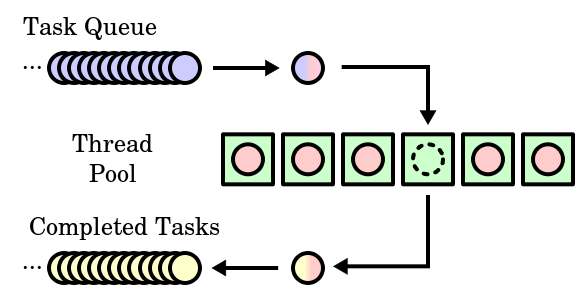

# Thread Pool

https://github.com/mtrebi/thread-pool

```
// VS 2017
cd <project-folder>
mkdir build
cd build/
cmake .. "Visual Studio 17 2022"


// Linux
cd <project-folder>
mkdir build
cd build/
cmake ..
make

```



- *Tasks Queue*. This is where the work that has to be done is stored.
- *Thread Pool*. This is set of threads (or workers) that continuously take work from the queue and do it.
- *Completed Tasks*. When the Thread has finished the work we return "something" to notify that the work has finished.

in case two threads try to take the same works at the same time, we need using lock to implementation mutex operates.

## Submit function

- Accept any function with any parameters.
- Return "something" immediately to avoid blocking main thread. This returned object should **eventually** contain the result of the operation.

```cpp
// Submit a function to be executed asynchronously by the pool
template<typename F, typename...Args>
auto submit(F&& f, Args&&... args) -> std::future<decltype(f(args...))> {
    // beacuse return type that depends on the input parameters of the function
    // we using decltype to delay type deduction
	// Create a function with bounded parameters ready to execute
	std::function<decltype(f(args...))()> func = std::bind(std::forward<F>(f), std::forward<Args>(args)...);
	// Encapsulate it into a shared ptr in order to be able to copy construct / assign 
	auto task_ptr = std::make_shared<std::packaged_task<decltype(f(args...))()>>(func);

	// Wrap packaged task into void function
	std::function<void()> wrapper_func = [task_ptr]() {
	  (*task_ptr)(); 
	};

	// Enqueue generic wrapper function
	m_queue.enqueue(wrapperfunc);

	// Wake up one thread if its waiting
	m_conditional_lock.notify_one();

	// Return future from promise
	return task_ptr->get_future();
}
```

### right value

Rvalue references solve at least two problems:

1. Implementing move semantics
2. Perfect forwarding

> The original definition of lvalues and rvalues from the earliest days of C is as follows: An lvalue is an expression e that may appear on the left or on the right hand side of an assignment, whereas an rvalue is an expression that can only appear on the right hand side of an assignment.


http://www.open-std.org/jtc1/sc22/wg21/docs/papers/2006/n2027.html#:~:text=Rvalue%20references%20is%20a%20small,performance%20and%20more%20robust%20libraries.

e.g.:

```cpp
A&  a_ref3 = A();  // Error!
A&& a_ref4 = A();  // Ok
```

*Question:* Why on Earth would we want to do this?

It turns out that the combination of rvalue references and lvalue references is just what is needed to easily code *move semantics*. The rvalue reference can also be used to achieve *perfect forwarding*, a heretofore unsolved problem in C++. From a casual programmer's perspective, what we get from rvalue references is more general and better performing libraries.

` Move Semantics`

```cpp
template <class T> swap(T& a, T& b)
{
    T tmp(a);   // now we have two copies of a
    a = b;      // now we have two copies of b
    b = tmp;    // now we have two copies of tmp (aka a)
}
```

But, we didn't want to have *any* copies of `a` or `b`, we just wanted to swap them. Let's try again:

```cpp
template <class T> swap(T& a, T& b)
{
    T tmp(std::move(a));
    a = std::move(b);   
    b = std::move(tmp);
}
```

In this particular case, we could have optimized `swap` by a specialization. However, we can't specialize every function that copies a large object just before it deletes or overwrites it. That would be unmanageable.

The first task of rvalue references is to allow us to implement `move()` without verbosity, or rutime overhead.

`move`

The `move` function really does very little work. All `move` does is accept either an lvalue or rvalue argument, and return it as an rvalue *without* triggering a copy construction:

```cpp
template <class T>
typename remove_reference<T>::type&&
move(T&& a)
{
    return a;
}
```


It is now up to client code to overload key functions on whether their argument is an lvalue or rvalue (e.g. copy constructor and assignment operator). When the argument is an lvalue, the argument must be copied from. When it is an rvalue, it can safely be moved from.

```cpp
template <class T>
class clone_ptr
{
private:
    T* ptr;
public:
    // construction
    explicit clone_ptr(T* p = 0) : ptr(p) {}

    // destruction
    ~clone_ptr() {delete ptr;}

    // copy semantics
    clone_ptr(const clone_ptr& p)
        : ptr(p.ptr ? p.ptr->clone() : 0) {}

    clone_ptr& operator=(const clone_ptr& p)
    {
        if (this != &p)
        {
            delete ptr;
            ptr = p.ptr ? p.ptr->clone() : 0;
        }
        return *this;
    }

    // move semantics
    clone_ptr(clone_ptr&& p)
        : ptr(p.ptr) {p.ptr = 0;}

    clone_ptr& operator=(clone_ptr&& p)
    {
        std::swap(ptr, p.ptr);
        return *this;
    }

    // Other operations
    T& operator*() const {return *ptr;}
    // ...
};
```

For classes made up of other classes (via either containment or inheritance), the move constructor and move assignment can easily be coded using the `std::move` function:

```cpp
class Derived
    : public Base
{
    std::vector<int> vec;
    std::string name;
    // ...
public:
    // ...
    // move semantics
    Derived(Derived&& x)              // rvalues bind here
        : Base(std::move(x)), 
          vec(std::move(x.vec)),
          name(std::move(x.name)) { }

    Derived& operator=(Derived&& x)   // rvalues bind here
    {
        Base::operator=(std::move(x));
        vec  = std::move(x.vec);
        name = std::move(x.name);
        return *this;
    }
    // ...
};
```

Note :

above that the argument `x` is treated as an lvalue internal to the move functions, even though it is declared as an rvalue reference parameter. That's why it is necessary to say `move(x)` instead of just `x` when passing down to the base class. This is a key safety feature of move semantics designed to prevent accidently moving twice from some named variable. All moves occur only from rvalues, or with an explicit cast to rvalue such as using `std::move`. *If you have a name for the variable, it is an lvalue.*

`Movable but Non-Copyable Types`

Some types are not amenable to copy semantics but can still be made movable. For example:

- `fstream`
- `unique_ptr` (non-shared, non-copyable ownership)
- A type representing a thread of execution

Movable but non-copyable types can also safely be put into standard containers. If the container needs to "copy" an element internally (e.g. vector reallocation) it will move the element instead of copy it.

```cpp
vector<unique_ptr<base>> v1, v2;
v1.push_back(unique_ptr<base>(new derived()));  // ok, moving, not copying
...
v2 = v1;             // Compile time error.  This is not a copyable type.
v2 = move(v1);       // Move ok.  Ownership of pointers transferred to v2.
```

Many standard algorithms benefit from moving elements of the sequence as opposed to copying them. This not only provides better performance (like the improved `std::swap` implementation described above), but also allows these algorithms to operate on movable but non-copyable types. For example the following code sorts a `vector<unique_ptr<T>>` based on comparing the pointed-to types:

```cpp
struct indirect_less
{
    template <class T>
    bool operator()(const T& x, const T& y)
        {return *x < *y;}
};
...
std::vector<std::unique_ptr<A>> v;
...
std::sort(v.begin(), v.end(), indirect_less())
```


As `sort` moves the `unique_ptr`'s around, it will use `swap` (which no longer requires `Copyability`) or move construction / move assignment. Thus during the entire algorithm, the invariant that each item is owned and referenced by one and only one smart pointer is maintained. If the algorithm were to attempt a copy (say by programming mistake) a compile time error would result.


`Perfect Forwarding`

```cpp
template <class T>
std::shared_ptr<T>
factory()   // no argument version
{
    return std::shared_ptr<T>(new T);
}

template <class T, class A1>
std::shared_ptr<T>
factory(const A1& a1)   // one argument version
{
    return std::shared_ptr<T>(new T(a1));
}

// all the other versions
```

In the interest of brevity, we will focus on just the one-parameter version. For example:

```cpp
std::shared_ptr<A> p = factory<A>(5);
```

*Question:* What if `T`'s constructor takes a parameter by non-const reference?

In that case, we get a compile-time error as the const-qualifed argument of the `factory` function will not bind to the non-const parameter of `T`'s constructor.

To solve that problem, we could use non-const parameters in our factory functions:

```cpp
template <class T, class A1>
std::shared_ptr<T>
factory(A1& a1)
{
    return std::shared_ptr<T>(new T(a1));
}
```

This example worked with our first version of `factory`, but now it's broken: The "`5`" causes the `factory` template argument to be deduced as `int&` and subsequently will not bind to the rvalue "`5`". Neither solution so far is right. Each breaks reasonable and common code.

*Question:* What about overloading on every combination of `AI&` and `const AI&`?

This would allow us to handle all examples, but at a cost of an exponential explosion: For our two-parameter case, this would require 4 overloads. For a three-parameter `factory` we would need 8 additional overloads. For a four-parameter `factory` we would need 16, and so on. This is not a scalable solution.

Rvalue references offer a simple, scalable solution to this problem:

```cpp
template <class T, class A1>
std::shared_ptr<T>
factory(A1&& a1)
{
 return std::shared_ptr<T>(new T(std::forward<A1>(a1)));
}
```

Now rvalue arguments can bind to the `factory` parameters. If the argument is const, that fact gets deduced into the `factory` template parameter type.

*Question:* What is that `forward` function in our solution?

Like `move`, `forward` is a simple standard library function used to express our intent directly and explicitly, rather than through potentially cryptic uses of references. We want to forward the argument `a1`, so we simply say so.

Here, `forward` preserves the lvalue/rvalue-ness of the argument that was passed to `factory`. If an rvalue is passed to `factory`, then an rvalue will be passed to `T`'s constructor with the help of the `forward` function. Similarly, if an lvalue is passed to `factory`, it is forwarded to `T`'s constructor as an lvalue.

The definition of `forward` looks like this:

```
template <class T>
struct identity
{
 typedef T type;
};

template <class T>
T&& forward(typename identity<T>::type&& a)
{
 return a;
}
```


### right value reference and  universal reference

https://isocpp.org/blog/2012/11/universal-references-in-c11-scott-meyers

```cpp
Widget&& var1 = someWidget;      // here, “&&” means rvalue reference
 
auto&& var2 = var1;              // here, “&&” does not mean rvalue reference
 
template<typename T>
void f(std::vector<T>&& param);  // here, “&&” means rvalue reference
 
template<typename T>
void f(T&& param);               // here, “&&”does not mean rvalue referenc
```

Key :

```
If a variable or parameter is declared to have type T&& for some deduced type T, that variable or parameter is a universal reference.
```

Like all references, universal references **must be initialized**, and it is a universal reference’s initializer that determines whether it represents an lvalue reference or an rvalue reference:

- If the expression initializing a universal reference is an lvalue, the universal reference becomes an lvalue reference.
- If the expression initializing the universal reference is an rvalue, the universal reference becomes an rvalue reference.

This information is useful only if you are able to distinguish lvalues from rvalues. A precise definition for these terms is difficult to develop (the C++11 standard generally specifies whether an expression is an lvalue or an rvalue on a case-by-case basis), but in practice, the following suffices:

- If you can take the address of an expression, the expression is an lvalue.
- If the type of an expression is an lvalue reference (e.g., `T&` or `const T&`, etc.), that expression is an lvalue. 
- Otherwise, the expression is an rvalue. Conceptually (and typically also in fact), rvalues correspond to temporary objects, such as those returned from functions or created through implicit type conversions. Most literal values (e.g., `10` and `5.3`) are also rvalues.

```cpp
std::vector<int> v;     // v[0] is a rvalue , because you can use v[0] = 1 etc.
...
auto&& val = v[0];               // val becomes an lvalue reference 
```

