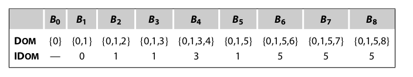

## Dominance Frontier

A definition in node n forces a φ-function at join points that lie just outside the region of the CFG that n dominates. More formally, a definition in node n forces a corresponding φ-function at any join point m where (1) n dominates a predecessor of m (q ∈ preds(m) and n ∈ Dom(q)), and (2) n does not strictly dominate m. (Using strict dominance rather than dominance allows a φ-function at the start of a single-block loop. In that case, n = m, and $m \notin Dom(n)- \{ n \}$.) \We call the collection of nodes m that have this property with respect to n the dominance frontier of n, denoted DF(n).

**Informally, df(n) contains the first nodes reachable from n that n does not dominate, on each cfg path leaving n.** (by this we could quick caculate by hand)


$DOM(B_5) = {B_5, B_6, B_7, B_8}$

$DF(B_5) = {B_3}$

ALG:




```
run:
n = B_3, IDOM(B_3) = B_1
	p = {B_2, B_7,}
	1. runner = B_2, neq B_1
		DF{B_2} += B_3
		runner = IDOM(B_2) = B_1  eq B_1, terminal
	2. runner = B_7, neq B_1
		DF{B_7} += B_3
		runner = IDOM(B_7) = B_5  neq B_1
		DF{B_5} += B_3
		runner = IDOM(B_5) = B_1  eq B_1, terminal
...
so, DF(B_5) = B_3
```

why?

we need satisfied two properties:

(1) n dominates a predecessor of m (q ∈ preds(m) and n ∈ Dom(q))

 (2) n does not strictly dominate m. 

prove:

since n has multiple predecessors, so impossible for p dom n, 

beside, p(runner) dom itself and IDOM(p) dom p, p is the predecessor of n

that means, *1. runner dominates a predecessor of n (dom p)*

we test *runner neq IDOM(n)*

means *2. runner does not strictly dominate n*, otherwise runner must first reach IDOM(n) 

(by the property of dominator tree)