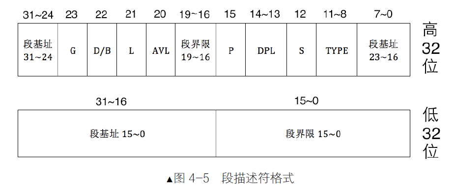

### BIOS 是如何苏醒的

在开机的一瞬间，也就是接电的一瞬间，CPU 的cs：ip 寄存器被强制初始化为0xF000：0xFFF0。由于开机的时候处于实模式，再重复一遍加深印象，在实模式下的段基址要乘以16，也就是左移4位，于是0xF000：0xFFF0 的等效地址将是0xFFFF0。上面说过了，此地址便是BIOS 的入口地址

既然此处只有16 字节的空间了，这只能说明BIOS 真正的代码不在这，那此处的代码只能是个跳转指令才能解释得通了

继续看第二个框框，里面有条指令jmp far f000：e05b，这是条跳转指令，也就是证明了在内存物理地址0xFFFF0 处的内容是一条跳转指令，我们的判断是正确的。那CPU 的执行流是跳到哪里了呢？段基址0xf000 左移4 位+0xe05b，即跳向了0xfe05b 处，这是BIOS 代码真正开始的地方。

接下来 BIOS 便马不停蹄地检测内存、显卡等外设信息，当检测通过，并初始化好硬件后，开始在内存中0x000～0x3FF 处建立数据结构，中断向量表IVT 并填写中断例程。

### MBR

在 MBR 引导扇区中存储引导程序，为的是从BIOS 手中接过系统的控制权，也就是处理器的使用权。任何一棒的接力都是由上一棒跳到下一棒，也就是上一棒得知道下一棒在哪里才能跳过去，否则权利还是交不出去。BIOS 知道MBR 在0 盘0 道1 扇区，这是约定好的，因此它会将0 盘0 道1 扇区中的MBR 引导程序加载到物理地址0x7c00，然后跳过去执行，这样BIOS 就把处理器使用权移交给MBR 了。

MBR 引导扇区中除了引导程序外，还有64 字节大小的分区表，里面是分区信息。分区表中每个分区表项占16 字节，因此MBR 分区表中可容纳4 个分区，这4 个分区就是“次引导程序”的候选人群，MBR 引导程序开始遍历这4 个分区，想找到合适的人选并把系统控制权交给他。

通常情况下这个“次引导程序”就是操作系统提供的加载器，因此MBR 引导程序的任务就，因此MBR 引导程序的任务就是把控制权交给操作系统加载器，由该加载器完成操作系统的自举，最终使控制权交付给操作系统内核核。但是各分区都有可能存在操作系统，MBR 也不知道操作系统在哪里，它甚至不知道分区上的二进制01 串是指令，还是普通数据，好吧，它根本分不清楚上面的是什么，谈何权利交接呢。

为了让 MBR 知道哪里有操作系统，我们在分区时，如果想在某个分区中安装操作系统，就用分区工具将该分区设置为活动分区，设置活动分区的本质就是把分区表中该分区对应的分区表项中的活动标记为0x80。MBR 知道“活动分区”意味着该分区中存在操作系统，这也是约定好的。活动分区标记位于分区表项中最开始的1 字节（有关分区内容，后面介绍分区的章节中会细说），其值要么为0x80，要么为0，其他值都是非法的。0x80 表示此分区上有引导程序，0 表示没引导程序，该分区不可引导。MBR 在分析分区表时通过辨识“活动分区”的标记0x80 开始找活动分区，如果找到了，就将CPU 使用权交给此分区上的引导程序，此引导程序通常是内核加载器，下面就直接以它为例。

“控制权交接”是处理器从“上一棒选手”跳到“下一棒选手”来完成的，内核加载器的入口地址是这里所说的“下一棒选手”，但是内核加载器在哪里呢？虽然分区那么大，但MBR 最想去看的是内核加载器，不想盲目地看看。因此您想到了，为了MBR 方便找到活动分区上的内核加载器，内核加载器的入口地址也必须在固定的位置，这个位置就是各分区最开始的扇区，这也是约定好的。这个“各分区起始的扇区”中存放的是操作系统引导程序—内核加载器，因此该扇区称为操作系统引导扇区，其中的引导程序（内核加载器）称为操作系统引导记录OBR，即OS Boot Record，此扇区也称为OBR 引导扇区。在OBR 扇区的前3 个字节存放了跳转指令，这同样是约定，因此MBR 找到活动分区后，就大胆主动跳到活动分区OBR 引导扇区的起始处，该起始处的跳转指令马上将处理器带入操作系统引导程序，从此MBR 完成了交接工作，以后便是内核的天下了。

### bits

总结一下，bits 伪指令用于指定运行模式，操作数大小反转前缀0x66 和寻址方式反转前缀0x67，用于临时将当前运行模式下的操作数大小和寻址方式转变成另外一种模式下的操作数大小及寻址方式。

### 段描述符

用哪些属性来描述这个内存段呢？

首先，先要解决实模式下存在的问题。

实模式下的用户程序可以破坏存储代码的内存区域，所以要添加个内存段类型属性来阻止这种行为。

实模式下的用户程序和操作系统是同一级别的，所以要添加个特权级属性来区分用户程序和操作系统的地位。

其次，是一些访问内存段的必要属性条件。

内存段是一片内存区域，访问内存就要提供段基址，所以要有段基址属性。

为了限制程序访问内存的范围，还要对段大小进行约束，所以要有段界限属性。

您看，这里我只是说了一小部分内存段的属性，看上去也要占不少字节呢。这些用来描述内存段的属性，被放到了一个称为段描述符的结构中，顾名思义，该结构专门用来描述一个内存段，该结构是8 字节大小（顺便说一句，在本书中提到的各种描述符大小都是8 字节.

### 全局描述符表GDT

一个段描述符只用来定义（描述）一个内存段。代码段要占用一个段描述符、数据段和栈段等，多个内存段也要各自占用一个段描述符，这些描述符放在哪里呢？答案是放在全局描述符表，就是本节开头所说的GDT（Global Descriptor Table）。全局描述符表GDT 相当于是描述符的数组，数组中的每个元素都是8 字节的描述符。可以用选择子（马上会讲到）中提供的下标在GDT 中索引描述符。

全局描述符表位于内存中，需要用专门的寄存器指向它后，CPU 才知道它在哪里。这个专门的寄存器便是GDTR，即GDT Register，专门用来存储GDT 的内存地址及大小

不过，对此寄存器的访问，不能够用mov gdtr，xxx 这样的指令为gdtr 初始化，有专门的指令来做这件事，这就是lgdt 指令.

