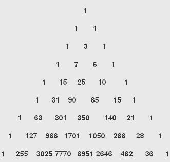

# [排列组合之N球放M盒问题 ](http://azaleasays.com/2011/12/16/combinatorics-n-balls-in-m-boxes/) Twelvefold way

复制自：

http://azaleasays.com/2011/12/16/combinatorics-n-balls-in-m-boxes/

本文主要复制下 做个记录

N球放M盒，其实有8种情况：

1. 球同，盒同，盒不可以为空
2. 球同，盒同，盒可以为空
3. 球同，盒不同，盒不可以为空
4. 球同，盒不同，盒可以为空
5. 球不同，盒同，盒不可以为空
6. 球不同，盒同，盒可以为空
7. 球不同，盒不同，盒不可以为空
8. 球不同，盒不同，盒可以为空

------

1 2 类情况，穷举法。

例如7个相同球放入4个相同盒子，每盒至少一个（1类情况），则先4个盒子每个放1个，多余3个。只需要考虑这3个球的去处就OK，由于盒子相同，所以只需要凑数就OK，不必考虑位置，因此只有300，211，111三种。

例如7个相同球放入4个相同盒子，可以空盒，则还是凑数，大的化小的，小的化更小的。

0007 0016 0025 0034 0115 0124 0133 0223 1114 1123 1222

11种。

------

3 4 类情况，用插板法（隔板法）解决。

3 的公式是把 N 个球排成一排（一种方法），它们中间有 N-1 个空。取 M-1 个板，放到空上，就把它们分成 M 部分，由于板不相邻，所以没有空盒。它的方法数有C(N-1, M-1)

4 的公式在3的基础上升华出来的，为了避免空盒，先在每一个盒里假装放一个球，这样就有 N+M 个球，C(N+M-1, M-1)

------

球不同的情况里，先来分析最特殊的8号：N球不同，M盒不同，允许空。每个球都有M种选择，N个球就有 M^N 种分法。

------

关于5 6 7 的情况，”我先教大家一个非常特殊的三角形，这个你在狗哥百度非常难以找的到的，秘传型，一般人我不会告诉他的。” (啊啊，可爱的原作者 —azalea注）

看起来很复杂，其实很简单：

性质1，左右两边都是1，第几行就有几个数，比如第5行就是1XXX1

性质2， S(N, K) = S(N-1, K-1) + K * S(N-1, K)，含义是第N排的第K个数等于他上一排的上一个位置数字加上一排的同样位置数字的K倍。

例如S(7, 3) 就是第7排第3个数字，所以他等于上排第6排第2个数字+第6排第3个位置*3。所以画图的话，明显第1排是1，第2排1，1，推理第3排（左右两边都是1，只有中间那个数字没确定）。 所以 S(3, 2) = 第2排第1个数字+第2排第2个数字两倍 = 1+1*2 = 3，所以第3排数字就是1，3，1。同理 S(4, 2) = S(3, 1) + 2*S(3, 2) = 1+2*3 = 7, … 如此类推。

当遇见类型5即：N不同球，M同盒，无空盒。一共有 S(N, M) 种分法，比如7个不同球，4个相同箱子，每个箱子至少一个，则看三角形的第7行，第4个数字多少。

而类型6，N不同球，M同箱，允许空的时候（在类型5的基础上允许空箱）。明显是N个球不变，一个空箱子都没有+有一个空箱子+有两个空箱子+有三个空箱子+，，，，，，都装在一个箱子。说的简单点一共有就是

S(N, 1) + S(N, 2) + S(N, 3) + … + S(N, M)

也就是说第N排开始第1个数字一直加到第M个数字就是总的分法。

而类型7同样是在类型5的基础上升华，因为5是箱同的，而7箱不同，所以箱子自身多了P(M, M) = M! 倍可能， 所以类型7的公式就是 M! * S(N, M)

总结：

N球M盒

1. 球同，盒同，盒不可以为空 穷举
2. 球同，盒同，盒可以为空 穷举
3. 球同，盒不同，盒不可以为空 C(N-1, M-1
4. 球同，盒不同，盒可以为空 C(N+M-1, M-1)
5. 球不同，盒同，盒不可以为空 S(N, M)
6. 球不同，盒同，盒可以为空 S(N, 1) + S(N, 2) + S(N, 3) + … + S(N, M)
7. 球不同，盒不同，盒不可以为空 M! * S(N, M)
8. 球不同，盒不同，盒可以为空 M^N

补充wiki上也有相关的说明：Twelvefold way

https://en.wikipedia.org/wiki/Twelvefold_way

